> 两个真实场景，一条完整链路：先是打比赛时 docker pull、modelscope 下载龟速，然后是 Codex 推理强度开高后频繁出现"5/5 重新连接失败"。原本以为是玄学，顺着 AI 给的解释把排查链路捋通之后，发现计算机网络的知识全部串起来了。

## 一、两个真实场景

### 1.1 场景 A：打比赛时的"万物拉不动"

比赛环境里 `docker pull` 一个镜像能卡到怀疑人生，modelscope 下载模型权重也是几十 KB/s 的龟速。当时的解法很朴素：换国内镜像源、找加速镜像，换了就能用，但不理解为什么"换个域名就好了"。

### 1.2 场景 B：Codex xhigh 的 5/5 重连失败

Codex 推理强度开到最高（xhigh）之后，经常跑着跑着就弹"5/5 重新连接失败"。第一直觉是"CoT 太长，服务器传回来的时候被截断了"——这个直觉是错的。

### 1.3 先给总判断

更准确的模型是：

> **任务越复杂 → 服务端计算/工具调用越久 → WebSocket/TCP 连接维持越久 → 代理、节点、NAT、超时、链路抖动暴露的概率越高。**

xhigh 不制造网络故障，它只是让连接活得更久，更容易撞上**本来就存在**的网络故障。

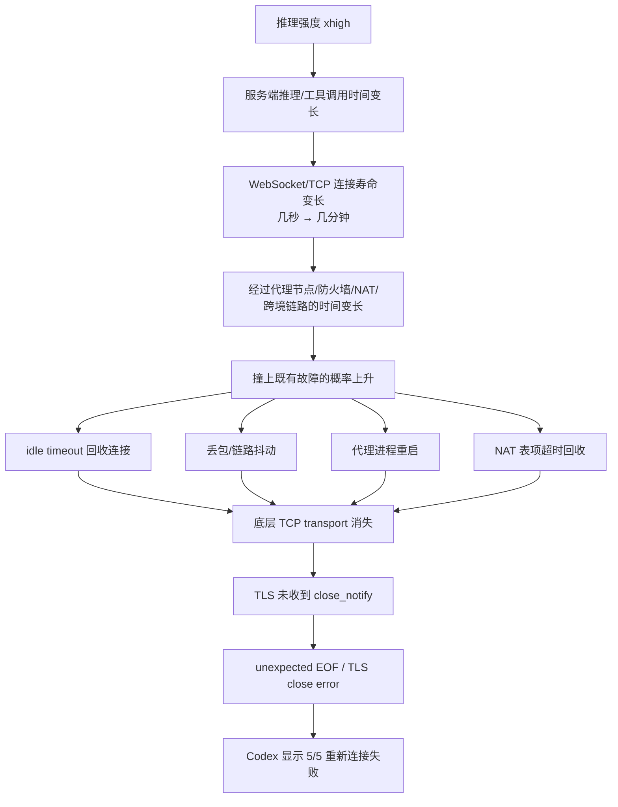

假设链路中每分钟出现异常的概率是 p，那么连接越长，"至少撞上一次"的概率约等于 `1 - (1-p)^n`。这就是工程思维：**长连接不是更容易坏，而是暴露时间更长。**

## 二、建立网络模型：三张图

排障之前先建立正确的模型。不要一上来背 OSI 七层，先记住三张图，它们回答三个不同的问题：

| 图 | 回答的问题 | 视角 |
|---|---|---|
| 图 A 端到端路径 | 数据**经过谁**？ | 横着看网络（设备/线路） |
| 图 B 协议栈 | 数据**怎么包装**？ | 竖着看协议（分层抽象） |
| 图 C 代理路径 | Clash 在**哪里插入**？ | 谁在中途接管流量 |

### 2.1 图 A：端到端路径 —— "数据经过谁"

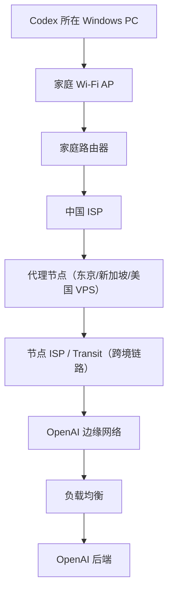

这张图关心的是：**哪台机器、哪个路由器、哪个代理、哪段线路**。之前对话里那条"Wi-Fi → Windows → Clash → 本地 TCP socket → 代理节点 → ..."就是在画这条线，但它把 socket 混进"经过的设备"里了——socket 不是网络上的一站（见 2.5）。

### 2.2 图 B：协议栈 —— "数据怎么包装"

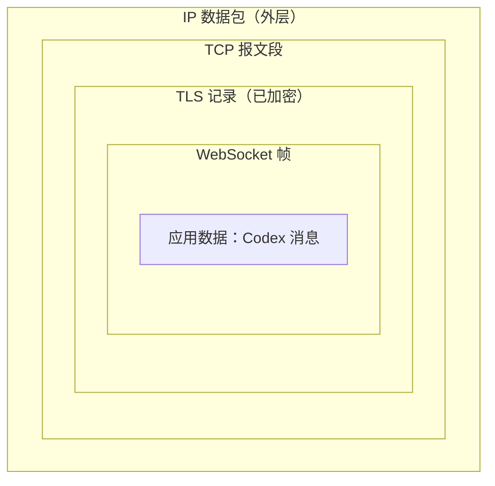

同一份数据在电脑内部经过五层抽象，像俄罗斯套娃：

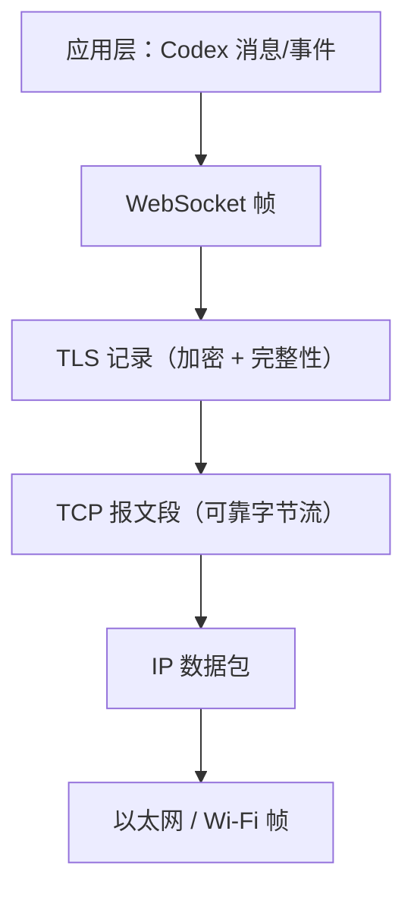

**这两张图不是矛盾的，而是两个维度**：图 A 是横着看（沿途经过哪些设备），图 B 是竖着看（数据在自己电脑里被一层层包装）。竖着看的数据，在每一台设备上都会被拆开、再重新封装一层。

### 2.3 图 C：代理路径 —— "Clash 在哪里插入"

Clash 有两种方式接管流量，这是理解后续一切的关键：

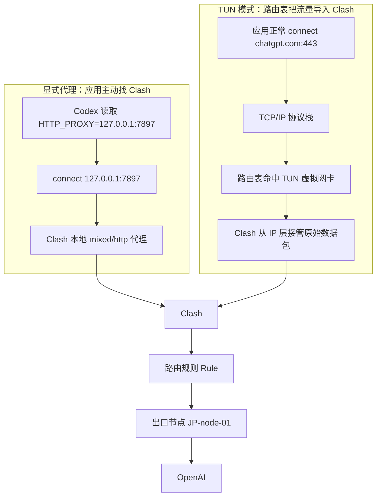

- **HTTP_PROXY 是应用主动投奔**：Codex 看到 `HTTP_PROXY=127.0.0.1:7897`，根本不直接连 chatgpt.com，而是先连 `127.0.0.1:7897`，告诉 Clash"帮我连 chatgpt.com:443"。这条路上**不需要 TUN 来抓流量**。
- **TUN 是被动接管**：应用照常建连接，是操作系统路由表把流量导进 TUN 虚拟网卡，Clash 在 IP 层读到原始数据包再决定放行方向（DIRECT / PROXY / REJECT）。

### 2.4 把两维合起来：协议 × 设备

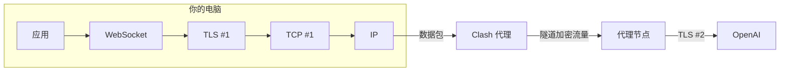

注意：用了代理之后，**TLS 不再是从你到 OpenAI 的一条到底**。你到 Clash 是一段，Clash 到节点是另一段（隧道），节点到 OpenAI 又是一段。每一段都有自己的 TCP 连接，甚至自己的 TLS。

### 2.5 一个 Codex 请求底下可能有多条 TCP 连接

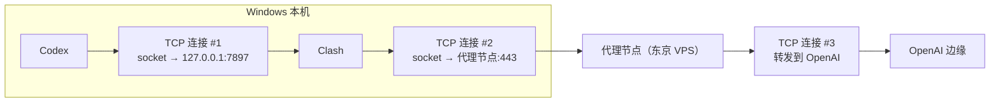

所以"Codex 的连接断了"**不能简单理解成 Codex ↔ OpenAI 那一条 TCP 断了**——中间可能是多段 TCP 连接拼接成的一条逻辑通信链路，断的是任意一段。

顺带澄清一个概念：**socket 不是网络里经过的一站**。Wi-Fi、Clash、代理节点、OpenAI 是设备/软件/网络位置，而 socket 是"应用程序使用操作系统网络协议栈的编程接口和内核对象"——程序进入 TCP/IP 世界的门把手，不是途中的一个路由器。

## 三、WebSocket：为什么长连接更容易被"杀"

### 3.1 HTTP 与 WebSocket 的生命周期差异

普通 HTTP 是"你给我网页、我给你、结束"，一次请求一条命。ChatGPT/Codex 这种实时应用需要服务器持续推送"我现在做到哪一步了、执行了哪个工具、又生成了哪段内容"，所以需要长连接。

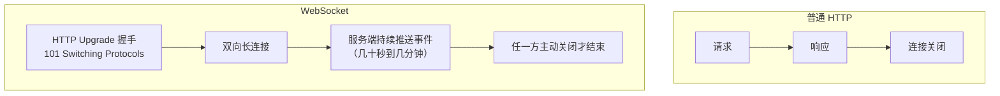

### 3.2 OpenAI 官方怎么说

OpenAI 官方文档明确说明：**ChatGPT 和 Codex 的部分功能使用安全 WebSocket**（在标准 HTTPS 请求之外）。Codex 的 sampling/streaming 使用 `wss://chatgpt.com/`，官方要求代理/防火墙/安全网关放行 **TCP 443 上的 WebSocket Upgrade 握手**，并特别提醒：如果代理、防火墙、TLS inspection 等提前关闭长时间 WebSocket，会导致 **stall（卡住）、disconnect（断开）或流式更新失败**——和你的现象高度吻合。

实际上社区里也有大量佐证：Codex 的 WebSocket 端点形如 `wss://chatgpt.com/backend-api/codex/responses`，有人抓包发现 WebSocket 升级成功后服务端直接回 1008 Policy 关闭、客户端默默回退到 HTTPS（openai/codex issue #13041）；也有人发现 Codex 的 WebSocket transport 不认 HTTP_PROXY 环境变量导致 TLS 握手失败（oh-my-pi issue #5384）。**"网页版在转圈"和"连接被掐"是两个不同的故事。**

### 3.3 idle timeout 是头号杀手

Codex 的流量形态和下载完全不同：发一个 event → 沉默 30 秒 → 又一个 event → 沉默 90 秒……服务器在长时间推理时，**没有数据流过连接**。

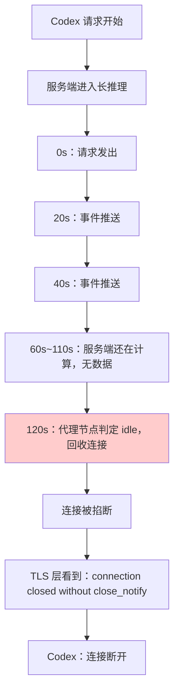

很多代理规定"120 秒没有有效数据就关连接"（Nginx、AWS ALB、HAProxy 的默认 idle timeout 都是 60 秒）。这就能解释为什么低推理强度基本没事、xhigh 经常出问题——而且**总是在 ~120s / ~300s / ~600s 附近死亡**。固定时间死亡是 timeout 非常强的信号。

**记住三个测试不是一回事**：吞吐量测试（持续大流量）≠ 长连接测试 ≠ idle WebSocket 测试。用 `curl` 从 Cloudflare 拉 200MB 文件 10 分钟不断，也证明不了 idle 120 秒的 WebSocket 能活。

## 四、TCP：可靠字节流与三次握手

IP 只负责"我尽量把数据包送过去"。丢包怎么办？乱序怎么办？重复怎么办？对方处理不过来怎么办？——这些问题由 TCP 解决。TCP 提供**可靠、有序、面向连接的字节流**。

### 4.1 三次握手

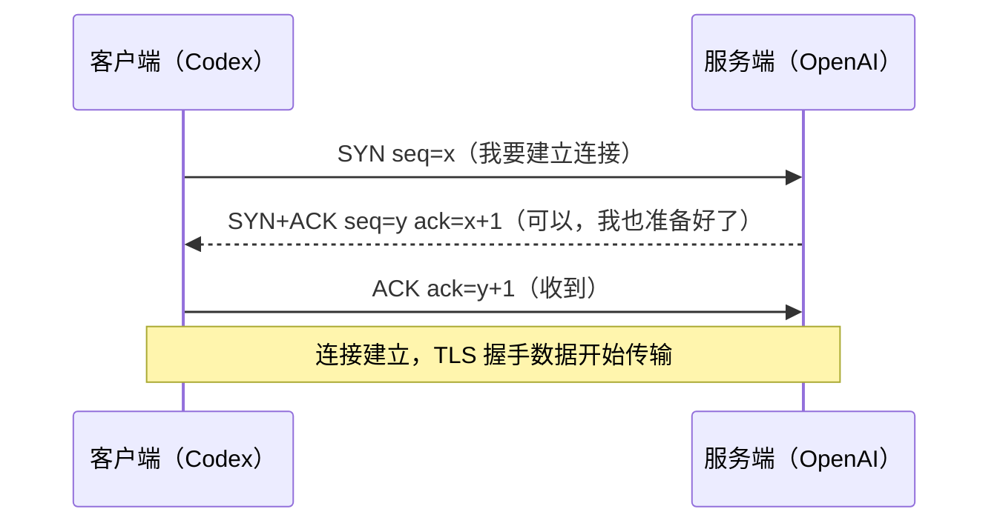

连接建立之后，TLS、WebSocket、Codex 的数据才在这条可靠的字节流上跑。层级关系：

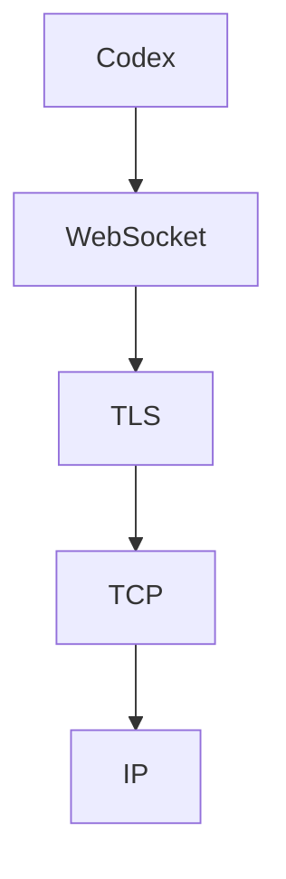

## 五、FIN 与 RST：两种"挂电话"

### 5.1 FIN：礼貌地挂电话

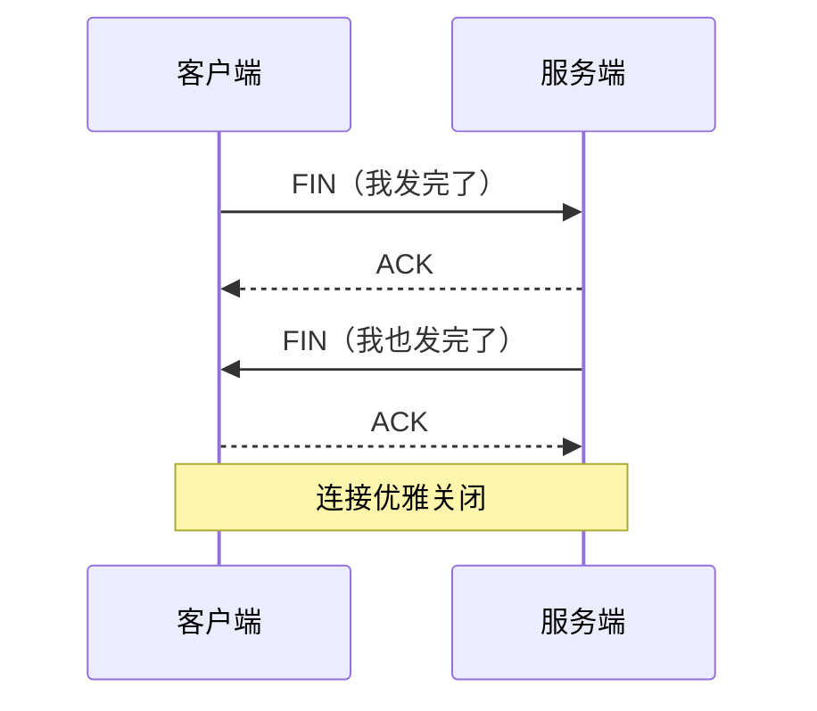

### 5.2 RST：啪，电话直接没了

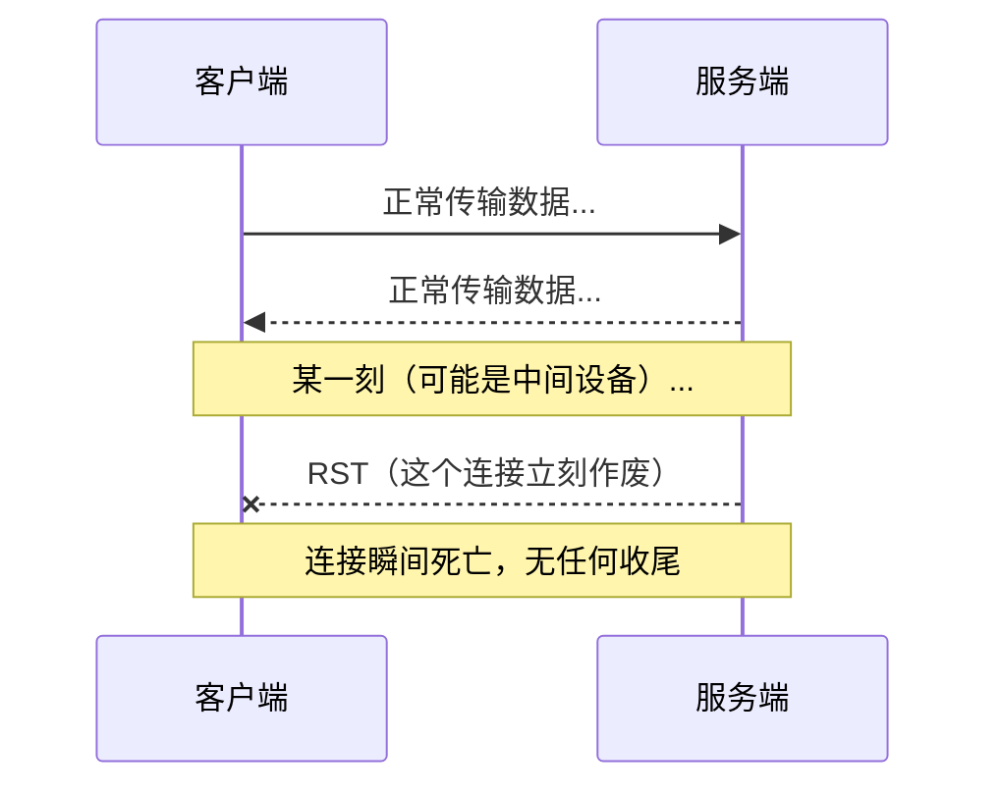

FIN 是"再见，我挂电话了"；RST 是"这个连接不存在了/立即停止"。RST 可能来自对端，也可能来自**中间的任何一个设备**。

### 5.3 谁在杀连接？—— 中间设备

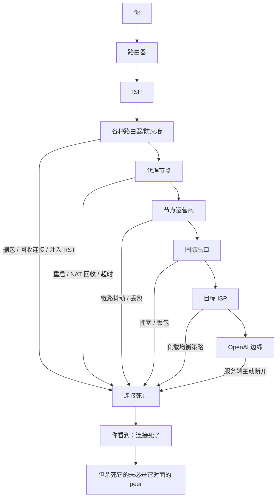

网络里存在大量 Firewall、NAT、Proxy、DPI、Load Balancer，任何一个都可能删除数据包、关闭 socket、注入 RST、超时回收连接。**收到 RST 不能推出"OpenAI 主动 RST 我"**——这是网络故障最麻烦的地方：你看到的是"连接死了"，但杀死它的人未必是你看到的那个 peer。

## 六、TLS 与 close_notify：证据强度意识

### 6.1 TLS 做三件核心的事

TCP 只保证可靠传字节，但不保密。裸 TCP 下中间设备能看到 `POST /api` 和你的内容。TLS 加了一层，提供：

- **机密性（Confidentiality）**：内容加密，别人看不懂
- **完整性（Integrity）**：内容不可被随意篡改
- **身份认证（Authentication）**：我知道对面确实是 chatgpt.com

### 6.2 close_notify 是什么意思

TLS 不仅规定怎么建立加密连接，还规定怎么**优雅结束**：

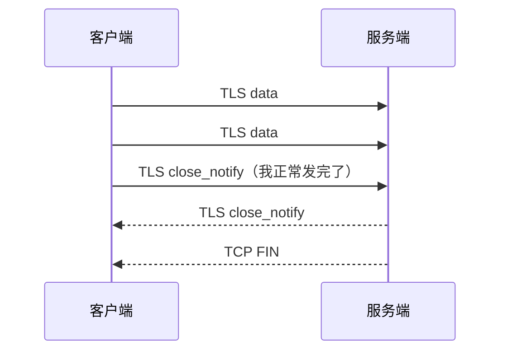

而你看到的是：TLS data → TLS data → TLS data → **连接突然消失**。TLS 层一脸懵："你怎么没发 close_notify 就没了？"于是报：

> `peer closed connection without sending TLS close_notify`

### 6.3 一个重要修正

网上很多解释直接说"这就是 TCP 被 RST"，这个结论**说得太死了**。严谨的说法是：

> 底层 TCP transport 非正常地消失了，TLS 没有收到预期的 close_notify。

可能是 TCP RST，也可能是 unexpected EOF、代理进程直接关闭、socket 被回收、连接超时、中间代理异常、服务进程异常退出……**missing close_notify 只能证明 TLS 会话没有正常收尾，不能 100% 证明 GFW 发了 RST。**

这就是网络诊断里的**证据强度意识**：

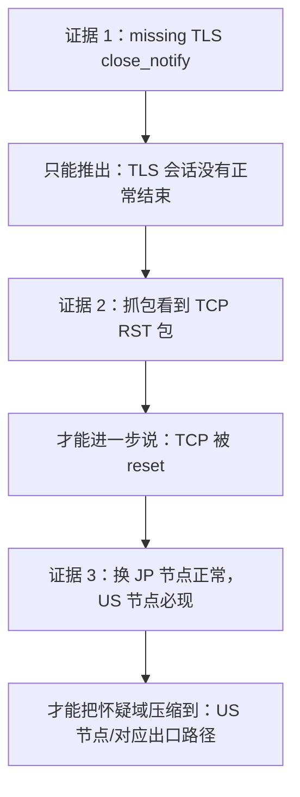

**症状 → 层 → 证据 → 假设 → A/B 实验 → 缩小故障域**，这是标准的网络排障方法。

## 七、TUN 与 HTTP_PROXY：入口和出口是两回事

### 7.1 为什么"开了 TUN 还是断"

这是最关键的认知：

> **TUN 决定流量怎么进入 Clash；路由规则 / 代理组 / 节点决定 Clash 把流量从哪里送出去。**

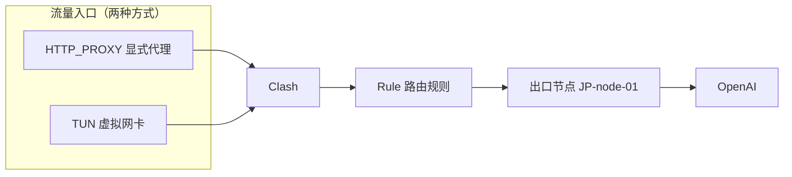

你只是把入口从 A 换成了 B，出口还是 `JP-node-01`。如果 **JP-node-01 → OpenAI 这一段不稳定**，开不开 TUN 当然没有本质帮助——这完全解释了你之前"TUN 测试基本没改变 Codex 这条路径"的现象，因为 Codex 尊重 `HTTP_PROXY`，本来就主动找 Clash 了。

### 7.2 但"TUN 完全没用"也不能绝对化

真实系统里流量是分散的：Codex 主模型流走 HTTP_PROXY，OAuth 可能走 TUN，某个 git 子进程走 TUN，某个 MCP 走 DIRECT，浏览器走系统代理。

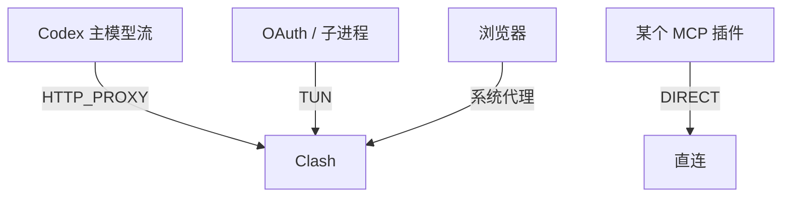

所以正确的工程习惯不是"我打开 TUN，所以全部走 TUN"，而是**验证每一条关键连接实际走了哪里**——Clash 的 Connections 页面就是干这个的。

## 八、排查方法论

### 8.1 分层定位思维

以后遇到网络问题，不要问"是不是 TUN 有问题？""是不是 GFW reset？"，而是画分层图，问：

> **"我的证据能够把故障定位到哪一层？"**

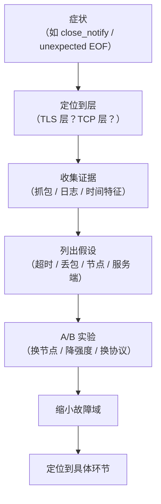

### 8.2 时间特征是强信号

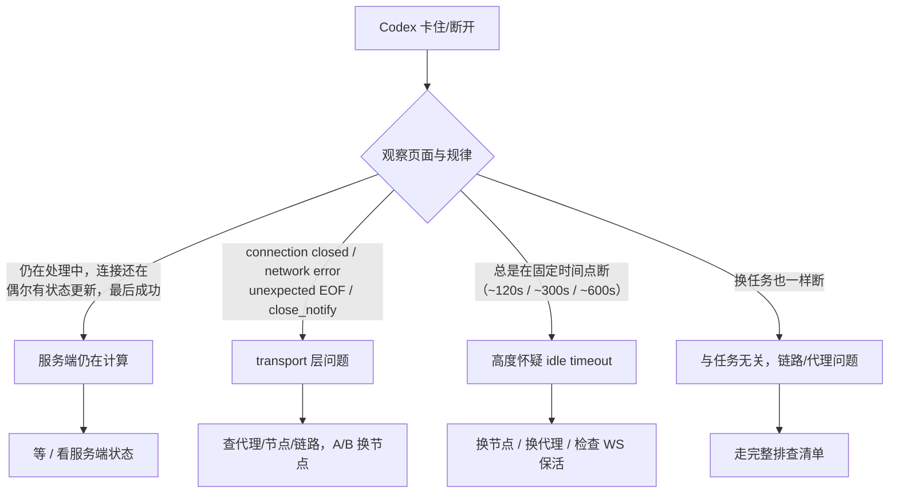

还有一个特别有价值的诊断现象：**看起来断了，刷新/重进会话，结果任务已经完成了**。这说明计算没有死，只是"结果实时送到你这里"的连接死了——属于 control/data streaming failure，而不是 model inference failure。

### 8.3 吞吐量测试 ≠ 长连接测试 ≠ idle 测试

`curl -x http://127.0.0.1:7897 -N --max-time 180 "https://speed.cloudflare.com/__down?bytes=200000000"` 是个不错的测试，但它只验证"本地 → Clash → 节点 → Cloudflare 持续传大量数据"的稳定性。一个代理完全可能：200MB 连续下载 10 分钟没问题，WebSocket idle 120 秒直接掐。**Codex 的流量是 event 型（脉冲式），不是吞吐型。**

### 8.4 症状-原因对照表

| 故障现象 | 最可能对应的层 |
|---|---|
| Could not resolve host | DNS 层 |
| Network unreachable / timeout | 路由 / IP 层 |
| Connection refused / timeout | TCP 建连失败 |
| Connection reset | TCP 中途 RST |
| certificate / handshake error | TLS 握手失败 |
| close_notify / unexpected EOF | TLS 异常结束（底层 transport 非正常消失） |
| stream disconnected | WebSocket 被代理 idle timeout 杀掉 |
| 页面显示"仍在处理"但连接正常 | OpenAI 后端仍在推理，**不是网络故障** |

## 九、回到两个场景

### 9.1 docker / modelscope 慢：镜像源链路

docker pull 慢的本质和 Codex 断连是同一课：**跨境链路 + 官方源限流**。解法是让流量走国内可达的镜像加速器：

```mermaid
flowchart LR
    A["docker pull nginx"] --> B{"registry 解析"}
    B -->|"默认配置"| C["registry-1.docker.io<br/>跨境链路 + 匿名限流"]
    B -->|"配置 registry-mirrors"| D["国内镜像加速器<br/>（阿里云 / 中科大 / 南京大学 / DaoCloud）"]
    C --> E["慢 / 超时 / context deadline exceeded"]
    D --> F["快 / 稳定"]
```

配置在 `/etc/docker/daemon.json` 的 `registry-mirrors` 数组（Docker Desktop 在设置里改），改完要重启 docker daemon 才生效。modelscope 同理：把默认下载端点换到国内 CDN 或走镜像，本质都是**缩短跨境路径**。

### 9.2 Codex 断连排查清单

```mermaid
flowchart TD
    A["Codex 断连排查"] --> B["1. 确认传输方式：WebSocket<br/>wss://chatgpt.com/backend-api/codex/responses"]
    B --> C["2. 确认代理支持 Upgrade: websocket<br/>且没有过短的 idle timeout"]
    C --> D["3. 观察断连时间是否固定（timeout 信号）"]
    D --> E["4. A/B 换节点（JP vs US，记录成功率）"]
    E --> F["5. 对照实验：降推理强度（xhigh vs high）"]
    F --> G["6. 打开 Clash Connections<br/>验证每条连接实际走了哪"]
    G --> H["7. 刷新重进会话，确认任务是否还在服务端继续"]
```

### 9.3 两个场景其实是同一课

docker 慢是"跨境链路 + 限流"，Codex 断是"长连接 + 中间设备超时"——表面症状完全不同，底层都是**把故障域画出来，然后逐层定位**。前者定位到"链路太长"，后者定位到"连接活太久"，解法就都清楚了。

## 十、总结：网络排障的核心思维

最后记住四句话，它们让之前那些看起来互相矛盾的图全部自洽：

> **协议栈描述"数据是什么结构"；路由/网络路径描述"数据经过哪里"；socket 描述"程序怎样使用网络"；Clash/TUN/Proxy 描述"谁在中途接管和转发流量"。**

以后不要问"是不是 TUN 有问题？""是不是 TLS 有问题？""是不是 GFW reset？"，而是画分层图，然后问："我的证据能把故障定位到哪一层？"——再配合 A/B 实验逐层缩小范围。这套"症状 → 层 → 证据 → 假设 → 实验 → 缩小故障域"的流程，就是标准网络排障方法，也是这次 Codex 断联给我上的最有价值的一课。

## 参考资料

- [OpenAI Help：Network recommendations for ChatGPT errors on web and apps（WebSocket 放行要求）](https://help.openai.com/en/articles/9247338-network-recommendations-for-chatgpt-errors-on-web-and-apps)
- [WebSocket.org：Fix WebSocket Timeout and Silent Dropped Connections（idle timeout 与心跳）](https://websocket.org/guides/troubleshooting/timeout)
- [LogicMonitor：TCP Resets - Everything You Need to Know About TCP Connections](https://www.logicmonitor.com/blog/tracking-down-failed-tcp-connections-and-rst-packets)
- [OneUptime：How to Fix TCP Connection Reset by Peer Errors](https://oneuptime.com/blog/post/2026-03-20-fix-tcp-connection-reset-peer/view)
- [openai/codex issue #13041：WebSocket upgrade 成功后服务端 1008 Policy 关闭并回退 HTTPS](https://github.com/openai/codex/issues/13041)
- [oh-my-pi issue #5384：Codex WebSocket transport 不认代理环境变量，静默回退 SSE](https://github.com/can1357/oh-my-pi/issues/5384)
- [博客园：Docker 镜像库国内加速的几种方法](https://www.cnblogs.com/east4ming/p/17691684.html)
