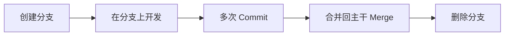
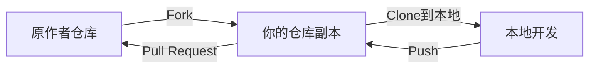

## 一、Git 核心概念详解

### 1.1 Init — 初始化

`git init` 是把一个普通文件夹变成 Git 仓库的第一步。

初始化后，文件夹中会生成一个 `.git` 子文件夹，里面存储了所有与 Git 版本控制相关的数据。如果把这个文件夹删除，就取消了 Git 管理。

在 VS Code 中：打开文件夹 → Source Control → Initialize Repository。

### 1.2 .gitignore — 忽略不需要的文件

`.gitignore` 文件声明了仓库中哪些文件不应该受 Git 管理。常见需要排除的内容：

- **密钥文件**：`.env` 文件中存储了 API Key 等敏感信息
- **依赖目录**：`node_modules/`（成千上万个第三方包，其他人可以通过 `npm install` 随时下载）
- **编译产物**：`dist/`、`build/`、`*.pyc`

```gitignore
# .gitignore 示例
.env
node_modules/
dist/
*.log
.DS_Store
```

> ⚠️ `.gitignore` 最好在项目初始化时就一并创建好，避免把不该提交的内容提交进仓库。

### 1.3 Commit — 提交

Commit 是 Git 版本控制的基本单元。每完成一次 commit，Git 就保存了仓库此时状态的快照。

**Commit 的三个要素：**
1. **Commit Message**：描述这次提交做了什么（如"新增用户登录功能"）
2. **Commit ID（哈希值）**：Git 通过哈希算法自动生成的唯一标识
3. **时间戳**：记录提交时间

Commit ID 有两种形式：
- 长 ID：`a1b2c3d4e5f6...`（40 位十六进制）
- 短 ID：`a1b2c3d`（前 7 位，在仓库内唯一）

> 💡 **AI 时代的小技巧**：每次让 AI 完成一个小的功能点就做一次 commit，这样如果 AI 的更改不符合预期，可以随时 discard 抛弃掉，然后修改提示词让 AI 重做。

### 1.4 三种"后悔药"

| 操作 | 行为 | 适用场景 |
|------|------|---------|
| **Discard** | 放弃还没有 commit 的更改 | 文件改了但还没提交，想撤销 |
| **Reset** | 强制回退到某个历史 commit | 单人分支，改动还没 push 到远端 |
| **Revert** | 通过反向提交抵消某次 commit | 多人协作分支，安全回退 |

**Reset vs Revert 的关键区别：**

- `reset` 会删除历史记录（后面的 commit 就没了），如果有代码已经 push 到远端，需要强制推送（`git push -f`），有搞丢代码的风险
- `revert` 是生成一个"反向提交"来抵消目标 commit 的内容，**历史记录完整保留**，是多人协作时唯一安全的回退方式

### 1.5 Diff — 比较差异

可以把两次 commit 的 ID 交给 AI，让它帮你比较：
```
"比较一下这两次提交有什么区别，修改了什么内容"
```

AI 在底层执行的是 `git diff` 命令，但对于用户来说，只需要理解 commit 的概念就能完成操作。

### 1.6 Branch — 分支

**分支的本质：不同开发线。**

默认情况下，每个仓库都有一个 `main`（或 `master`）分支，即主干分支。

**创建分支就是创建一个副本，但 Git 通过指针实现，并不需要真的拷贝代码。**

创建分支的操作为什么在 Git 里极快？因为它只是创建了一个指针，指向当前 commit。无论你的仓库有多大，创建分支都是瞬间完成的。

#### 分支的生命周期



**分支的核心价值：**
- 互不干扰：在不同分支上的代码修改不会互相影响
- 并行开发：多人或多 Agent 可以各自创建分支进行开发
- 安全实验：实验性功能在分支上开发，即使搞砸了也不影响主干

#### 分支创建方式

1. **基于最新提交创建**：`基于 main 创建 feature 分支`
2. **基于历史提交创建**：`找到某次 commit → 右键 Create Branch`
3. **基于其他分支创建**：`基于 feature 创建 feature2 → 包含 feature 和 main 的代码`

#### 合并后删除分支

功能开发完毕并合并后，通常需要删除该分支。Git 不允许删除当前所在分支，所以先切换到其他分支再删除。

### 1.7 HEAD — 当前位置

HEAD 一句话总结：**当前仓库处于哪一次 commit 上。**

- 切换到 main 分支 → HEAD 指向 main 的最新 commit
- 切换到 feature 分支 → HEAD 指向 feature 的最新 commit
- 切换到历史提交（Detached HEAD/分离头指针） → HEAD 指向历史 commit，**不处于任何分支管理中**

> ⚠️ 在分离头指针状态下修改代码容易搞丢，因为没有任何分支指向你的新 commit。建议基于历史提交**创建分支**后再修改。

### 1.8 Worktree — 工作树

Worktree 本质上是用 Git 创建一个新分支，然后把代码完整复制到一个**新的文件夹**中。主文件夹和分支文件夹可以并行工作，互不干扰。

**使用场景**：当你在一个分支上工作到一半，突然需要切换到另一个分支处理紧急任务时，可以用 worktree 创建一个独立的工作区。

在 Codex 中：右键项目 → 创建永久工作树 → 起名 → 代码被复制到新文件夹。

```bash
# Claude Code 创建 worktree
claude --worktree ADD-coconut
```

### 1.9 Merge Conflict — 合并冲突

当两个分支修改了**同一个文件的同一行代码**时，Git 无法自动决定保留哪个改动，这就产生了合并冲突。

**AI 时代的冲突解决**：
1. AI 检测到冲突后自动停下来
2. AI 询问如何处理（保留哪个、两个都保留、手动编辑）
3. 你做出选择，AI 完成合并

比传统的手动编辑 `<<<<<<<`、`=======`、`>>>>>>>` 标记要简单得多。

### 1.10 Git 的分区模型

Git 有四个分区，理解了分区模型就理解了 Git 的本质：

```
Working Directory  →  Staging Area  →  Local Repository  →  Remote Repository
   (工作区)              (暂存区)          (本地仓库)            (远端仓库)
```

1. **Working Directory（工作区）**：电脑磁盘上的本地文件夹，你实际编辑文件的地方
2. **Staging Area（暂存区/Index）**：commit 之前的检查点，可以精确选择哪些文件进入本次提交
3. **Local Repository（本地仓库）**：commit 后文件改动进入本地仓库
4. **Remote Repository（远端仓库）**：push 后代码上传到 GitHub（或其他远端服务器）

**数据流向：**
- `git add` → 工作区 → 暂存区
- `git commit` → 暂存区 → 本地仓库
- `git push` → 本地仓库 → 远端仓库
- `git pull` → 远端仓库 → 工作区（fetch + merge 两步合成一步）

> 💡 VS Code 默认把 `git add` 和 `git commit` 合并成了一个按钮，大幅简化了操作。当然你也可以手动使用暂存区功能，精细控制每次提交包含哪些文件。

---

## 二、GitHub 与远端操作

### 2.1 绑定远端仓库的两种方法

#### 方法一：git clone（推荐）

先在 GitHub 上创建仓库，然后克隆到本地：

1. GitHub → New → 填仓库名 → 创建
2. VS Code → Source Control → Clone → 粘贴仓库地址
3. 选择本地文件夹 → 完成克隆
4. 在项目中新增文件 → Commit → Publish

#### 方法二：先本地初始化再推送

1. VS Code 中打开文件夹 → Initialize Repository
2. 第一次 Commit
3. 点击 Publish → 填远端仓库名 → 推送到 GitHub

### 2.2 同步远端代码

**从远端拉取**：
- `git pull` = `git fetch` + `git merge`（一步到位）
- 或者在 VS Code 中点击 Sync Changes 的下箭头

**推送到远端**：
- VS Code → Sync Changes 的上箭头
- 注意：只有仓库管理员或被授予权限的人才能 push 成功

### 2.3 远端分支

有了远端仓库后，你会看到两种分支：
- `origin/main`：远端仓库的 main 分支
- `main`：本地仓库的 main 分支

当本地比远端多了提交 → 上箭头（需要 push）
当远端比本地多了提交 → 下箭头（需要 pull）

---

## 三、GitHub 界面全攻略

### 3.1 Repository（存储库/代码仓库）

GitHub 仓库地址格式：`github.com/用户名/仓库名`

**仓库主页关键区域：**
- **代码库**：显示项目源代码文件，每个文件后面有最近一次的 commit message 和更新时间
- **README**：项目介绍文件，自动展示在代码库下方
- **Releases**：版本发布信息，包含打包好的可下载软件
- **About 模块**：项目简介、标签（Topics）、Star、开源协议

**Star**：类似视频网站的点赞+收藏，反映项目热度。如果你对项目感兴趣，不妨给作者点个 Star。

### 3.2 Fork（复刻）

Fork 是把项目复制一份到自己的名下。



> Fork 是参与开源项目的入口。你可以 fork 一个项目后，按需进行 DIY，甚至通过 Pull Request 给原作者贡献代码。

### 3.3 Issues（议题/问题）

Issues 是与项目作者讨论的地方：
- 提出 Bug 报告
- 建议新功能
- 参与已有讨论
- 帮助他人解决问题

Issue 状态：**Open**（未解决/讨论中）→ **Close**（已解决/已结束）

> 小技巧：在学习开源项目前，不妨先搜索 Issues，有些问题可能别人已经遇到过并给出了解决方案。

### 3.4 GitHub 实用快捷键

| 快捷键 | 功能 |
|--------|------|
| `/` | 快速打开搜索功能 |
| `T` | 快速定位到文件搜索栏 |
| `L` | 跳转到指定行号 |
| `B` | Git Blame（查看每行代码是谁提交的） |
| `?` | 打开快捷键速查表 |
| `G` + `I` | 快速进入 Issues 页面 |
| `.`（句号） | 打开网页版 VS Code |
| `G` + `C` | 快速进入代码页面 |

### 3.5 Codespace

GitHub 提供的云端开发环境。在仓库中按 `.` 键打开网页版 VS Code 后，可以进一步创建 Codespace 获得完整的远程运行环境，直接在浏览器中调试和修改代码。

---

## 四、多人协作完全指南

### 4.1 开源项目贡献流程（Fork 模式）

适用于你没有项目直接 push 权限的场景：

```
1. Fork → 把项目复制到自己的名下
2. Clone → 把 Fork 后的仓库克隆到本地
3. 创建分支 → 不要直接在 main 上修改
4. 修改代码 → 在分支上完成功能开发
5. Commit → 提交到本地仓库
6. Push → 推送到自己的远端 Fork 仓库
7. Pull Request → 请求合并到原项目
```

**⚠️ 关键原则：**
- **永远在分支上修改**，不要直接在 main 上操作
- 创建 PR 前，**先同步上游项目的最新代码**，确保没有冲突
- PR 创建后，仓库管理员会进行 **Code Review（代码审核）**，确认无误后合并

### 4.2 团队内部协作模式（Collaborator）

当你在同一个组织/团队中，管理员可以把你添加为 Collaborator：

1. 管理员 → Settings → Collaborators → Add People
2. 你收到邀请 → 右上角收件箱 → 确认
3. 获得直接 push 权限

**此时工作流程简化为：**
- 不需要 Fork（直接在项目仓库中操作）
- 创建分支 → 开发 → Commit → Push
- 创建 Pull Request → Code Review → Merge

### 4.3 同步上游代码（关键步骤）

在创建 PR 之前，必须确保你的分支包含了母项目的最新代码，否则合并时可能产生冲突。

**正确的同步流程：**

```
1. 切换到 feature 分支
2. 将母项目的最新改动合并进当前分支
3. 若有冲突，先在本地解决
4. 推送到远端
5. 创建 Pull Request
```

这个流程可以让 AI 自动完成：
> "这是母项目的地址，把母项目的最新改动先合并进当前分支。注意如果有冲突，让我选择怎么处理。"

### 4.4 Code Review（代码审核）

Pull Request 的审核过程：

1. **Review Changes**：管理员查看代码差异（File Changes 标签页）
2. **提出建议**：可以在代码行上直接添加评论和建议修改
3. **通过合并**：确认代码 OK 后，点击 Merge 按钮
4. **贡献者记录**：合并后，贡献者的名字会出现在项目的 Contributors 列表中

---

## 五、进阶 Git 操作

### 5.1 Cherry-pick（拣选提交）

字面意思是"挑选樱桃"，在 Git 语境中就是**挑选某几个 commit 合并过来**。

**场景**：在 feature 分支上做了 3 次提交（蔬菜、肉类、主食），但只想把蔬菜和主食合并到 main，不想要肉类。

**操作方法**：把需要的 commit ID 复制给 AI
> "你把这两次提交 cherry-pick 进主干"

### 5.2 Stash（临时存储）

当你在一个分支上写着代码还没写完，突然需要切换到另一个分支处理紧急任务时：

**解决方案一**：直接在当前分支 commit（即使没写完）
**解决方案二**：使用 Stash

```bash
# VS Code → 三点菜单 → Stash（临时存储）
# 处理完紧急任务后 → Pop（拿回来继续写）
```

Stash 会把没写完的代码临时存储起来，切换回来后再取出继续编写。

### 5.3 Rebase（变基）

Rebase 是 Git 的进阶操作，有两层理解：

1. **从效果看**：把 main 分支合并进了 feature 分支
2. **从原理看**：把 feature 分支"变基"到了 main 分支

**Rebase vs Merge 的区别：**

| 特性 | Merge | Rebase |
|------|-------|--------|
| 历史记录 | 保留分支合并记录（产生 Merge Commit） | 线性历史，没有 Merge Commit |
| 可追溯性 | 清楚知道是哪个分支合并进来的 | 看起来像在一条直线上开发 |
| 强制推送 | 不需要 | 需要（因为提交历史被改写） |
| 多人分支使用 | 安全 | **禁止使用** |

> ⚠️ **重要警告**：Rebase 后必须强制推送（`git push -f`），因为提交的根基发生了变化。强制推送**只适用于单人使用的分支**，多人协作分支上绝对不能使用，否则会覆盖掉别人提交的代码！

### 5.4 工程团队协作最佳实践

#### 分支策略

**GitHub Flow**（推荐小型团队）：
- `main` 分支始终保持可部署状态
- 每次开发新功能从 `main` 创建功能分支
- 通过 PR 合并回 `main`
- 合并后立即部署

**Git Flow**（适合有发布周期的项目）：
- `main`：正式发布分支
- `develop`：日常开发分支
- `feature/*`：功能开发分支
- `release/*`：发布准备分支
- `hotfix/*`：紧急修复分支

**Trunk-Based Development（主干开发）**（适合成熟 DevOps、每日多次发布）：

Trunk-Based Development（TBD）的核心思想是：**所有开发者直接向主干（trunk/main）提交代码**，或者创建寿命极短（通常不超过几小时）的短期分支。

核心规则：
- 分支存活时间极短，通常不超过一天
- 频繁合并回主干，避免长期分支
- 配合 feature flags（功能开关），未完成的功能通过开关隐藏，不影响主干部署
- 依赖强大的自动化测试和 CI/CD 流水线
- 强制 Code Review（通过配对编程或短周期 PR）

**如何选择：**
- **小团队 + 快速迭代** → GitHub Flow
- **大团队 + 固定发布周期** → Git Flow
- **成熟 DevOps + 每日多次发布** → Trunk-Based Development

#### 提交规范

推荐的 Commit Message 格式（Conventional Commits）：

```
feat: 新增用户登录功能
fix: 修复登录页白屏问题
docs: 更新 API 文档
refactor: 重构用户验证逻辑
test: 添加用户模块单元测试
chore: 更新依赖版本
```

#### 团队协作黄金法则

1. **频繁提交**：每次完成一个小功能点就 commit，不要攒了一大堆再提交
2. **写清楚 Commit Message**：让别人（和未来的自己）一眼看懂这次改了啥
3. **不要直接向 main 提交**：永远通过分支 + PR 的方式
4. **PR 尽量小**：一个 PR 只做一件事，方便 Code Review
5. **合并前先同步**：确保自己的分支包含主干的最新代码
6. **CR 后再合并**：至少让另一个人看过你的代码再合并
7. **不要在多人分支上使用 Rebase / Force Push**

---

## 六、AI 时代的 Git 使用技巧

### 6.1 用自然语言操作 Git

在 AI 编程工具中，你可以这样说：

- "把这个文件夹初始化成 git 项目，注意把不需要的内容都排除掉"
- "把仓库还原到 [commit_id] 这次提交的状态，它后面的所有提交都不要了"
- "把 [commit_id] 这一次的提交撤销掉，保持其他的不变"
- "比较一下这两次提交有什么区别"
- "把 feature 分支合并进 main"
- "创建一个新分支，把第二行改成西瓜"
- "把母项目的最新改动先合并进当前分支"

AI 会帮你执行对应的底层 Git 命令（`git reset --hard`、`git revert`、`git diff` 等），你只需要理解每个操作的概念含义。

### 6.2 小步提交策略

```
修改小功能 → Commit → 检查结果
   ↓ 不满意                        ↓ 满意
Discard 重做                    继续下一个功能
```

每次让 AI 完成一个小功能点就做一次 commit，这样：
- 可以随时回退
- 历史记录清晰
- 方便管理

---

## 七、自学资源推荐

### 📚 交互式学习工具

**[Git-Interactive-Tutorial](https://woyeyao.github.io/Git-Interactive-Tutorial/)** — 一款在线的 Git 交互式学习工具，可以让你在浏览器中动手操作，直观地理解 Git 的各项工作机制。

### 📖 推荐阅读

- **[Pro Git 中文版](https://git-scm.com/book/zh/v2)** — Git 官方权威书籍，免费在线阅读
- **[GitHub Skills](https://skills.github.com/)** — GitHub 官方互动课程
- **[Learn Git Branching](https://learngitbranching.js.org/)** — 可视化 Git 分支学习工具

---

## 总结与延伸

### 核心知识图谱

```
Git & GitHub 知识体系
│
├── 本地 Git
│   ├── 初始化（init, .gitignore）
│   ├── 提交（commit, commit id）
│   ├── 后悔药（discard, reset, revert）
│   ├── 分支（branch, merge, conflict, head）
│   ├── 工作树（worktree）
│   ├── 分区模型（工作区→暂存区→本地仓库→远端仓库）
│   ├── 进阶操作（stash, cherry-pick, rebase）
│   └── AI 时代的操作方式（自然语言替代命令）
│
├── GitHub
│   ├── 远端仓库（push, pull, clone）
│   ├── 仓库页面（README, Releases, Issues, Star, Fork）
│   ├── 快捷键与工具（Codespace, Web VS Code）
│   └── 团队管理（Collaborator, Organization）
│
├── 多人协作
│   ├── Fork 模式（开源贡献流程）
│   ├── Collaborator 模式（团队内部协作）
│   ├── Pull Request（创建、Code Review、合并）
│   └── 同步上游代码（避免冲突）
│
└── 工程实践
    ├── 分支策略（GitHub Flow, Git Flow, Trunk-Based Development）
    ├── 提交规范（Conventional Commits）
    └── 协作黄金法则
```

### 关键认知升级

Git 与 GitHub 已经不再是"开发者的专属工具"，而是 AI 时代每个技术人都必须掌握的基础技能。理解 Git 的核心原理——commit、branch、merge、remote——远比赛记具体的命令更重要。

在 AI 的加持下，Git 的操作门槛已经大幅降低。你只需要：

1. **理解每个操作的本质**（commit 是保存快照，branch 是指针，merge 是合并分支…）
2. **用自然语言告诉 AI 你想做什么**
3. **AI 帮你执行底层命令**

就像视频中所说：「言者所以在意，得意而忘言」——掌握了概念的本质，命令自然会水到渠成。
