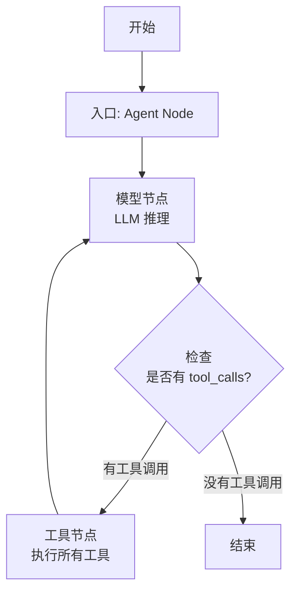
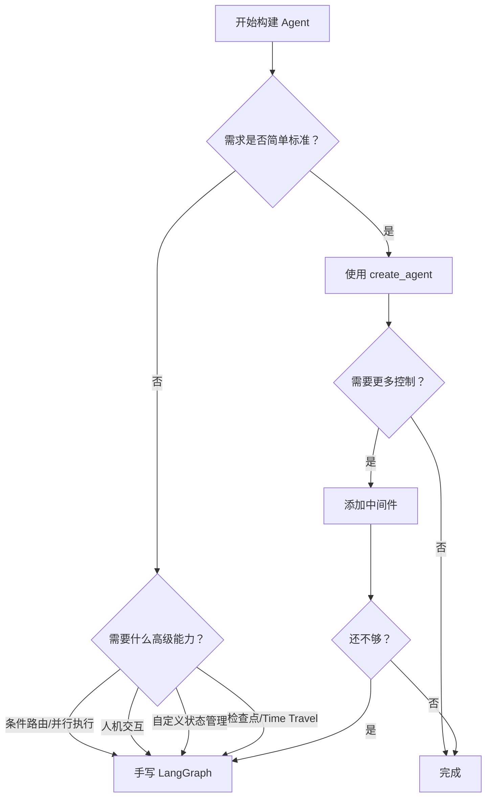

import PdfViewer from "@/components/PdfViewer.astro";

# Modern Agent 02：LangChain vs LangGraph ReAct 实现差异全解析

> *"ReAct 启发了现在的 Agent 设计与开发（maybe 也启发了 OpenAI API 中的 function calling 功能的设计），如同 CoT 启发了 prompt engineering 一样。"*
> —— 五道口纳什

本文是 **Modern Agent 系列** 的第二期。在上期我们讨论了 LLM Reasoning & Planning 的宏观分类之后，这一期回调到最经典朴素的 **ReAct 模式**，对比两个最主流的框架实现——**LangChain** 与 **LangGraph**，同时引入 **LangSmith** 作为 Agent 行为监控和调试工具。

本文基于五道口纳什 × Codex 的 B 站视频讲解，并融入了 **LangChain 1.0（2025年10月发布）之后的最新 API 变化**，特别是 `create_agent` 的引入及其与 LangGraph 的内在关系。

---

## PDF 原文笔记

<PdfViewer
  src="/pdfs/Modern_Agent_02_LangChain_vs_LangGraph_ReAct_notes.pdf"
  title="Modern Agent 02：LangChain vs LangGraph ReAct Notes"
/>

---

## 目录

1. [ReAct 模式回顾](#一react-模式回顾)
2. [LangChain 的 ReAct 实现](#二langchain-的-react-实现)
3. [LangGraph 的 ReAct 实现](#三langgraph-的-react-实现)
4. [深入解读：create_agent 与 LangGraph 的关系](#四深入解读create_agent-与-langgraph-的关系)
5. [LangSmith：Agent 行为监控与调试](#五langsmithagent-行为监控与调试)
6. [LangChain vs LangGraph 全面对比](#六langchain-vs-langgraph-全面对比)
7. [实践选择策略](#七实践选择策略)
8. [总结与延伸](#八总结与延伸)
9. [相关链接](#九相关链接)

---

## 一、ReAct 模式回顾

### 1.1 什么是 ReAct

**ReAct（Reasoning + Acting）** 是 LLM Agent 最基础的架构模式，由 Yao et al. 在 2022 年提出。其核心思想是让语言模型在**推理（Reasoning）** 和**行动（Acting）** 之间循环交替：

```
Thought（思考）→ Action（行动）→ Observation（观察）→ Thought → ...
```

**四个步骤详细解释：**

| 步骤 | 含义 | 示例 |
|------|------|------|
| **Thought（思考）** | 模型基于当前上下文分析下一步该做什么 | "用户想知道旧金山的天气，我需要调用天气查询工具" |
| **Action（行动）** | 调用一个工具（Tool）或执行具体操作 | `get_weather(city="San Francisco")` |
| **Observation（观察）** | 获取工具返回的结果或环境反馈 | "当前旧金山温度 15°C，多云" |
| **循环** | 回到 Thought，直到问题解决或达到最大步数 | 如果信息不足，继续思考→行动→观察 |

### 1.2 ReAct 的核心价值

ReAct 将**推理链与外部交互**结合起来，让语言模型不再是"缸中之脑"，而是能够通过工具调用获取实时信息、执行计算、操作外部系统。它的两个关键洞察：

1. **推理引导行动**：Thought 告诉模型该调用什么工具、传什么参数
2. **行动反馈推理**：Observation 为下一轮思考提供新的事实依据

### 1.3 ReAct 的历史意义

> ReAct 论文发表于 ICLR 2023，但它对 Agent 生态的影响远超一篇论文本身。它定义了 Agent 最基本的交互范式，启发了 OpenAI Function Calling API、Anthropic Tool Use、以及几乎所有现代 Agent 框架的设计。

作为类比：**CoT 对 Prompt Engineering 的影响 ≈ ReAct 对 Agent 设计的影响**。

---

## 二、LangChain 的 ReAct 实现

### 2.1 LangChain 0.x 时代：AgentExecutor

在 LangChain 1.0 之前，ReAct 的核心实现是 **AgentExecutor**。它的工作方式是一个显式的 while 循环：

```python
# LangChain 0.x 时代：AgentExecutor 核心逻辑
from langchain.agents import AgentExecutor, create_react_agent
from langchain import hub

# 获取 ReAct prompt template
prompt = hub.pull("hwchase17/react")

# 构建 agent
agent = create_react_agent(llm=llm, tools=tools, prompt=prompt)

# AgentExecutor 封装循环
agent_executor = AgentExecutor(
    agent=agent,
    tools=tools,
    max_iterations=10,     # 防止无限循环
    early_stopping_method="generate",  # 提前终止策略
    handle_parsing_errors=True,        # 解析错误处理
    verbose=True,                      # 打印中间步骤
)
```

**AgentExecutor 内部循环逻辑：**

```python
# 伪代码：AgentExecutor 的本质
while not done:
    # 1. Agent 决定下一步
    action = agent.plan(intermediate_steps)

    if isinstance(action, AgentFinish):
        return action.return_values

    # 2. 执行工具调用
    observation = tool(action.tool, action.tool_input)

    # 3. 记录到中间步骤
    intermediate_steps.append((action, observation))

    # 4. 检查是否达到最大迭代次数
    if len(intermediate_steps) >= max_iterations:
        return handle_early_stopping()
```

**AgentExecutor 的局限：**

- **循环逻辑固化**：Thought → Action → Observation 的顺序被硬编码在 AgentExecutor 中，难以插入自定义中间步骤
- **状态管理隐式**：所有历史集中在 `intermediate_steps` 列表中，类型不安全
- **分支逻辑困难**：实现条件路由、并行执行需要大量 Hacks
- **不支持人机交互**：没有中断/断点机制
- **不支持并行工具调用**：只能串行执行

### 2.2 LangChain 1.0 革命：create_agent

2025 年 10 月，LangChain 正式发布 **v1.0**，带来了全新的 Agent API——`create_agent`。

```python
# LangChain 1.0+：全新的 create_agent API
from langchain.agents import create_agent

agent = create_agent(
    model="openai:gpt-4.1-mini",         # 支持 provider:string 或 BaseChatModel
    tools=[my_tool1, my_tool2],           # Sequence[BaseTool | Callable | dict]
    system_prompt="你是一个智能助手。",     # 可选的系统提示词
    name="my_react_agent",                # 可选的 agent 名称
)

# 调用方式：基于 Chat Messages
result = agent.invoke({
    "messages": [{"role": "user", "content": "旧金山今天天气怎么样？"}]
})

# 支持流式输出和事件流
for event in agent.stream({
    "messages": [{"role": "user", "content": "分析一下这个数据集"}]
}):
    print(event)
```

**`create_agent` 的关键特性：**

| 特性 | 说明 |
|------|------|
| **Provider 字符串** | 直接用 `"openai:gpt-4.1-mini"` 格式，无需预创建 LLM 对象 |
| **简化调用** | 统一的 `.invoke({"messages": [...]})` 接口 |
| **中间件系统** | 支持 PII 过滤、人机交互、Token 预算等中间件 |
| **结构化输出** | 内置 `response_format` 参数，支持 Pydantic 模型 |
| **检查点** | 通过 `checkpointer` 参数支持持久化和状态恢复 |
| **流式事件** | 支持 `.stream()` 和 `.astream_events()` |

> ⚠️ **注意**：旧的 `create_react_agent`（来自 `langgraph.prebuilt`）已被标记为**弃用（Deprecated）**，将在 LangChain 2.0 中移除。虽然目前仍可使用，但官方建议迁移到 `langchain.agents.create_agent`。

---

## 三、LangGraph 的 ReAct 实现

### 3.1 LangGraph 设计哲学

LangGraph 是 LangChain 团队推出的**新一代 Agent 框架**，核心思想是用**有向图（Graph）** 来建模 Agent 的执行流程：

- **Nodes（节点）**：代表一个具体的处理步骤（Agent 决策、工具执行、条件判断）
- **Edges（边）**：定义节点之间的流转关系
- **State（状态）**：全局状态对象，在节点之间传递和更新

>如果说 AgentExecutor 是一个硬编码的循环，LangGraph 则是让开发者**自己绘制流程图**。

### 3.2 用 LangGraph 实现 ReAct

```python
from langgraph.graph import StateGraph, END
from typing import TypedDict, List
from langgraph.graph.message import add_messages

# 1. 定义全局状态
class AgentState(TypedDict):
    messages: List        # 消息历史（自动叠加）
    remaining_steps: int  # 剩余步数

# 2. 定义 Agent 节点
def call_agent(state: AgentState):
    """LLM 决定下一步行动"""
    response = llm.invoke(state["messages"])
    return {"messages": [response]}

# 3. 定义 Tool 节点
def run_tool(state: AgentState):
    """执行工具调用"""
    last_message = state["messages"][-1]
    tool_calls = last_message.tool_calls
    results = []
    for tc in tool_calls:
        tool = tools_by_name[tc["name"]]
        result = tool.invoke(tc["args"])
        results.append(ToolMessage(content=result, tool_call_id=tc["id"]))
    return {"messages": results}

# 4. 定义路由函数
def should_continue(state: AgentState) -> str:
    """判断是继续调用工具还是结束"""
    last_message = state["messages"][-1]
    if last_message.tool_calls:
        return "continue"
    return "end"

# 5. 构建图
graph = StateGraph(AgentState)

# 添加节点
graph.add_node("agent", call_agent)
graph.add_node("tool", run_tool)

# 设置入口
graph.set_entry_point("agent")

# 条件边：Agent 的输出决定下一步
graph.add_conditional_edges(
    "agent",
    should_continue,
    {"continue": "tool", "end": END}
)

# Tool 执行后返回 Agent
graph.add_edge("tool", "agent")

# 6. 编译为可执行图
app = graph.compile()

# 7. 调用
result = app.invoke({
    "messages": [{"role": "user", "content": "旧金山天气怎么样？"}]
})
```

### 3.3 LangGraph 的核心优势

#### 显式状态管理

```python
# 类型安全的状态定义
class AgentState(TypedDict):
    messages: List           # 自动消息叠加
    remaining_steps: int     # 剩余步数
    user_preferences: dict   # 自定义字段
    intermediate_results: List  # 自定义中间结果
```

- State 用 TypedDict/Pydantic 定义，**类型安全**
- 所有节点共享 State，任意节点可以读写任意字段
- 状态更新通过 **Reducer 函数** 控制（如 `add_messages` 自动叠加消息）

#### 灵活的路由控制

```python
# 条件路由：根据 Agent 输出动态选择路径
graph.add_conditional_edges(
    "agent",
    router_function,
    {
        "continue_to_tool": "tool",
        "ask_human": "human_review",
        "end": END,
    }
)

# 并行边：同时触发多个节点
graph.add_edge("agent", ["tool_1", "tool_2", "tool_3"])

# 循环边：天然支持
graph.add_edge("tool", "agent")  # 无限制循环
```

#### 细粒度控制

- **自定义任意中间节点**：日志、检查、数据转换
- **中断（Interrupt）和断点（Breakpoint）**：支持人机交互
- **每个节点独立控制**：重试、错误处理、超时
- **支持 Time Travel**：回退到任意历史状态重新执行

---

## 四、深入解读：create_agent 与 LangGraph 的关系

### 4.1 评论原文

在 B 站视频的评论区中，有这样一条精彩评论：

> *"其实 create_agent 内部本质上还是一个基于 langgraph（全局状态、节点以及 edge 定义）定义的 ReAct（不断跟 tools 交互，obs → act → obs → act）。An LLM Agent runs tools in a loop to achieve a goal. 大家从命名上也可以看出，react 越发是 langchain 中的一等公民，当然 langchain 1.0 之后，可以对这个基础的也是本质的 Agent workflow 做更丰富、更精细的调控。"*

这条评论完全正确，而且敏锐地指出了 LangChain 1.0 架构变革的核心。

### 4.2 create_agent 的内幕：它就是 LangGraph

很多人以为 `create_agent` 是取代了 LangGraph，但**恰恰相反**——`create_agent` 返回的是一个 **`CompiledStateGraph`**，本质上它就是一个 LangGraph 图！

```python
from langchain.agents import create_agent

agent = create_agent(model="openai:gpt-4.1-mini", tools=tools)

# 验证：create_agent 返回的就是一个 CompiledStateGraph
print(type(agent))
# <class 'langgraph.graph.graph.CompiledStateGraph'>

# 它也支持所有 LangGraph 的高级特性
# 流式输出
for chunk in agent.stream({"messages": [user_msg]}):
    print(chunk)

# 检查点/持久化
agent_with_checkpoint = create_agent(
    model="openai:gpt-4.1-mini",
    tools=tools,
    checkpointer=MemorySaver(),
)

# 中断/人机交互
agent_with_interrupt = create_agent(
    model="openai:gpt-4.1-mini",
    tools=tools,
    interrupt_before=["tools"],  # 在执行工具前暂停
)
```

**`create_agent` 内部构建的图结构：**



**具体来说，`create_agent` 内部做了这些事：**

1. **定义默认状态**：`AgentState`，包含 `messages` 和 `remaining_steps`
2. **创建 Agent 节点**：名为 `"model"`（旧版叫 `"agent"`），负责 LLM 推理
3. **创建 Tool 节点**：如果 LLM 返回 tool_calls，则自动执行
4. **设置条件边**：检查 LLM 输出，有 tool_calls 就去工具节点，否则结束
5. **编译为 CompiledStateGraph**：支持 `.invoke()`、`.stream()`、检查点等

### 4.3 评论的深层含义

**"react 越发是 langchain 中的一等公民"**——这意味着：

- ReAct 不再是"一种 Agent 类型"，而是 Agent 的**默认执行范式**
- 整个框架围绕 ReAct 循环设计，从命名（`create_agent`）到实现（内部的预编译图）
- 开发者不需要显式区分"用哪种 Agent 模式"，直接说"我要一个 Agent"即可

**"可以做更丰富、更精细的调控"**——这意味着：

- 简单的需求：`create_agent(model, tools)` 一句话搞定
- 复杂的需求：通过 **中间件（Middleware）** 系统深度定制

```python
# 通过中间件实现精细调控
from langchain.agents.middleware import (
    PIIMiddleware,
    HumanInTheLoopMiddleware,
    SummarizationMiddleware,
)

agent = create_agent(
    model="openai:gpt-4.1-mini",
    tools=tools,
    middleware=[
        PIIMiddleware(redact_emails=True),           # 自动脱敏
        HumanInTheLoopMiddleware(approve_tools=True), # 人工审批工具调用
        SummarizationMiddleware(max_tokens=2000),     # 自动摘要长历史
    ],
)
```

### 4.4 LangChain vs LangGraph：两种路径，同一套底层

| 层面 | create_agent（高层 API） | 手写 LangGraph（底层 API） |
|------|------------------------|---------------------------|
| **抽象层次** | 高，一行代码创建 Agent | 低，需要定义 State/Node/Edge |
| **学习曲线** | 低，适合快速原型 | 中高，需要理解图模型 |
| **默认行为** | 预置最佳实践的 ReAct | 完全自定义 |
| **定制能力** | 通过中间件和参数 | 完全自由，任意节点/边 |
| **内部实现** | 同样是 CompiledStateGraph | 同样是 CompiledStateGraph |
| **适用场景** | 80% 的标准场景 | 20% 需要极端定制的场景 |

**核心认识**：两者不是"二选一"的对立关系，而是**同一套底层图引擎的不同抽象层次**。`create_agent` 是快速通道，手写 LangGraph 是自由通道。

---

## 五、LangSmith：Agent 行为监控与调试

### 5.1 为什么需要 LangSmith

Agent 的行为具有**非确定性**和**长周期**的特点。一个问题可能经过多轮 Thought-Action-Observation 循环，传统的日志方式难以追踪。LangSmith 提供了可视化的 Trace 能力，让每个步骤都清晰可见。

### 5.2 核心功能

| 功能 | 说明 | 应用场景 |
|------|------|----------|
| **Tracing（追踪）** | 自动捕获每次 LLM 调用、工具执行、Agent 决策的完整链路 | 排查 Agent 行为异常 |
| **Debugging（调试）** | 查看每次 LLM 调用的完整 Prompt + Tool Call 输入输出 | 优化 Prompt 和策略 |
| **Evaluation（评估）** | 使用预定义或自定义指标评估 Agent 输出质量 | 构建回归测试套件 |
| **Monitoring（监控）** | 实时仪表盘显示延迟、Token 消耗、错误率 | 生产环境告警 |

### 5.3 快速集成

```python
import os

# 设置环境变量即可一键启用
os.environ["LANGCHAIN_TRACING_V2"] = "true"
os.environ["LANGCHAIN_API_KEY"] = "ls_..."  # 从 LangSmith 获取
os.environ["LANGCHAIN_PROJECT"] = "my-agent-project"  # 项目隔离

# 此后所有的 create_agent 调用自动进入 LangSmith Trace
from langchain.agents import create_agent

agent = create_agent(model="openai:gpt-4.1-mini", tools=tools)
result = agent.invoke({"messages": [user_msg]})
# ↑ LangSmith 自动记录这次调用的完整链路
```

### 5.4 实用 Tips

**在 LangSmith Trace 中重点关注：**

1. **LLM Raw Output**：检查模型输出是否被 Output Parser 正确解析——很多时候 Agent 行为异常是因为解析失败
2. **Token 消耗统计**：不同 Prompt 策略的 Token 消耗对比，有助于优化成本
3. **Tool Call 输入输出**：确认工具是否被正确调用，返回值是否符合预期
4. **总耗时**：定位性能瓶颈，看是 LLM 调用慢还是工具执行慢

> **实践建议**：不要在生产环境才想起加 LangSmith——它应该在开发初期就集成。Trace 数据既是调试工具，也是后期优化 Prompt 和 Agent 行为的重要依据。

---

## 六、LangChain vs LangGraph 全面对比

### 6.1 架构维度对比

| 维度 | LangChain (AgentExecutor) | LangGraph (StateGraph) | create_agent (1.0+) |
|------|--------------------------|----------------------|---------------------|
| **循环模型** | 隐式 while 循环 | 显式图边 | 预编译图（基于 LangGraph） |
| **状态管理** | `intermediate_steps` 列表 | 全局类型化 State | 全局类型化 State |
| **路由控制** | 硬编码（继续/停止） | 条件边 + 自定义路由函数 | 预置条件边 + 中间件 |
| **并行调用** | 不支持 | 支持（Parallel Edges） | 支持 |
| **人机交互** | 不支持原生 | 支持 Interrupt/Breakpoint | 支持（通过中间件） |
| **调试能力** | 日志级别控制 | 完整图 Trace | 完整图 Trace + LangSmith |
| **学习曲线** | 低 | 中等 | 低 |
| **灵活性** | 中等（需 Hacks） | 高（任意自定义 Node） | 高（通过中间件系统） |

### 6.2 API 演化对比

| 阶段 | Agent 创建方式 | 弃用状态 | 推荐度 |
|------|---------------|----------|--------|
| **LangChain 0.x** | `create_react_agent` + `AgentExecutor` | 已弃用 | ❌ |
| **LangGraph 预置** | `langgraph.prebuilt.create_react_agent` | 已弃用 | ❌ |
| **LangChain 1.0+** | `langchain.agents.create_agent` | 当前标准 | ✅ 推荐 |
| **纯 LangGraph** | 手动定义 StateGraph | 未弃用 | ✅ 需要定制时 |

### 6.3 代码量对比

**LangChain 0.x（旧方式）：**
```python
~15-20 行：导入 + 创建 LLM + 创建 Tools + 创建 Prompt + 创建 Agent + 创建 Executor
```

**create_agent（新方式）：**
```python
~3 行：导入 + create_agent + invoke
```

**手写 LangGraph（最灵活）：**
```python
~30-50 行：导入 + 定义 State + 定义 Nodes + 定义 Edges + 编译
```

---

## 七、实践选择策略

### 7.1 什么时候用 create_agent

- **快速原型**：几天内验证 Agent 概念
- **标准 ReAct**：简单的 Thought-Action-Observation 线性循环
- **团队初学**：团队成员对 Agent 框架不熟悉，需要低门槛上手
- **中小项目**：不需要极端定制

### 7.2 什么时候手写 LangGraph

- **复杂控制流**：需要条件分支、并行执行、循环嵌套
- **人机交互**：需要 Agent 在执行过程中暂停并等待人工确认
- **精细状态**：多个组件需要共享和更新复杂的状态
- **生产级要求**：需要完整的可观测性、错误恢复、重试机制

### 7.3 迁移路径

1. 先用 `create_agent` 快速验证方案可行性
2. 识别出需要自定义控制流的边界点
3. 参考 `create_agent` 内部的图结构，在 LangGraph 中重新实现
4. 复用已有的 Tool 定义和 LLM 配置，逐步替换为 Graph Edges

> **关键提醒**：create_agent 和手写 LangGraph 共享大量底层组件（Tool 定义、LLM 封装、Prompt Template），迁移成本远低于换用完全不同的框架。

### 7.4 决策流程图



---

## 八、总结与延伸

### 8.1 核心回顾

1. **ReAct 是 Agent 的基础模式**：Thought → Action → Observation 循环，启发了一整代 Agent 设计
2. **create_agent（LangChain 1.0+）**：当前推荐的标准 API，底层基于 LangGraph，一行代码创建 Agent
3. **手写 LangGraph**：当标准 ReAct 不够用时，提供完全的图级控制
4. **两者的关系**：create_agent 是 LangGraph 的高层封装，不是替代关系
5. **LangSmith**：Agent 开发不可或缺的 Trace、Debug、Eval、Monitor 平台

### 8.2 Modern Agent 系列路径

```
第1期：LLM Reasoning & Planning 综述（宏观分类）
第2期：LangChain vs LangGraph ReAct 实现差异（本期）
第3期：Plan-Execute-RePlan 与进阶 Workflow
第4期：结构化输出与工具调用系统
第5期：Multi-Agent 编排模式
...
```

### 8.3 延伸思考

- 为什么 ReAct 会在 2022 年之后成为 Agent 事实上标准模式？
- LangGraph 的图模型是否有性能开销？在什么场景下会成为瓶颈？
- 当 Agent 的行为越来越复杂时，如何保证其可预测性和安全性？
- create_agent 的中间件系统是否能够覆盖 90% 的定制需求？

---

## 九、相关链接

### 框架官方资源

| 资源 | 链接 |
|------|------|
| LangChain 官方文档 | [https://python.langchain.com/docs/](https://python.langchain.com/docs/) |
| LangChain v1 迁移指南 | [https://docs.langchain.com/oss/python/migrate/langchain-v1](https://docs.langchain.com/oss/python/migrate/langchain-v1) |
| LangGraph 官方文档 | [https://langchain-ai.github.io/langgraph/](https://langchain-ai.github.io/langgraph/) |
| LangSmith 文档 | [https://docs.smith.langchain.com/](https://docs.smith.langchain.com/) |
| LangChain GitHub | [https://github.com/langchain-ai/langchain](https://github.com/langchain-ai/langchain) |
| LangGraph GitHub | [https://github.com/langchain-ai/langgraph](https://github.com/langchain-ai/langgraph) |

### 本内容相关资源

| 资源 | 链接 |
|------|------|
| **B 站视频** | [BV1n4n7znEDN - Modern Agent 02](https://www.bilibili.com/video/BV1n4n7znEDN) |
| **PDF 原文笔记** | [Modern_Agent_02_LangChain_vs_LangGraph_ReAct_notes.pdf](/pdfs/Modern_Agent_02_LangChain_vs_LangGraph_ReAct_notes.pdf) |
| **视频配套代码** | [GitHub: react_langchain_langgraph.ipynb](https://github.com/wdkns/modern_genai_bilibili/blob/main/agents/langchain-graph/react_langchain_langgraph.ipynb) |
| **UP 主主页** | [五道口纳什 - Bilibili](https://space.bilibili.com/59807853) |
| **Modern Agent 第1期** | [LLM Agent 推理与规划综述](/posts/modern-agent-01-reasoning-planning/) |

### 论文与扩展阅读

| 资源 | 链接 |
|------|------|
| ReAct 原论文（ICLR 2023） | [Yao et al. "ReAct: Synergizing Reasoning and Acting in Language Models"](https://arxiv.org/abs/2210.03629) |
| Building Effective Agents | [Anthropic Agent 设计最佳实践](https://docs.anthropic.com/en/docs/agents) |
| LangGraph 教程 | [LangGraph Quick Start](https://langchain-ai.github.io/langgraph/tutorials/introduction/) |

---

> *本文基于五道口纳什 × Codex 的 B 站视频讲解整理扩展，并补充了 LangChain 1.0 发布后的最新 API 变化。PDF 笔记由 wdkns-skills（youtube-render-pdf）生成。*
