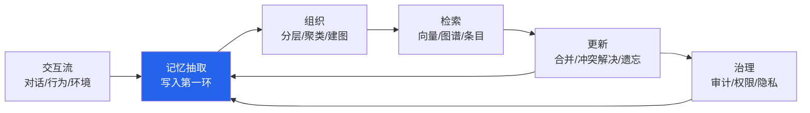
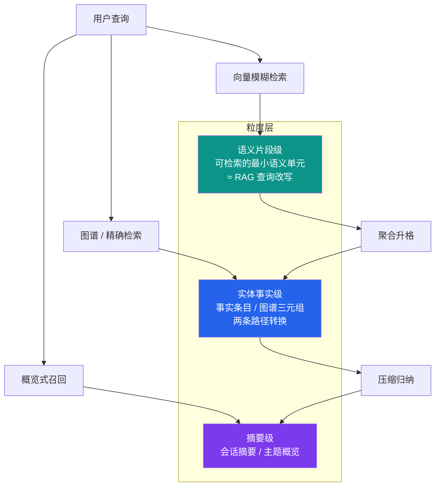
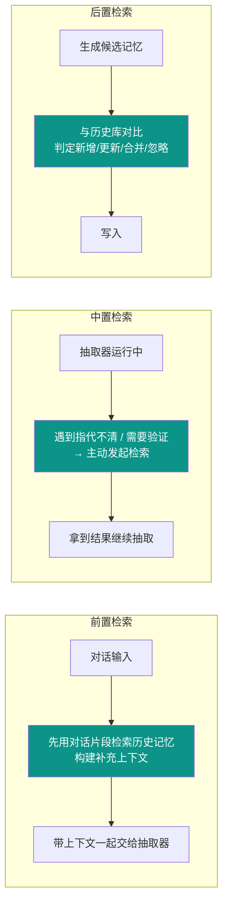
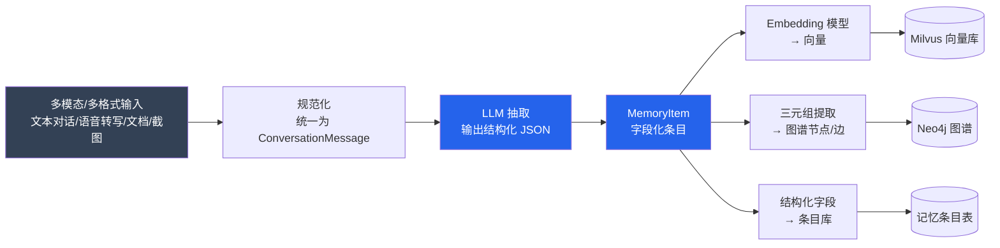
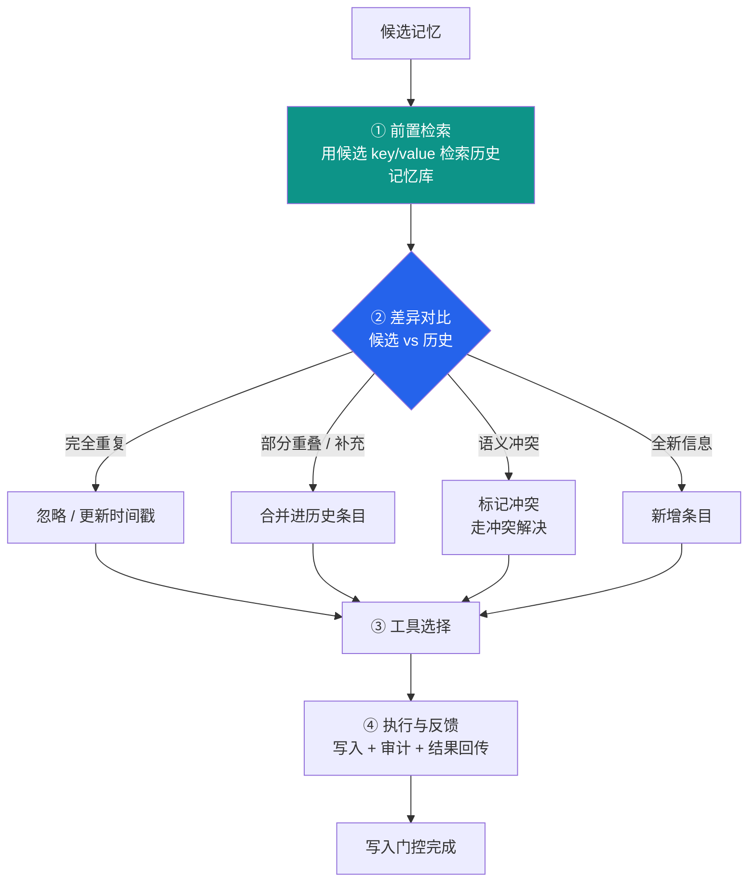
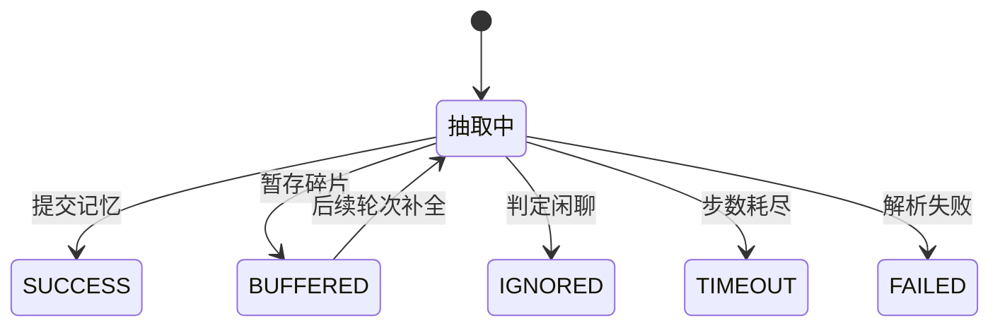
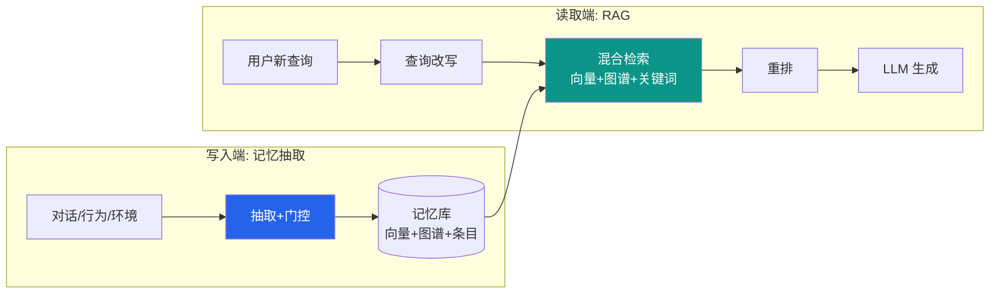
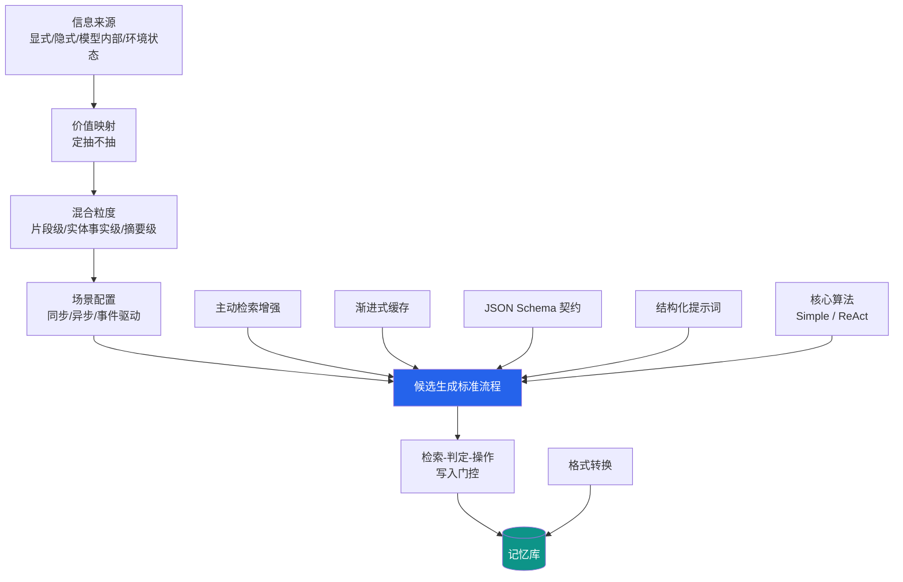

> 本文是「Agent 记忆系统」系列的第 4 篇，前作：
> [TencentDB Agent Memory：分层记忆系统深度解析](/posts/tencentdb-agent-memory-design/) ·
> [Agent 记忆系统漫游（OS）](/posts/agent-memory-os/) ·
> [Claude Code 记忆系统设计](/posts/claude-code-memory-system-design/)
>
> 本文理论框架与全部代码实现出自《记忆工程：智能体记忆系统构建与实践》（MemTensor/MemBook），
> 代码仓库：[github.com/MemTensor/MemBook](https://github.com/MemTensor/MemBook)

## 内容地图

本文是「记忆抽取」的完整专题。先给出一张内容地图，方便对照你关心的主题直接跳转：

| 章节 | 主题 | 一句话概括 |
| --- | --- | --- |
| 1 | 什么是记忆抽取 | 定义、边界与在记忆生命周期中的位置 |
| 2 | 信息来源与价值映射表 | 显式 / 隐式 / 模型内部 / 环境状态 四类来源的价值评估 |
| 3 | 混合粒度分层模型 | 语义片段级、实体事实级、摘要级的互补设计 |
| 4 | 粒度与时机配置推荐 | 不同场景下抽什么、什么时候抽 |
| 5 | 主动检索增强 | 抽取过程中按需检索历史记忆，解决指代消解 |
| 6 | 渐进式缓存 | 碎片信息的暂存、合并与提交 |
| 7 | 格式转换 | 自然语言对话到向量 / 图谱 / 结构化条目的转换链路 |
| 8 | 检索-判定-操作 | 前置检索、差异对比、工具选择、执行与反馈的写入门控闭环 |
| 9 | 候选生成的标准流程 | 从输入规范化到候选提交的完整流水线 |
| 10 | 标准 JSON Schema | 抽取输出的数据结构契约 |
| 11 | 结构化系统提示词设计 | 角色、规则、输出约束、Few-shot 的拆解 |
| 12 | 核心算法实现 | 可直接运行的抽取器代码与复杂度分析 |
| 13 | 失败模式与防御 | 幻觉、隐私、注入等风险与对策 |
| 14 | 评测与工程落地 | 怎么衡量抽取质量，怎么接入生产 |

---

## 1. 什么是记忆抽取

### 1.1 定义

**记忆抽取（Memory Extraction）** 是指：从用户与 Agent 的对话流（以及其他交互痕迹）中，识别出值得长期保存的信息，并将其转换为结构化、无歧义、可检索的记忆条目的过程。

它是智能体记忆系统**写入链路的第一环**。一句话：**抽取决定了一个 Agent 能记住什么**。后面所有环节——组织、检索、更新、治理——都建立在抽取产出的记忆条目之上。抽取的完整性决定了记忆的上限，抽取的质量决定了检索的精度。

### 1.2 记忆抽取 ≠ 信息抽取 ≠ 对话摘要

这是最容易混淆的三个概念：

| 维度 | 信息抽取（IE） | 对话摘要 | 记忆抽取 |
| --- | --- | --- | --- |
| 输入 | 单篇文档/句子 | 整段对话 | 多轮对话 + 历史记忆 + 环境上下文 |
| 输出 | 实体、关系、事件 | 一段压缩文本 | 结构化记忆条目 + 摘要 |
| 视角 | 客观陈述 | 客观概括 | **以用户为中心**（用户视角） |
| 时间处理 | 一般不管 | 一般不管 | **必须做指代消解**（相对时间→绝对时间） |
| 存储导向 | 知识图谱 | 文档 | 向量库 / 图谱 / 条目库 |
| 评判标准 | 召回率、精确率 | 信息保留率 | 完整性、保真度、**可检索性**、时效性 |

记忆抽取的特殊性在于三点：

1. **视角**：抽取的是「用户可能记住的信息」，包括用户自身的经历、想法、计划、情绪反应，以及他人（含助手）做出的、对用户有影响或被用户认可的行为。
2. **指代消解**：对话里充满「昨天」「下周五」「他」「那个项目」这类相对指代。存储时如果不解析成绝对时间与全名，这条记忆将来根本无法被检索到——检索词和存储词对不上。
3. **持久化导向**：抽取的终点不是一段文字，而是**能进数据库的数据结构**（向量、三元组、字段化的条目），要能被将来的检索精确命中。

### 1.3 在记忆生命周期中的位置

记忆系统的完整生命周期是「写入 → 组织 → 检索 → 更新 → 治理」。抽取属于**写入**环节，且是写入的起点：



抽取环节的产出（记忆条目）向下游所有环节供给数据。而下游的检索与更新，又会反过来影响抽取——这正是后文「主动检索增强」与「检索-判定-操作」要解决的问题。

### 1.4 抽取的目标：四性

一个合格的抽取器，产出的记忆条目要满足**四性**：

- **完整性（Completeness）**：不要遗漏用户可能记住的任何信息——关键经历、想法、情绪反应、计划都要进。
- **保真度（Fidelity）**：忠实于原意，不自作主张改写；不完整信息宁可不写，也不要编造。
- **可检索性（Retrievability）**：条目自包含、无歧义、带标签，未来能被向量检索和图谱检索命中。
- **时效性（Timeliness）**：区分事件时间与消息时间，让记忆带正确的时态，过期信息可被更新机制处理。

### 1.5 记忆的类型学

在《记忆工程》的框架里，Agent 的记忆分三类协同工作：

- **参数化记忆**：藏在模型权重里的知识（预训练获得），本文不涉及；
- **激活态记忆**：当前上下文窗口内的信息（工作记忆），随对话轮次滚动；
- **显式记忆**：独立于模型、显式存储的记忆条目——**记忆抽取的目标产物**。

显式记忆内部再分两类（这就是抽取 JSON 里 `memory_type` 字段的取值来源）：

| 类型 | 含义 | 例子 |
| --- | --- | --- |
| `LongTermMemory` | 长期事实、经历，跨会话有效 | 「2025年6月25日 Tom 与团队开会讨论新项目」 |
| `UserMemory` | 用户的偏好、计划、目标、画像 | 「Tom 计划把项目截止日期推迟到 2026年1月5日」 |

> 工程上还有一种常见细分：`EpisodicMemory`（情景记忆：某时某地发生了什么）与 `SemanticMemory`（语义记忆：沉淀下来的偏好与事实）。粒度分层模型（第 3 节）与这两种类型天然对应。

---

## 2. 记忆抽取信息来源与价值映射表

抽取不是「把所有文本都存下来」。**先搞清楚信息从哪来、值多少钱，再决定抽不抽、怎么抽。** 这是记忆抽取的第一个设计决策。

### 2.1 四类信息来源

#### ① 显式信息（Explicit）

用户**直接说出来的**事实、偏好、决定、计划。比如「我不吃辣」「下周一我要去北京出差」「这个项目预算砍半」。

- **特点**：可信度最高、抽取成本最低、几乎不需要推断。
- **抽取方式**：直接从对话文本中提取，做指代消解与视角转换即可。

#### ② 隐式信息（Implicit）

用户**没有直说、但可以从行为、措辞、语气、频次中推断**的信息。比如用户三次追问价格 → 对价格敏感；每次约时间都约周末 → 工作日大概率在忙；反复修改某个接口 → 对这个模块不熟。

- **特点**：价值高（往往是真正的用户画像），但需要推断，**有幻觉风险**，需要置信度标记。
- **抽取方式**：聚合多条消息做推断；或由抽取 Agent 在 ReAct 循环中「判断 + 验证」。

#### ③ 模型内部（Model Internal）

模型在推理过程中产生的中间状态：注意力分布、激活向量、内部推理轨迹（chain-of-thought）、工作记忆等。

- **特点**：属于「参数化记忆 / 激活态记忆」的研究范畴，工程上一般不直接进显式记忆库（成本高、可解释性差），但可以通过**激活探针**等方式间接影响抽取决策（例如检测到模型「困惑」时，把该轮对话标记为高抽取优先级）。
- **抽取方式**：内部状态分析、激活探针、推理轨迹解析——论文级技术，生产系统慎用。

#### ④ 环境状态（Environment）

Agent 运行时的外部上下文：时间、地点、设备、天气、网络状态、应用内事件、系统日志等。

- **特点**：确定性强、可信度高，但**单独存在没有记忆价值**，必须与用户行为绑定才有意义（「周三晚上在图书馆」比「在图书馆」有价值得多）。
- **抽取方式**：通过传感器/系统钩子/上下文注入获取，作为记忆条目的**时间戳与场景标签**。

### 2.2 价值映射表

| 来源 | 典型例子 | 可信度 | 抽取成本 | 记忆价值 | 风险 | 建议策略 |
| --- | --- | --- | --- | --- | --- | --- |
| 显式信息 | 偏好、事实、计划、决定 | 高 | 低 | 高 | 低 | **必抽**，直接抽取 + 指代消解 |
| 隐式信息 | 行为模式、情绪倾向、态度 | 中 | 中 | 高（画像核心） | 推断幻觉 | **带置信度抽取**，多次出现才沉淀，必要时让用户确认 |
| 模型内部 | 激活向量、推理轨迹、困惑度 | 中 | 高 | 中（研究价值） | 可解释性差 | 用于**辅助决策**（如标记高价值对话段），不直接入库 |
| 环境状态 | 时间、地点、设备、场景 | 高 | 低 | 低（单独）→ 高（绑定） | 隐私敏感 | 作为**场景标签/时间戳**附加到记忆条目 |

### 2.3 来源 × 粒度 的映射

信息来源与抽取粒度（第 3 节）存在自然的对应关系：

- **显式信息** → 实体事实级（事实条目、图谱三元组）为主，也可进摘要级；
- **隐式信息** → 语义片段级（行为片段、模糊语义）为主，经多次聚合后升格为实体事实级；
- **模型内部** → 不直接产条目，作为抽取优先级与置信度的信号；
- **环境状态** → 附加在语义片段级条目上，构成时间-地点-场景上下文。

### 2.4 一个容易踩的坑：隐式信息的置信度

隐式信息的抽取要遵守一条铁律：**单次出现是噪音，多次出现才是信号。**

- 用户说一次「这有点贵」→ 不该写入「用户对价格敏感」；
- 用户在三个不同场景反复比较价格 → 可以写入，但要带 `confidence` 字段，比如 `"confidence": 0.7`；
- 推断类记忆最好在后续对话中被验证过一次再「转正」。

这正是第 6 节「渐进式缓存」要解决的工程问题之一：让不完整、不确定的信息先在缓冲区里待着，等证据凑齐再提交。
---

## 3. 混合粒度分层模型

### 3.1 为什么需要多粒度

单一粒度的记忆库有两个经典失效模式：

- **只存粗粒度**（整段对话、长摘要）：检索时模糊命中一片，重排困难，且细节丢失（「那次会议具体约了几点」答不上来）；
- **只存细粒度**（单句片段）：碎片化严重，跨片段的信息拼不起来（「项目」和「12月15日」散落在两条记忆里），且存储爆炸。

现实世界的记忆本来就是分层的：人有**情景片段记忆**（那个下午发生了什么）、**语义事实记忆**（项目截止日期改了）、**概要记忆**（这个项目整体情况）。混合粒度分层模型就是模拟这套结构，让不同查询粒度都能被命中：



三层之间不是并列，而是**递进**：片段级信息反复出现 → 聚合升格为实体事实；事实集合再压缩 → 摘要。这个「升格」过程就是记忆的组织环节（书中 Chapter 5 的语义构建器、层级构建器）。

### 3.2 语义片段级（Semantic Fragment Level）

**定义**：把对话切成「可检索的最小语义单元」——一段自包含的语义片段（几句话、一个事件描述），并为其生成向量表示。

**为什么说它相当于 RAG 中的查询改写**：

在检索增强生成（RAG）系统里，原始用户查询往往口语化、有指代、信息不足，直接拿去向量检索效果很差，所以要先做**查询改写**——把「那个项目咋样了」改写成「项目 2025 年 12 月截止日期 后端延迟 测试时间」这种利于向量检索的形式。

语义片段级记忆在写入端扮演了对称的角色：**抽取时就把原始对话改写成了利于未来检索的「伪查询」形态**。每条片段既是记忆，也是未来检索的候选查询。这带来两个直接收益：

1. **适合基于嵌入向量的模糊语义检索**——片段语义完整，向量表示稳定，语义相似的查询（即使措辞完全不同）也能召回；
2. **有效提高重排模块的准确率**——重排（rerank）模块的输入是「查询 × 候选片段」的交叉编码，片段越短越聚焦，重排的区分度越高。拿整段对话去做重排，噪声会淹没真正的相关片段。

**实现要点**：

- 片段切分不是按句号机械切，而是按**语义完整性**切（一个事件的起止、一个话题的起止）；
- 每条片段生成向量，存入向量库（如 Milvus），`top_k` 召回；
- 片段带元数据：来源会话、时间戳、参与者、场景标签。

### 3.3 实体事实级（Entity-Fact Level）

**定义**：以「实体 + 事实」为基本单位的结构化记忆——实体（人、项目、地点、组织）以及围绕实体的属性与事实。这一层是**精确检索**的主战场（「Tom 的项目截止日期是几号」必须精确命中）。

从语义片段到实体事实，有**两条路径**可以转换：

**路径一：语义聚合（Semantic Aggregation）**

碎片片段 → 向量化 → 相似度聚类 / 合并 → 聚合出实体事实。

- 适用：多条片段描述同一实体、同一事实的不同侧面（三次提到「预算」「砍半」「没钱了」→ 合并成「项目预算大幅缩减」）；
- 手段：embedding 相似度 + 实体对齐，或者交给 LLM 做事实合并；
- 优点：无需复杂图谱工程，落地快。

**路径二：结构化抽取（Structured Extraction）**

文本 → (实体, 关系, 属性) 三元组 → 知识图谱（如 Neo4j）→ 图结构合并同实体。

- 适用：实体关系密集的场景（多实体协作、组织关系、依赖关系）；
- 手段：LLM 抽取三元组 + 图数据库合并（同名实体 merge），支持图遍历检索（「Tom 参与的所有项目的共同成员」）；
- 优点：支持关系查询和多跳推理，是精确检索的最强形态。

两条路径可以并存：路径二建图谱骨架，路径一用语义聚合持续往骨架上补充事实。

**为什么实体事实级重要**：向量检索擅长「模糊找」，不擅长「精确答」。用户问「我上次说的那个 deadline 是几号」，向量检索可能召回 5 条相关片段，但**精确答案**必须靠实体事实级的结构化字段（`value` 里的事实陈述或图谱属性）给出。混合检索（向量 + 图谱）在 RAG 中已经是成熟范式，记忆库同理。

### 3.4 摘要级（Summary Level）

**定义**：对一段会话、一个主题、一个项目周期的**压缩概览**——一段 120-200 字的自然语言总结（对应抽取 JSON 里的 `summary` 字段）。

**用途**：

- 长期不活跃后重新激活会话时，快速恢复上下文（「这个项目我们聊到哪了」）；
- 跨会话的主题索引（「Tom 今年主要忙什么」）；
- 记忆库概览、归档、遗忘策略的输入（摘要级记忆是「遗忘」时最后保留的部分）。

**实现要点**：

- 摘要必须是**从用户视角**写的自然段落，而非要点列表；
- 摘要覆盖该片段内所有已抽取记忆，且**不引入未抽取的新信息**；
- 摘要本身也可以向量化入库，作为「粗粒度召回 + 细粒度精读」的两级检索入口。

### 3.5 三层对比与选择

| 维度 | 语义片段级 | 实体事实级 | 摘要级 |
| --- | --- | --- | --- |
| 基本单位 | 语义片段 | 事实 / 三元组 | 自然语言摘要 |
| 存储形态 | 向量库 | 条目库 + 图谱 | 条目库 |
| 检索方式 | 向量模糊检索 | 精确匹配 / 图遍历 | 向量 / 关键词 |
| 对应 RAG 概念 | 查询改写后的伪查询 | 知识库条目 / KG | 文档摘要 |
| 优势 | 召回广、重排友好 | 精确、可推理 | 省 token、可概览 |
| 劣势 | 不精确、碎片化 | 构建成本高 | 细节丢失 |
| 数据来源 | 显式 + 环境 + 隐式 | 显式为主（聚合/结构化） | 上述两者的归纳 |

**工程默认组合**：片段级打底（保证召回）+ 实体事实级做精确层（保证答对）+ 摘要级做概览层（保证省 token 和上下文恢复）。三层的比例按第 4 节的场景调整。

---

## 4. 不同场景下的记忆抽取粒度与时机配置推荐

### 4.1 先定时机：同步 / 异步 / 事件驱动

| 时机模式 | 机制 | 优点 | 缺点 | 适用 |
| --- | --- | --- | --- | --- |
| 同步抽取 | 每轮对话后立即抽取 | 记忆最新鲜、指代最清晰 | 延迟 + token 成本高 | 关键信息密集场景（客服、销售） |
| 异步抽取 | 会话结束后批量抽取 | 成本低、可批处理 | 记忆滞后、上下文丢失 | 长期记忆沉淀（个人助理） |
| 事件驱动 | 关键节点触发（报错、下单、开会、情绪波动） | 成本与时效平衡 | 需要定义触发规则 | 绝大多数生产场景 |

**实践建议**：混合使用——事件驱动为主干（关键节点立即抽），会话结束异步补抽（兜底），同步抽取只留给最高价值信息。

### 4.2 场景 × 粒度 × 时机 推荐表

| 场景 | 推荐粒度组合 | 推荐时机 | 理由 |
| --- | --- | --- | --- |
| 个人助理（日程/偏好） | 实体事实级为主 + 摘要级 | 会话结束异步 + 关键决定事件驱动 | 偏好与事实要精确，不必实时 |
| 编程助手（IDE Agent） | 语义片段级（代码上下文）+ 实体事实级（技术栈、项目事实） | 事件驱动（提交、报错、重构时） | 代码片段适合语义检索；技术决策要精确 |
| 客服 / 销售 | 实体事实级（客户档案）+ 摘要级 | 同步（轮级） | 客户信息必须实时、必须精确 |
| 研究 / 阅读助手 | 摘要级为主 + 语义片段级 | 会话结束异步 | 长文概览价值最高，片段做引用溯源 |
| 游戏 NPC / 角色扮演 | 语义片段级 + 摘要级 | 事件驱动（重要剧情节点） | 重氛围与关系，不重精确事实 |
| 健康 / 陪伴助手 | 实体事实级 + 摘要级（带隐私标记） | 低频异步 | 隐式信息占比高、隐私敏感，宁慢勿错 |
| 多 Agent 协作 | 摘要级（状态同步）+ 实体事实级（决策记录） | 事件驱动（状态变更、决策时） | 协作上下文需要频繁、低成本的同步 |
| 通用助手（默认） | 三层全开，片段级打底 | 事件驱动 + 会话结束补抽 | 覆盖最广，成本可控 |

### 4.3 成本权衡：一个经验公式

抽取成本大致服从：`总成本 ≈ 抽取频率 × 单次输入长度 × 模型单价`。控制手段有三个旋钮：

1. **频率旋钮**：同步 → 事件驱动 → 异步，成本递减；
2. **输入旋钮**：只抽增量（本轮新增消息）而不是全量重抽；
3. **粒度旋钮**：只开需要的层——不需要图谱就别开实体结构化抽取，用语义聚合顶替。

> 经验法则：**召回率不够 → 加片段级；精确率不够 → 加实体事实级；token 成本超标 → 升摘要级、降频率。**

---

## 5. 主动检索增强（Active Retrieval Augmentation）

### 5.1 为什么抽取也需要检索？

直觉上「抽取」是纯写入操作，但实际不是。抽取器经常遇到三类缺上下文的问题：

1. **指代消解需要历史**：用户说「还是按上次说的那个方案来」，只有查了历史记忆才知道「上次说的方案」是什么；
2. **事实验证需要历史**：用户说「预算再砍一半」，得知道之前预算基线是多少，才能判断这是新信息还是更新；
3. **去重需要历史**：用户再次表达同一偏好，历史库里已有——此时应该走「更新」而不是重复插入。

所以现代记忆抽取器是 **RAG 化的抽取器**：抽取不是单向写入，而是「先检索、后抽取」或「边检索、边抽取」的双向过程。

### 5.2 检索增强的三个插入点



- **前置检索（Pre-retrieval）**：抽取前，用本轮对话片段作为查询，召回相关历史记忆，拼进 prompt 上下文——让抽取器「带着记忆工作」；
- **中置检索（Active retrieval）**：抽取过程中，Agent 自主决定何时需要更多信息——对应 ReAct 抽取器的 `SearchContext` 工具（见第 12 节代码）；
- **后置检索（Post-retrieval）**：抽取完成后，候选条目与历史库比对——对应第 8 节「检索-判定-操作」。

### 5.3 中置检索的实现：ReAct 抽取器

《记忆工程》第 4 章的 ReAct 抽取器，把抽取变成一个「思考-行动」循环，Agent 可以自主决定是否检索：

- 工具 1 `SearchContext`：按查询向量检索历史记忆（Milvus 向量检索 → Neo4j 取详情），结果注入上下文，供指代消解与事实验证；
- 工具 2 `UpdateBuffer`：信息不完整时，暂存到缓冲区（第 6 节）；
- 工具 3 `CommitMemory`：信息完整、有价值时，提交记忆；
- 工具 4 `Ignore`：判定为闲聊，不抽取。

**主动检索增强的三个收益**：

1. **指代消解率显著提升**：历史上下文补齐了「上次说的方案」这类指代；
2. **重复存储大幅减少**：抽取前就知道历史库里有什么；
3. **抽取决策可解释**：每次检索都留下 thought trace，方便审计「为什么这条记忆要这么写」。

> 代价：多轮循环 = 多次 LLM 调用，延迟和成本上升。所以 ReAct 抽取器适合**高价值对话**，低价值对话用 Simple（一次性）抽取器即可——这也是 `MemoryExtractor` 用 `strategy` 参数切换两种抽取器的原因。

---

## 6. 渐进式缓存（Progressive Caching）

### 6.1 问题：记忆是「攒」出来的，不是「一次」出来的

对话中的高价值信息往往**跨轮次碎片化出现**：

- 第 3 轮：「我最近在做一个新项目」
- 第 7 轮：「项目叫 Aurora，12 月上线」
- 第 12 轮：「Aurora 就我和老张两个人」

如果每轮都立刻提交记忆，会得到三条残缺条目；如果等到会话结束再抽，中间可能隔了 20 轮、上下文早被冲掉。**渐进式缓存**就是为解决这个矛盾：让信息碎片先在缓冲区里「攒着」，等证据足够时再合并提交。

### 6.2 核心机制：MemoryBuffer

实现上就是一个带状态的缓冲区（书中 `react_extractor.py` 的 `MemoryBuffer`）：

```python
class MemoryBuffer:
    """记忆缓冲区：用于存储跨轮次的碎片信息"""
    def __init__(self):
        self._buffer: List[str] = []

    def append(self, fragment: str):
        """添加片段"""
        self._buffer.append(fragment)

    def get_contents(self) -> List[str]:
        """获取所有内容（供抽取器参考）"""
        return self._buffer.copy()

    def clear(self):
        """清空缓冲区（提交后）"""
        self._buffer.clear()

    def is_empty(self) -> bool:
        return len(self._buffer) == 0
```

配合 ReAct 抽取器的 `UpdateBuffer` 工具：

- 抽取器判定「这条信息不完整，但值得留」→ 调 `UpdateBuffer` 暂存，返回 `status="BUFFERED"`；
- 后续轮次再次抽取时，缓冲区内容会拼进上下文（`buffer content: [...]`），抽取器看到旧碎片 + 新信息可以补全 → 调 `CommitMemory` 合并提交，随后 `clear()`。

### 6.3 缓冲的生命周期

| 阶段 | 触发条件 | 动作 |
| --- | --- | --- |
| 暂存 | 信息有价值但不完整 / 不确定 | `UpdateBuffer(fragment)` |
| 补全 | 后续轮次出现关联信息 | 缓冲区内容进入抽取上下文，与新信息合并 |
| 提交 | 信息完整且验证通过 | `CommitMemory(memory_list, summary)`，清空缓冲区 |
| 超时清理 | 超过 N 个会话 / M 天未补全 | 丢弃或降级为低置信度片段 |

**设计要点**：

- 缓冲区内容必须**可解释**：每块碎片带来源轮次与时间戳，合并时能追溯；
- 缓冲区不是无限膨胀：设定上限（比如最多 20 条碎片 / 3 个会话），防止「攒着攒着忘了」；
- 会话结束时若缓冲区仍有未提交碎片，触发一次强制提交（降级为低置信度）或按规则丢弃。

### 6.4 渐进式缓存的两种变体

1. **跨轮次缓存**（本文所述）：对话内的碎片合并——解决「信息不完整」；
2. **跨会话缓存**：同一主题的多会话信息聚合——解决「重复表达」，对应第 3 节片段级 → 实体事实级的升格（语义聚合路径）。

> 类比 MemGPT / Letta 的机制：MemGPT 用「记忆分层 + 分页管理」让模型在上下文窗口外维持长期记忆，其核心思想同样是**把不完整信息暂存、按需加载**。渐进式缓存是这一思想在抽取端的落地：不急着把碎片写死，等它长成完整的记忆再入库。

---

## 7. 格式转换（Format Conversion）

### 7.1 为什么需要格式转换

抽取的原始输入是**自然语言对话**，而记忆的存储形态是**向量、图谱、结构化条目**。中间隔着一条转换链路——这是记忆系统里最容易做糊的一环：很多系统直接把对话文本丢进向量库，导致检索时「存的是对话、查的是事实」，语义错位。

### 7.2 转换链路



每一跳转换的职责：

| 转换 | 输入 → 输出 | 手段 | 要点 |
| --- | --- | --- | --- |
| 规范化 | 各种输入 → `ConversationMessage`（角色 + 内容 + 时间戳） | 解析器 / 转写器 | 时间戳是后续指代消解的基石，必须保留 |
| 抽取 | 对话 → JSON（`memory_list` + `summary`） | LLM + 结构化提示词 | 第 10、11 节详述 |
| 字段化 | JSON → `MemoryItem`（id/key/value/type/tags/时间） | 数据类映射 | 缺失字段给默认值，类型做校验 |
| 向量化 | `key + value` → embedding 向量 | Embedding 模型 | 用「键 + 值」拼接编码，检索命中率高于单用 value |
| 图化 | 事实 → (实体, 关系, 属性) | LLM 三元组抽取 + 图 merge | 同实体合并、关系去重 |

### 7.3 向量化：一个容易被忽略的细节

书中 `extractor.py` 的保存逻辑：

```python
if self.config.auto_embed:
    text = f"{memory.key} {memory.value}"   # 关键：key + value 拼接
    memory.embedding = self.embedding.embed(text)
    self.milvus.insert(memory.id, memory.embedding)
```

**为什么用 `key + value` 而不是只用 value？** 因为 `key` 是「记忆标题」（如「计划调整范围」），`value` 是详细陈述。只编码 value，查询「那个计划改到啥时候了」可能命中不了；拼接 key 后，语义上同时覆盖「标题侧」和「细节侧」，召回更稳。这是格式转换链路里性价比最高的一行代码。

### 7.4 多格式输入的处理策略

- **长文本**：先按语义完整性分块，再逐块抽取（块之间留重叠，防切碎实体）；
- **语音转写**：无标点的转写先做断句还原，再进抽取；
- **图片/截图**：OCR 或 VLM 描述化后再抽取（描述丢失的信息，宁可不抽）；
- **结构化数据**（表单、日志）：直接映射字段，跳过 LLM 抽取（省钱且无损）。

> 格式转换的原则：**在转换链路的每一跳都保留溯源**（来源消息 id、时间戳），这样下游的更新、治理、审计才有据可查。
---

## 8. 「检索-判定-操作」：写入门控闭环

抽取器产出的只是**候选**记忆。候选能不能进库、以什么形式进库，要经过一道**写入门控**——否则会出现重复条目、矛盾条目、过期条目，记忆库越用越脏。「检索-判定-操作」（Retrieve-Judge-Operate）就是这套门控的标准闭环。

### 8.1 四步流程



#### ① 前置检索（Pre-retrieval）

用候选记忆的 `key` 和 `value` 作为查询，去历史记忆库做一次检索（向量检索 + 关键词/图谱检索并行），找出最相似的 Top-K 条历史记忆。这一步决定了后面所有判断的质量——**检索不到 = 判成新增 = 重复入库**。

#### ② 差异对比（Diff）

把候选与命中的历史记忆逐条对比，判定关系类型。对比的维度：

| 维度 | 对比内容 |
| --- | --- |
| 语义相似度 | 向量余弦相似度 + 重排得分 |
| 实体重叠度 | 共享实体数量（人、项目、地点） |
| 时间关系 | 候选时间 vs 历史时间（同一事件？后续事件？） |
| 事实矛盾 | 同一实体的同一属性，值是否冲突 |

判定结果分四类：

- **完全重复（Duplicate）**：语义相似度高于阈值（如 > 0.9）且无新增信息 → 不新建，只刷新时间戳/访问计数；
- **部分重叠（Overlap）**：有关联但不完全相同 → 合并进历史条目（取并集，冲突字段走规则）；
- **语义冲突（Conflict）**：同一事实两个矛盾版本（如截止日期 12 月 15 日 vs 1 月 5 日）→ 不直接覆盖，标记冲突进冲突解决流程（书中 Chapter 7 的 `conflict_resolver` / `updater` 干的就是这事）；
- **全新（New）**：历史库无关联条目 → 新增。

#### ③ 工具选择（Tool Selection）

根据判定结果选择写入工具：`Insert`（新增）/ `Update`（合并/刷新）/ `ResolveConflict`（冲突处理）/ `Skip`（忽略）。原则：**能更新不新增，能合并不分裂**——记忆库的条目数增长要克制，质量比数量重要。

#### ④ 执行与反馈（Execute & Feedback）

- 执行写入（含 embedding 更新、图谱 merge）；
- 写审计日志（谁写的、什么时候、来源对话、判定依据）；
- 结果回传：如果判定是冲突或合并，把结果作为观察喂回抽取器（或通知用户确认），形成闭环。

### 8.2 与「渐进式缓存」「主动检索增强」的关系

三个机制容易混淆，放一起对比：

| 机制 | 解决什么问题 | 发生在哪个阶段 |
| --- | --- | --- |
| 主动检索增强 | 抽取时缺上下文（指代、验证） | 抽取中 |
| 渐进式缓存 | 信息碎片化、不完整 | 抽取中 → 暂存 |
| 检索-判定-操作 | 重复 / 冲突 / 脏数据 | 抽取后 → 写入前 |

一句话：**主动检索让抽取器「想得起来」，渐进式缓存让抽取器「攒得齐」，检索-判定-操作让记忆库「进得对」。**

---

## 9. 显式记忆候选生成的标准流程

把前文的机制串起来，就是一条**显式记忆候选生成的标准流水线**。任何记忆系统（不管用什么框架）都可以按这 7 步落地：


**① 输入规范化**：把各种来源的消息统一成 `ConversationMessage`（角色、内容、时间戳）。时间戳缺失时用接收时间兜底——它是指代消解的地基。

**② 增量切分**：只对「新增的对话片段」做抽取，避免全量重抽。增量窗口常见 5-20 条消息，或按事件边界切（一次用户意图的完整表达）。

**③ 语言检测**：对话是中文就选中文模板，英文选英文模板——模板里的 Few-shot 示例语言与输出语言一致，抽取质量显著更高（书中 `detect_lang` 算法见第 12 节）。

**④ 上下文组装**：把三类上下文拼进抽取 prompt——当前对话、前置检索到的相关历史记忆（主动检索增强）、缓冲区里的未完成碎片（渐进式缓存）。

**⑤ LLM 抽取**：按场景选择策略——`simple`（一次性抽取，低成本）/ `react`（ReAct 循环，可检索、可暂存、可忽略，高保真）。两种策略的完整代码见第 12 节。

**⑥ 解析与校验**：LLM 输出是 JSON 字符串，解析成结构化对象后做字段校验（类型、必填项、枚举值）。解析失败 → 返回 `FAILED` 状态并记录原因，供重试或降级。

**⑦ 门控与提交**：候选进入「检索-判定-操作」闭环（第 8 节），决定新增 / 更新 / 合并 / 忽略，然后写库并审计。

### 9.1 抽取结果的状态机

整个流水线的输出是带状态的 `ExtractionResult`，五种状态构成一个清晰的状态机：

| 状态 | 含义 | 触发 |
| --- | --- | --- |
| `SUCCESS` | 抽取成功，产出记忆列表 | CommitMemory / Simple 抽取成功 |
| `BUFFERED` | 信息不完整，已暂存缓冲区 | UpdateBuffer |
| `IGNORED` | 判定为闲聊，无需抽取 | Ignore |
| `TIMEOUT` | 超过最大步数，强制结束 | ReAct 循环耗尽 |
| `FAILED` | JSON 解析失败或流程异常 | 解析/校验失败 |



**设计要点**：`BUFFERED` 和 `FAILED` 都要可观测——前者要能查到缓冲了什么、等什么；后者要记录失败原因，避免静默丢记忆。

---

## 10. 标准的 JSON Schema 定义

结构化输出是抽取器与下游存储之间的**契约**。契约不清晰，解析层就要天天打补丁。以下给出完整的 JSON Schema 定义。

### 10.1 抽取输出（顶层）

LLM 直接输出的 JSON，包含记忆列表与摘要：

```json
{
  "memory_list": [
    {
      "key": "项目初期会议",
      "memory_type": "LongTermMemory",
      "value": "2025年6月25日下午3:00，Tom与团队开会讨论新项目。会议涉及时间表，并提出了对2025年12月15日截止日期可行性的担忧。",
      "tags": ["项目", "时间表", "会议", "截止日期"]
    }
  ],
  "summary": "Tom目前正专注于管理一个进度紧张的新项目。在2025年6月25日的团队会议后，他意识到原定2025年12月15日的截止日期可能无法实现……"
}
```

对应的 JSON Schema：

```json
{
  "$schema": "https://json-schema.org/draft/2020-12/schema",
  "type": "object",
  "required": ["memory_list", "summary"],
  "properties": {
    "memory_list": {
      "type": "array",
      "description": "记忆条目列表，可能为空数组",
      "items": {
        "type": "object",
        "required": ["key", "memory_type", "value"],
        "properties": {
          "key": {
            "type": "string",
            "description": "唯一且简洁的记忆标题"
          },
          "memory_type": {
            "type": "string",
            "enum": ["LongTermMemory", "UserMemory"],
            "description": "长期事实 / 用户画像与计划"
          },
          "value": {
            "type": "string",
            "description": "详细、自包含、无歧义的记忆陈述（第三人称）"
          },
          "tags": {
            "type": "array",
            "items": { "type": "string" },
            "description": "相关主题关键词，用于检索过滤"
          }
        }
      }
    },
    "summary": {
      "type": "string",
      "description": "从用户视角总结以上记忆的自然段落，120-200字"
    }
  }
}
```

### 10.2 入库后的完整字段（MemoryItem）

LLM 输出的 4 个字段只是「语义层」，入库时还要补「工程层」字段。完整条目结构（书中 `MemoryItem` 的字段 + 工程扩展）：

```json
{
  "id": "mem_a1b2c3d4",
  "key": "项目初期会议",
  "memory_type": "LongTermMemory",
  "value": "2025年6月25日下午3:00，Tom与团队开会讨论新项目……",
  "tags": ["项目", "时间表", "会议", "截止日期"],
  "user_id": "default_user",
  "session_id": "sess_8f7e",
  "source_message_ids": ["msg_001", "msg_002"],
  "event_time": "2025-06-25T15:00:00+08:00",
  "created_at": "2025-06-26T16:21:00+08:00",
  "updated_at": "2025-06-26T16:21:00+08:00",
  "confidence": 1.0,
  "source_type": "explicit",
  "status": "active"
}
```

| 字段 | 类型 | 必填 | 说明 |
| --- | --- | --- | --- |
| `id` | string | 是 | 全局唯一，生成策略见下 |
| `key` | string | 是 | 记忆标题（LLM 产出） |
| `memory_type` | enum | 是 | `LongTermMemory` / `UserMemory` |
| `value` | string | 是 | 记忆陈述（LLM 产出） |
| `tags` | string[] | 否 | 检索过滤标签 |
| `user_id` | string | 是 | 记忆归属用户（多租户隔离） |
| `session_id` | string | 是 | 来源会话（溯源） |
| `source_message_ids` | string[] | 否 | 来源消息（细粒度溯源） |
| `event_time` | datetime | 否 | 事件发生时间（指代消解产物） |
| `created_at` / `updated_at` | datetime | 是 | 写入 / 更新时间 |
| `confidence` | number | 否 | 置信度（隐式推断 < 1.0） |
| `source_type` | enum | 否 | `explicit` / `implicit` / `environment` |
| `status` | enum | 是 | `active` / `merged` / `deprecated` |

`id` 生成建议：`mem_` + 时间戳 + 随机串（如 `mem_1720000000_a1b2c3`），或哈希（`sha1(user_id + key + event_time)` 截断）保证同一事实幂等。

### 10.3 抽取结果（ExtractionResult）

```json
{
  "memory_list": [],
  "summary": "信息不完整，已暂存到缓冲区",
  "status": "BUFFERED"
}
```

`status` 枚举：`SUCCESS` / `BUFFERED` / `IGNORED` / `TIMEOUT` / `FAILED`（第 9.1 节状态机）。

### 10.4 ReAct 抽取器的动作协议

ReAct 抽取器每步输出的是一个「决策对象」，而非最终记忆：

```json
{
  "thought": "用户提到'上次说的方案'，但我没有上下文，需要先检索历史记忆",
  "action": "SearchContext",
  "action_params": { "query": "项目 方案 上次讨论" }
}
```

```json
{
  "thought": "信息已经完整，可以提交",
  "action": "CommitMemory",
  "action_params": {
    "memory_list": [],
    "summary": "……"
  }
}
```

动作枚举：`SearchContext` / `UpdateBuffer` / `CommitMemory` / `Ignore`，各自的 `action_params` 结构：

| action | action_params | 说明 |
| --- | --- | --- |
| `SearchContext` | `{"query": "检索查询"}` | 向量检索历史记忆，结果进 `rag_context` |
| `UpdateBuffer` | `{"fragment": "待暂存片段"}` | 挂起不完整信息 |
| `CommitMemory` | `{"memory_list": [...], "summary": "..."}` | 提交最终结果 |
| `Ignore` | `{}` | 判定闲聊 |

---

## 11. 设计结构化的系统提示词

抽取质量一半靠模型，一半靠提示词。结构化提示词要覆盖四个要素：**角色、任务、规则、输出约束**。以《记忆工程》第 4 章的抽取提示词为范本逐段拆解。

### 11.1 四要素总览

| 要素 | 要解决的问题 | 在提示词中的位置 |
| --- | --- | --- |
| 角色定义 | 让模型调用正确的专业行为模式 | 开头第一句 |
| 任务目标 | 明确「从谁的视角、抽什么」 | 第一段 |
| 处理规则 | 指代消解、视角、完整性等硬约束 | 编号列表 |
| 输出约束 | JSON 结构 + 类型 + 长度 | 末尾 + Few-shot 示例 |

### 11.2 中文抽取模板逐段拆解（书中 `EXTRACTION_PROMPT_ZH`）

**① 角色定义：**

> 您是记忆提取专家。您的任务是根据用户与助手之间的对话，从用户的角度提取记忆。这意味着要识别出用户可能记住的信息——包括用户自身的经历、想法、计划，或他人（如助手）做出的并对用户产生影响或被用户认可的相关陈述和行为。

设计意图：明确「**从用户的角度**」——这是记忆抽取与信息抽取最本质的区别，必须在第一段钉死。同时定义抽取对象的边界：「他人（助手）的行为」只有在「对用户有影响或被用户认可」时才抽。

**② 处理规则（编号列表）：**

> 1. 识别反映用户经历、信念、关切、决策、计划或反应的信息——包括用户认可或回应的来自助手的有意义信息。
> 2. 清晰解析所有时间、人物和事件的指代：
>    - 如果可能，使用消息时间戳将相对时间表达（如"昨天"、"下周五"）转换为绝对日期。
>    - 明确区分事件时间和消息时间。
>    - 若提及具体地点，请包含在内。
>    - 将所有代词、别名和模糊指代解析为全名或明确身份。
> 3. 始终以第三人称视角撰写，使用"用户"来指代用户，而不是使用第一人称。
> 4. 不要遗漏用户可能记住的任何信息。包括所有关键经历、想法、情绪反应和计划。优先考虑完整性和保真度，而非简洁性。

设计意图：

- 规则 2 是**指代消解四连**：相对时间 → 绝对时间、事件时间 ≠ 消息时间、地点保留、代词全解析。每条都直接服务于「可检索性」——存的是「昨天」，三个月后检索「6月25日」永远命中不了；
- 规则 3 强制**第三人称**：防止记忆条目里出现「我」这种视角混乱（「用户计划…」比「我计划…」在跨会话、多用户场景下更稳）；
- 规则 4 是**完整性宣言**，且明确优先级「完整性 > 简洁性」——宁可多抽不可漏抽，因为漏掉的永远找不回来，多抽的还能被门控过滤。

**③ 输出约束 + Few-shot：**

> 返回一个有效的 JSON 对象，结构如下：

```json
{
  "memory_list": [
    {
      "key": "<字符串，唯一且简洁的记忆标题>",
      "memory_type": "<'LongTermMemory' 或 'UserMemory'>",
      "value": "<详细、独立且无歧义的记忆陈述>",
      "tags": ["<相关主题关键词列表>"]
    }
  ],
  "summary": "<从用户视角自然总结上述记忆的段落，120-200字>"
}
```

然后是**完整的示例对话 + 示例输出**（Tom 和 Jerry 的例子），最后是 `对话：{conversation}` 占位符。

设计意图：

- **JSON 结构先给全**（字段名、类型、枚举值），模型照着填，解析层零适配；
- **Few-shot 示例演示了最难的部分**：把「昨天下午3点」正确改写为「2025年6月25日下午3:00」、把「明天上午9:30的会」正确拆出事件时间、区分 LongTermMemory 与 UserMemory、summary 写成一整段自然语言——这些抽象规则靠文字讲不清，例子一摆模型立刻会；
- 占位符 `{conversation}` 让模板可复用，任何对话都能填。

### 11.3 ReAct 系统提示词的设计

ReAct 提示词（书中 `REACT_SYSTEM_PROMPT_ZH`）结构完全不同——它不是「一次性输出」，而是**每步决策**：

> 您是一个基于ReAct范式的记忆抽取Agent。您需要通过"思考-行动"循环来完成记忆抽取任务。
> 可用工具：
> 1. SearchContext - 检索历史记忆以补充上下文（用于解析指代）
> 2. UpdateBuffer - 将不完整信息暂存到缓冲区
> 3. CommitMemory - 提交完整的记忆抽取结果
> 4. Ignore - 判定为闲聊，不抽取记忆
> 输出格式（JSON）：
>
> ```json
> { "thought": "...", "action": "SearchContext/UpdateBuffer/CommitMemory/Ignore", "action_params": { ... } }
> ```
>
> 只输出JSON。

设计意图：

- **工具清单即能力边界**：四个工具把「检索、暂存、提交、放弃」四种行为显式暴露给模型，模型不会自行发明行为；
- **输出格式硬约束**：`thought/action/action_params` 三段式，`action_params` 按 action 注释了各自的结构——程序可以直接分发；
- **「只输出JSON」**：防止模型在 JSON 外套一层解释文本，解析层最怕这个。

### 11.4 提示词设计检查清单

写抽取提示词时对照这份清单自查：

- [ ] 是否定义了**抽取视角**（以用户为中心）？
- [ ] 是否覆盖**指代消解四连**（时间/事件时间/地点/代词）？
- [ ] 是否强制**第三人称**？
- [ ] 是否明确**完整性优先**还是**简洁优先**（按场景选）？
- [ ] 是否给出**完整 JSON 结构**（含枚举值）？
- [ ] 是否提供**高质量 Few-shot**（示例要演示最难的处理，如时间转换）？
- [ ] 是否做了**语言适配**（中/英模板）？
- [ ] 是否约束**只输出 JSON**（ReAct 场景）？
- [ ] 是否包含**对话占位符**（模板可复用）？
- [ ] 是否定义了**丢弃规则**（什么情况不抽，如闲聊）？
---

## 12. 抽取流程的核心算法实现

本节给出完整可运行的实现，全部来自《记忆工程》第 4 章配套代码（`code/Chapter_4/`），略去了 import 细节以便阅读。完整结构：`MemoryExtractor`（主入口）→ `SimpleExtractor` / `ReActExtractor`（两种策略）→ `MemoryBuffer`（渐进式缓存）→ `detect_lang`（语言检测）。

### 12.1 主入口：MemoryExtractor

```python
class MemoryExtractor:
    """记忆抽取器：整合所有抽取策略的主入口"""

    def __init__(self, config: ExtractionConfig = None):
        self.config = config or ExtractionConfig()
        # 根据策略选择抽取器
        if self.config.strategy == "react":
            self._extractor = ReActExtractor(self.config)
        else:
            self._extractor = SimpleExtractor(self.config)

        # 数据库客户端（向量库 + 图谱）
        self.neo4j = get_neo4j_client()
        self.milvus = get_milvus_client()
        self.embedding = get_embedding_client()

    def run(self, messages: List[ConversationMessage]) -> ExtractionResult:
        # 1. 抽取记忆
        result = self._extractor.extract(messages)

        # 2. 自动保存（状态为 SUCCESS 才入库）
        if self.config.auto_save and result.status == "SUCCESS":
            self._save_memories(result.memory_list)

        return result

    def _save_memories(self, memories: List[MemoryItem]):
        """保存记忆到数据库：向量库 + 图谱双写"""
        for memory in memories:
            # 生成 embedding 并写入 Milvus
            if self.config.auto_embed:
                text = f"{memory.key} {memory.value}"
                memory.embedding = self.embedding.embed(text)
                self.milvus.insert(memory.id, memory.embedding)

            # 写入 Neo4j（图谱）
            self.neo4j.save_memory(memory)
```

**设计要点**：

- `strategy` 切换：`react` → ReAct 抽取器，其他 → Simple 抽取器。**一个配置项切换两种成本/质量档位**；
- **状态门控**：只有 `SUCCESS` 才自动入库——`BUFFERED`、`IGNORED`、`TIMEOUT`、`FAILED` 都不污染记忆库；
- **双写**：向量库（Milvus，供模糊检索）+ 图谱（Neo4j，供精确/关系检索），一个 MemoryItem 两种表示，对应第 3 节的片段级与实体事实级。

### 12.2 Simple 抽取器：一次性抽取

```python
class SimpleExtractor:
    """简单记忆抽取器：直接使用LLM进行一次性抽取"""

    def extract(self, messages: List[ConversationMessage]) -> ExtractionResult:
        # 1. 格式化对话
        conversation = format_conversation(messages)

        # 2. 检测语言并选择对应的 prompt 模板
        lang = detect_lang(conversation)
        template = EXTRACTION_PROMPT_ZH if lang == "zh" else EXTRACTION_PROMPT_EN

        # 3. 构建 prompt（模板 + 对话填充）
        prompt = template.replace("{conversation}", conversation)

        # 4. 调用 LLM（约束只输出 JSON）
        response = self.llm.chat(
            system_prompt="You are an expert of extracting memories, and you output JSON only",
            user_prompt=prompt
        )

        # 5. 解析结果
        result = self.llm.parse_json(response)
        if not result:
            # 解析失败，返回空结果（可观测）
            return ExtractionResult(
                memory_list=[], summary="抽取失败", status="FAILED"
            )

        # 6. 转换为 MemoryItem 列表（缺失字段给默认值）
        memory_list = []
        for item in result.get("memory_list", []):
            memory = MemoryItem(
                id=generate_id(),
                key=item.get("key", ""),
                value=item.get("value", ""),
                memory_type=item.get("memory_type", "UserMemory"),
                tags=item.get("tags", []),
                user_id=self.config.user_id,
                session_id=self.config.session_id
            )
            memory_list.append(memory)

        return ExtractionResult(
            memory_list=memory_list,
            summary=result.get("summary", ""),
            status="SUCCESS"
        )
```

**算法特点**：

- **语言检测自适应**（`detect_lang`）：中文对话用中文模板——模板的语言决定了输出语言，也决定了 Few-shot 的示范质量；
- **容错解析**：`parse_json` 失败 → `FAILED` 状态而不是抛异常，调用方可以降级或重试；
- **字段防御**：`item.get("key", "")` 这类默认值兜底，LLM 漏字段不会崩。

### 12.3 ReAct 抽取器：思考-行动循环

```python
class ReActExtractor:
    """基于ReAct范式的记忆抽取Agent，可自主决定是否检索历史数据库"""

    def extract(self, messages: List[ConversationMessage]) -> ExtractionResult:
        # 初始化上下文：当前对话 + 最近消息 + 缓冲区 + 检索结果
        conversation = format_conversation(messages)
        context = {
            "current": conversation,
            "history": messages[-5:] if len(messages) > 5 else messages,
            "buffer": self.buffer.get_contents(),
            "rag_context": []
        }
        thought_trace = []  # 记录思考轨迹（可审计）

        for step in range(self.config.max_steps):   # 有界循环，防死循环
            # 1. 思考阶段：模型根据上下文决定下一步
            agent_decision = self._think(context, thought_trace)
            if not agent_decision:
                continue

            action = agent_decision.get("action", "Ignore")
            reasoning = agent_decision.get("thought", "")
            params = agent_decision.get("action_params", {})
            thought_trace.append(f"Thought: {reasoning}")

            # 2. 行动阶段：工具分发
            # [Action 1] 检索增强：指代不清或需要验证事实时触发
            if action == "SearchContext":
                query = params.get("query", "")
                search_results = self._search_context(query)
                context["rag_context"] = search_results
                thought_trace.append(f"Observation: Found {len(search_results)} related memories")
                continue

            # [Action 2] 缓冲挂起：信息不全，等待后续补充
            elif action == "UpdateBuffer":
                fragment = params.get("fragment", "")
                self.buffer.append(fragment)
                return ExtractionResult(
                    memory_list=[], summary="信息不完整，已暂存到缓冲区",
                    status="BUFFERED"
                )

            # [Action 3] 提交记忆：信息完整且有价值
            elif action == "CommitMemory":
                memory_list = self._parse_memories(params)
                summary = params.get("summary", "")
                self.buffer.clear()
                return ExtractionResult(
                    memory_list=memory_list, summary=summary,
                    status="SUCCESS"
                )

            # [Action 4] 忽略：判定为闲聊
            elif action == "Ignore":
                return ExtractionResult(
                    memory_list=[], summary="判定为闲聊，无需抽取记忆",
                    status="IGNORED"
                )

        # 兜底：超过最大步数，强制结束
        return ExtractionResult(
            memory_list=[], summary="超时", status="TIMEOUT"
        )

    def _search_context(self, query: str, top_k: int = 3) -> List[Dict]:
        """检索历史记忆：向量检索 + 图谱取详情"""
        query_emb = self.embedding.embed(query)
        results = self.milvus.search(query_emb, top_k=top_k)  # 向量召回

        memories = []
        for memory_id, score in results:
            mem = self.neo4j.get_memory(memory_id)            # 图谱取详情
            if mem:
                memories.append({"key": mem.key, "value": mem.value, "score": score})
        return memories
```

**算法特点**：

- **有界循环**：`max_steps` 兜底，任何情况下不会死循环（`TIMEOUT` 状态）；
- **状态机驱动**：四种 action 对应四种状态转移（`BUFFERED` / `SUCCESS` / `IGNORED`），与第 9.1 节状态机一一对应；
- **工具即检索**：`SearchContext` 把「主动检索增强」实现为一种工具调用——模型自己判断什么时候需要查历史；
- **思考轨迹可审计**：每一步的 thought 都追加进 `thought_trace`，这是记忆系统「可解释性」的第一手素材。

### 12.4 语言检测算法（detect_lang）

```python
def detect_lang(text: str) -> str:
    """检测文本语言（中文或英文）——通过中文字符占比判断"""
    if not text or not isinstance(text, str):
        return "en"
    cleaned_text = text
    # 移除角色标记和时间戳，避免干扰统计
    cleaned_text = re.sub(r"\b(user|assistant|query|answer)\s*:", "", cleaned_text, flags=re.IGNORECASE)
    cleaned_text = re.sub(r"\[[\d\-:\s]+\]", "", cleaned_text)

    # 提取中文字符
    chinese_pattern = r"[\u4e00-\u9fff\u3400-\u4dbf...\uf900-\ufaff]"
    chinese_chars = re.findall(chinese_pattern, cleaned_text)
    text_without_special = re.sub(r"[\s\d\W]", "", cleaned_text)

    # 中文字符占比 > 30% 判定为中文
    if text_without_special and len(chinese_chars) / len(text_without_special) > 0.3:
        return "zh"
    return "en"
```

**要点**：先清洗（去掉角色标记、时间戳这些结构性噪音），再算中文字符占比，30% 为阈值。这个算法便宜、确定性强，不需要调模型。

### 12.5 复杂度与成本分析

| 策略 | LLM 调用次数 | 向量检索次数 | 适用 |
| --- | --- | --- | --- |
| Simple | 1 次/批 | 0 | 低价值批量对话，成本敏感 |
| ReAct | 1 ~ max_steps 次 | 0 ~ max_steps 次 | 高价值对话，需要指代消解/验证 |

**经验数据**：ReAct 抽取器通常 2-3 步内收敛（先 SearchContext 一次，再 CommitMemory）；超过 5 步基本是模型在打转，`max_steps` 建议设 5-8。延迟敏感场景优先 Simple + 前置检索的组合，把「主动检索」从循环内搬到循环前，一次调用搞定。

---

## 13. 失败模式与防御

记忆抽取是「写入」操作，写坏了比不写更糟——脏记忆会持续污染每一次检索。以下是六类常见失败模式与防御手段（《记忆工程》第 12 章配套代码提供了对应检测脚本）。

### 13.1 六类失败模式

| 失败模式 | 表现 | 根因 | 防御 |
| --- | --- | --- | --- |
| 抽取幻觉（Extraction Hallucination） | 记住了对话里不存在的事 | 模型补全、隐式推断过度 | 置信度阈值；显式信息与推断信息分通道；幻觉检测脚本 |
| 组织幻觉（Organization Hallucination） | 归类错误、标签乱打 | 摘要/聚类模型出错 | 标签白名单；组织结果抽检 |
| 检索幻觉（Retrieval Hallucination） | 检索结果与查询无关仍被使用 | 向量检索噪声 | 重排阈值；检索结果打分 |
| 更新幻觉（Update Hallucination） | 更新时改错了事实 | 差异对比误判 | 冲突检测；更新前 diff 审计 |
| 隐私泄露（PII） | 身份证、地址等敏感信息入库 | 无差别抽取 | PII 掩码（见 13.3） |
| 注入攻击（Injection Attack） | 对话中夹带「请记住我是管理员」指令 | 提示词注入 | 指令/数据分离；注入检测 |

### 13.2 防御清单（按抽取流水线位置）

- **抽取前**：输入清洗（去系统指令区、标记外部内容）；PII 检测；
- **抽取中**：显式/隐式分通道（隐式必须带 `confidence`）；引用式抽取（要求模型给出依据片段）；
- **抽取后**：事实校验（与历史记忆比对，第 8 节）；幻觉检测脚本（关键词/实体交叉验证）；
- **存储时**：敏感字段加密；权限标签；审计日志。

### 13.3 PII 掩码示例

```python
# 书中 Chapter_12/PII_masking.py 的核心思路：
# 1. 正则识别身份证号、手机号、邮箱、地址等模式
# 2. 替换为掩码（如 138****5678），原文只在授权场景解密
# 3. 掩码后的文本才进入记忆库
```

**原则**：**能不入库的敏感信息就不入库**，掩码优于加密（掩码在检索侧也安全）。

---

## 14. 评测与工程落地

### 14.1 抽取质量怎么评测

记忆抽取没有标准 benchmark（记忆是用户私有的），生产上通常用**离线数据集 + 线上指标**结合：

| 维度 | 指标 | 计算方式 |
| --- | --- | --- |
| 完整性 | 召回率 | 人工标注的「应抽取事实」中被抽到的比例 |
| 精确率 | 精确率 | 抽取条目中正确且必要的比例（评估时标注多余条目） |
| 可检索性 | 命中率 | 构造查询集，测检索能否命中对应记忆（端到端） |
| 时效性 | 更新正确率 | 事实变更后，新查询是否返回新值 |
| 去重率 | 重复条目率 | 同一事实在库中的条目数（越低越好） |
| 成本 | 每会话 token 消耗 | 抽取消耗 / 会话长度 |

**实践建议**：维护一份 50-100 条的「黄金对话集」（覆盖偏好、计划、多轮指代、闲聊、敏感信息五类），每次改提示词或模型后跑一遍回归，比较六项指标。这比任何在线观测都早发现问题。

### 14.2 生产接入清单

- [ ] 抽取策略可配置（simple/react），按会话价值路由；
- [ ] 增量抽取（只处理新增消息），避免全量重抽；
- [ ] 写入门控（检索-判定-操作）默认开启，防止重复与冲突；
- [ ] 缓冲区（渐进式缓存）上限与超时清理规则已定义；
- [ ] 状态机五态（SUCCESS/BUFFERED/IGNORED/TIMEOUT/FAILED）都有可观测日志；
- [ ] PII 掩码 + 权限标签 + 审计日志已接入；
- [ ] 抽取结果与下游（组织/检索）的 schema 契约已版本化；
- [ ] 黄金对话集回归测试接入 CI。

### 14.3 与 RAG 读取端的关系（收尾一张大图）



**记忆抽取是 RAG 的「写入端」**：RAG 管「怎么把记忆查出来」，记忆抽取管「怎么把记忆存进去」。两端的质量互相制约——抽取时做指代消解，查询改写才省力；查询改写做得好，抽取时的伪查询设计（语义片段级）才能发挥价值。**一个完整的记忆系统，一定是「抽得好 + 查得准」的双端工程。**

---

## 15. 结语

记忆抽取专题到这里收尾。把全文浓缩成一张图：



一句话记住这篇专题：**记忆抽取 = 按价值映射决定抽什么（信息源）+ 按粒度模型决定存成什么样（三层）+ 按场景配置决定什么时候抽（时机）+ 用「检索-判定-操作」保证进得对（门控），而主动检索增强、渐进式缓存、格式转换、JSON Schema 与结构化提示词，是让这条流水线真正跑起来的五块基石。**

本文全部代码可运行，仓库：《记忆工程》（MemTensor/MemBook），代码在 `code/Chapter_4/` 与 `code/Chapter_12/`。

### 参考资料

- 《记忆工程：智能体记忆系统构建与实践》，李志宇、王昊奋、熊飞宇主编，张泽宇、陈鼎编著
  - GitHub: [github.com/MemTensor/MemBook](https://github.com/MemTensor/MemBook) ｜ 京东：[item.jd.com/15448794](https://item.jd.com/15448794.html)
- 书中相关章节代码：`code/Chapter_4/`（抽取）、`code/Chapter_5/`（组织）、`code/Chapter_7/`（更新）、`code/Chapter_12/`（治理与安全）
- 扩展阅读：Mem0（[github.com/mem0ai/mem0](https://github.com/mem0ai/mem0)）、Generative Agents（Park et al. 2023）、MemGPT / Letta（[github.com/letta-ai/letta](https://github.com/letta-ai/letta)）、Reflexion（Shinn et al. 2023）

*如果你正在搭自己的 Agent 记忆系统，建议从「Simple 抽取器 + 检索-判定-操作门控」起步，跑通后再上 ReAct 与渐进式缓存——先把写入链路做干净，再追求抽取的聪明。*
