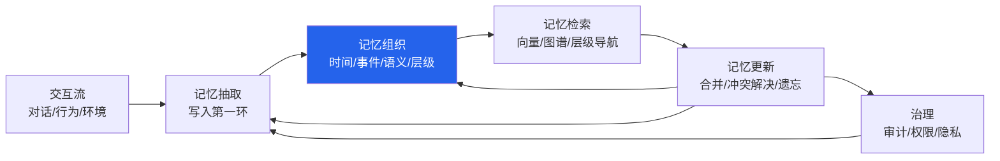
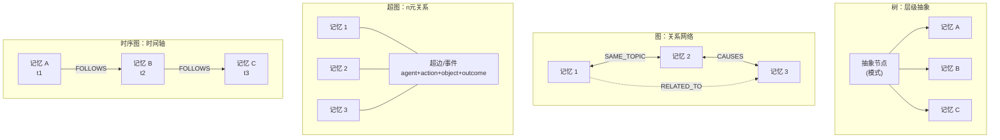
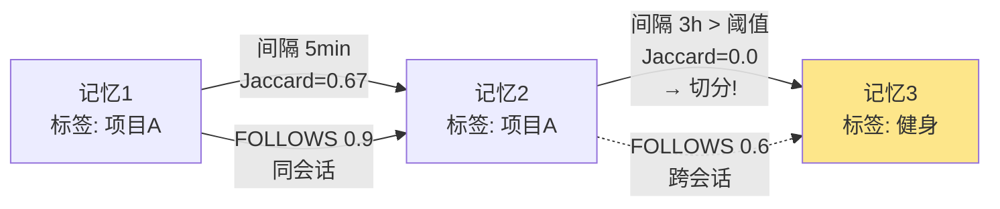
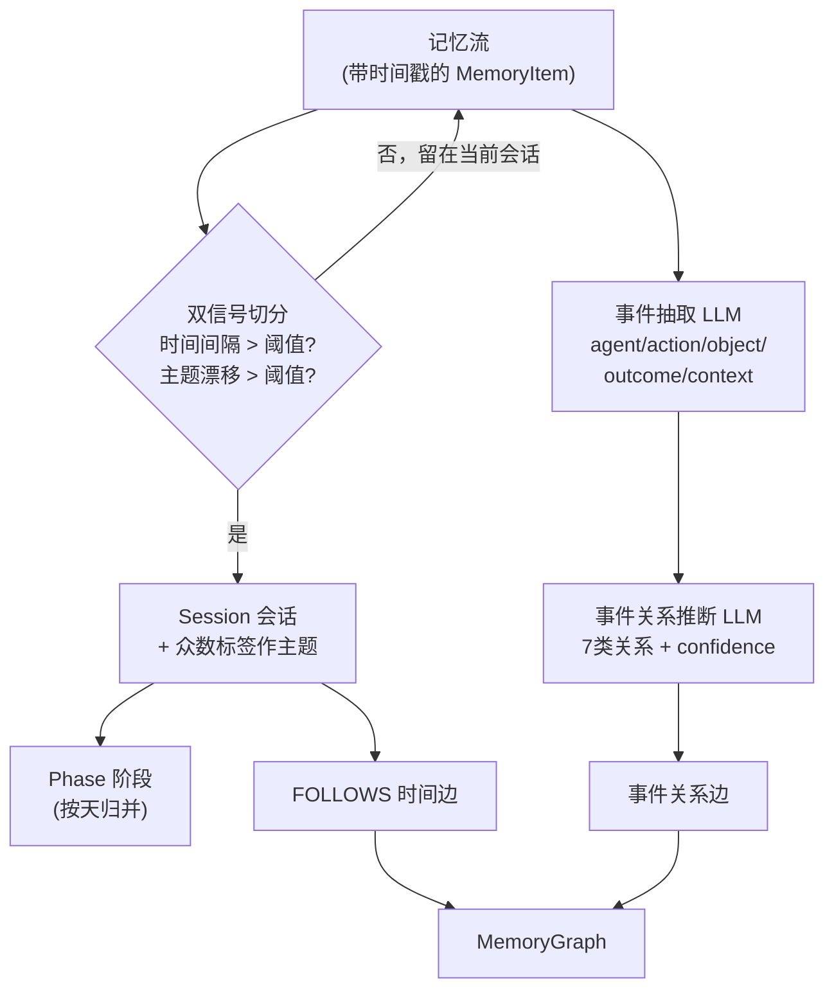
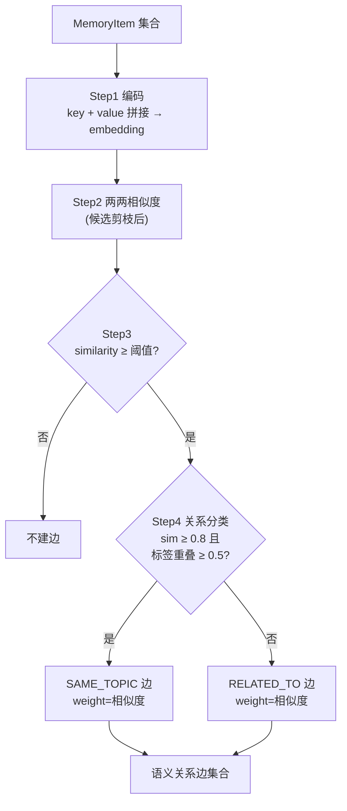
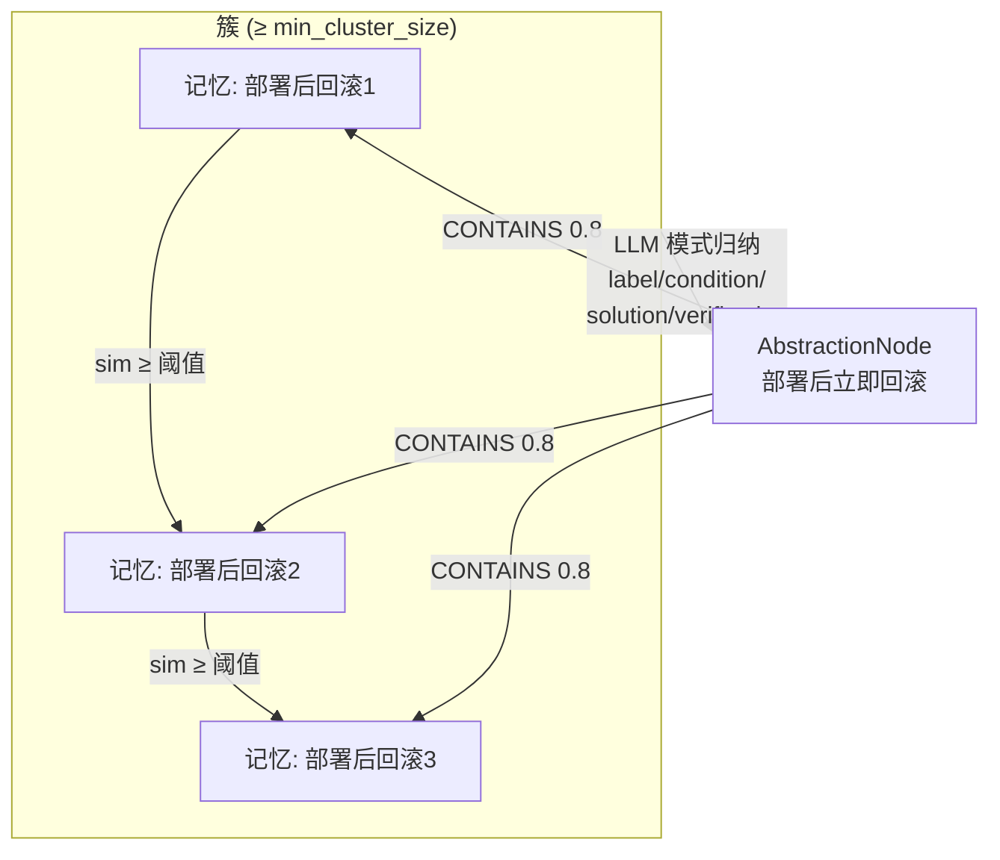
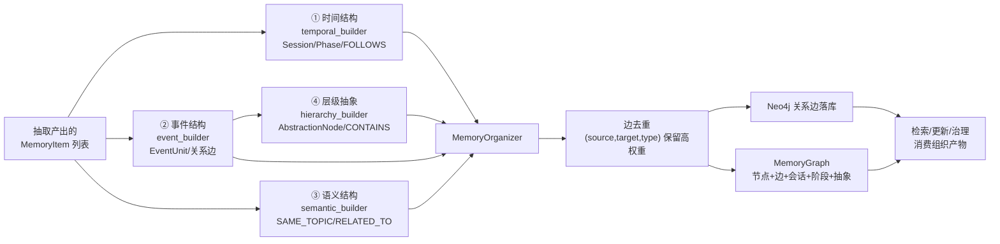

> 本文是「Agent 记忆系统」系列的第 5 篇，前作：
> [记忆抽取专题：从对话流到可检索的结构化记忆](/posts/memory-extraction/) ·
> [TencentDB Agent Memory：分层记忆系统深度解析](/posts/tencentdb-agent-memory-design/) ·
> [Agent 记忆系统漫游（OS）](/posts/agent-memory-os/) ·
> [Claude Code 记忆系统设计](/posts/claude-code-memory-system-design/)
>
> 本文理论框架与全部代码实现出自《记忆工程：智能体记忆系统构建与实践》（MemTensor/MemBook），
> 代码仓库：[github.com/MemTensor/MemBook](https://github.com/MemTensor/MemBook) `code/Chapter_5/`

## 内容地图

本文是「记忆组织」的完整专题。先给出一张内容地图，方便对照主题直接跳转：

| 章节 | 主题 | 一句话概括 |
| --- | --- | --- |
| 1 | 什么是记忆组织 | 定义、目标与在记忆生命周期中的位置 |
| 2 | 记忆的组织结构 | 树 / 图 / 超图 / 时序图四种形态与代表工作 |
| 3 | 时间结构与事件结构 | 相似度+主题驱动的会话分割、事件抽取、LLM 关系推理实践 |
| 4 | 语义结构与关系建模 | 轻标签层与槽位层、结构化关系建模的完整步骤 |
| 5 | 层级化与抽象建模 | 聚类聚合 → 模式归纳 → 抽象边的算法细节 |
| 6 | 整合：MemoryOrganizer 流水线 | 四条组织线索如何串成一条流水线 |
| 7 | 结构 × 论文 × 代码对照 | 全文映射表与落地建议 |

---

## 1. 什么是记忆组织

### 1.1 定义

**记忆组织（Memory Organization）** 是指：将抽取出来的零散记忆条目，按照**时间、事件、语义、层级**四条线索，构建成**可推理的结构**（树、图、超图、时序图）的过程。

上一篇文章讲的是记忆抽取——把对话流变成结构化记忆条目。但抽取的产物是一条条**孤立**的 `MemoryItem`：它们各自是完整的、可检索的，却互相之间没有关系。没有关系的记忆库，本质上还是一个「大向量池子」——检索时只能靠 embedding 相似度打捞，回答不了「这件事之后发生了什么」「这两个偏好矛盾吗」「用户反复遇到的是什么问题」这类需要**跨记忆推理**的问题。

组织要做的事，就是把「点」连成「线、面、体」：

- **时间线**：这条记忆发生在哪段对话、哪个阶段？
- **事件链**：这些记忆描述了同一个事件的什么要素？事件之间是因果、依赖还是承接？
- **语义网**：哪些记忆在讲同一主题？相似度多高？
- **抽象层**：这批反复出现的相似记忆，能不能归纳出一条可复用的经验/模式？

一句话：**抽取决定了一个 Agent 能记住什么，组织决定了它能「想通」什么。**

### 1.2 在记忆生命周期中的位置

记忆系统的完整生命周期是「写入 → 组织 → 检索 → 更新 → 治理」。抽取属于**写入**，组织紧随其后，且是检索的前置条件：



组织在两条链路上都起作用：

1. **检索侧**：组织产出的边（FOLLOWS、CAUSES、SAME_TOPIC、CONTAINS）让检索从「打向量」升级为「导航图谱」——向量召回起点，图遍历做扩展，层级抽象做剪枝。
2. **更新侧**：更新的第一步（找相关记忆、判冲突）依赖组织好的结构；第 7 章的合并/冲突解决，本质上是**对组织产物的再组织**。

### 1.3 组织的三个目标

| 目标 | 含义 | 缺失时的后果 |
| --- | --- | --- |
| **可检索性** | 记忆能被快速、精确地定位 | 只能靠全库向量扫描，召回噪声大 |
| **可关联性** | 记忆之间能发现并表达关系 | 无法回答因果、依赖、主题聚合类问题 |
| **可抽象性** | 从具体记忆沉淀出可复用模式 | 同样的错误反复犯，经验无法跨场景迁移 |

### 1.4 四条组织线索

《记忆工程》第 5 章把组织拆成四条正交的线索，每条线索对应一个构建器：

| 线索 | 回答的问题 | 数据结构 | 构建器 |
| --- | --- | --- | --- |
| 时间结构 | 什么时候发生的？ | Session / Phase | `temporal_builder.py` |
| 事件结构 | 发生了什么？要素是什么？事件间什么关系？ | EventUnit + 关系边 | `event_builder.py` |
| 语义结构 | 讲的是什么？和谁相似？ | 语义边（SAME_TOPIC / RELATED_TO） | `semantic_builder.py` |
| 层级结构 | 能抽象到什么程度？ | AbstractionNode（CONTAINS 边） | `hierarchy_builder.py` |

四条线索最终汇聚成一个 `MemoryGraph`——一个同时包含记忆节点、多种关系边、会话/阶段容器、抽象节点的复合结构。下面从「四种组织结构形态」讲起，再逐条深入。

---

## 2. 记忆的组织结构：四种形态

在进入代码之前，先建立理论坐标系。Agent 记忆系统在文献中呈现为四种典型组织结构：**树、图、超图、时序图**。它们不是互斥的——成熟系统往往是它们的组合（比如「图 + 时序」或「树 + 图」）。

### 2.1 树：层级索引与递归抽象

**概念**：树结构让「父节点概括子节点」。检索从根出发逐层剪枝，成本从 O(n) 降到 O(log n)；抽象层自上而下越来越具体。

代表工作（均在库内）：

- **RAPTOR**（Recursive Abstractive Processing for Tree-Organized Retrieval，2024，E 集合）：对文档递归聚类 + 摘要，构建多层树。检索时在树的不同层并行查找，低层管细节、高层管主题。这是「树 = 递归抽象」最典型的实现。
- **HNSW**（Hierarchical Navigable Small World，E 集合）：分层可导航小世界图。上层是稀疏的「远跳」边，下层是稠密的「近邻」边——本质上是**用多层图模拟树的分层剪枝**，是向量检索的事实标准。
- **MemGPT**（Towards LLMs as Operating Systems，2023，F 集合）：主上下文 / 档案存储 / 召回存储三层，加上「上下文换页」机制——把树的分层变成 OS 的内存层级。它证明**层级不是存储的花哨，而是上下文预算的刚需**。

树的短板：**关系表达弱**。兄弟节点之间没有边，「A 的两次失败经历」之间无法直接关联——关系只能通过共同的父节点间接表达。

### 2.2 图：关系网络

**概念**：节点 = 记忆/实体，边 = 关系（因果、依赖、同主题、引用……）。图是最接近「记忆即关联」直觉的结构，也是当前 Agent 记忆的主流形态。

代表工作（均在库内）：

- **Generative Agents**（Interactive Simulacra of Human Behavior，2023，A/F 集合）：记忆流（memory stream）按时间戳存储全部观察，检索时按**近期性 × 重要性 × 相关性**打分——图（关系）+ 时间（近期性）的早期融合。反思（reflection）则是对记忆流的**高层抽象**，是层级线索的雏形。
- **A-MEM**（Agentic Memory for LLM Agents，2025，F 集合）：Zettelkasten 式笔记系统。每条新记忆由 LLM 判断与哪些既有笔记「相关」，自动建立双向链接——**边的建立完全交给大模型的关系推理**，这正是本文第 3.5 节实践的思想源头。
- **Mem0**（Building Production-Ready AI Agents with Scalable Long-Term Memory，2025，F 集合）：抽取时让 LLM 输出实体 + 关系（`user → relationship → entity` 三元组），记忆库本质是一个持续演化的知识图。
- **HippoRAG**（Neurobiologically Inspired Long-Term Memory for LLMs，2024，E 集合）：用 LLM 做开放信息抽取（OpenIE）从文本建知识图，检索时跑 **Personalized PageRank**——把「语义相似度检索」升级为「图上多跳推理」。神经海马体类比：新皮层（LLM）建图，海马体（PPR）做索引与回放。

图的短板：**边爆炸与噪声**。全对全建边是 O(n²)，边一多，检索和更新都要面对「边的通胀」；需要阈值、类型约束和去重来治理。

### 2.3 超图：n 元关系

**概念**：普通图的边连接**两个**节点；超图的**超边（hyperedge）可以连接任意多个节点**。一次会议、一个群体、一个多因素事件——这类 n 元关系用普通图要拆成多个二元边（丢失整体性），超边一次表达。

库内暂无超图记忆论文，但有一个重要的外部参照：

- **Memoria**（Resolving Fateful Forgetting Problem through Human-Inspired Memory Architecture，arXiv:2310.03052）：以**超图**作为记忆的底层结构，配合 Hebbian 学习更新边权——记忆被组织成「事件超边」的集合，节点是实体与概念，超边是一次次具体经历。这是超图形态最完整的一套工程实践。

有趣的是，本文要讲的《记忆工程》代码里，**事件单元（EventUnit）的槽位结构就是一条「隐性超边」**：`agent + action + object + outcome + context` 五个槽位一次绑定了主体、动作、对象、结果、上下文——这在语义上正是 n 元关系。用普通图表达它，要拆成 agent→action、action→object、action→outcome 至少三条二元边；而槽位化的 EventUnit 天然保持整体性。

超图的短板：**工程生态不成熟**。没有像 Neo4j 这样成熟的超图数据库，聚类、检索、更新的算法也比普通图复杂，所以当前 Agent 记忆系统更多用「槽位化事件 + 普通图」的组合来近似超图能力。

### 2.4 时序图：时间轴上的记忆

**概念**：时序图 = 图 + 时间语义。有两种形态：①节点按时间组织（记忆流、时间线）；②边带时间属性（follows、发生在……之后）。

代表工作（均在库内）：

- **MemoryBank**（Enhancing Large Language Models with Long-Term Memory，2023，F 集合）：**时间感知**的记忆库——每条记忆带时间戳，用 **Ebbinghaus 遗忘曲线**驱动「记多久、什么时候该被遗忘/强化」。时间在这里不是装饰，而是记忆生命周期的调度器。
- **Generative Agents**：记忆流本身就是一条时间线，检索的「近期性」分量就是时间轴上的衰减函数。
- **MemGPT**：上下文换页本质是时间分层——新近的留在主上下文，久远的换到档案存储，时间决定记忆在层级中的位置。

《记忆工程》代码里时序结构有两级容器（Session 会话 / Phase 阶段）+ 一种时间边（FOLLOWS），第 3 节详解。

### 2.5 代码落地：四结构合一的数据模型

理论的四种形态，在 `code/Chapter_5/data_structures.py` 里收敛为一个复合结构。这个文件定义了组织层全部的「积木」：

```python
@dataclass
class Session:
    """会话/片段：时间连续的记忆集合"""
    session_id: str
    memory_ids: List[str]
    start_time: str
    end_time: str
    topic: Optional[str] = None

@dataclass
class Phase:
    """阶段：更高层次的时间划分"""
    phase_id: str
    label: str
    session_ids: List[str]
    start_time: str
    end_time: str
    summary: Optional[str] = None

@dataclass
class EventUnit:
    """事件单元：结构化的事件表示（五槽位 = 隐性超边）"""
    event_id: str
    agent: Optional[str]        # 执行主体
    action: str                 # 动作
    object: Optional[str]       # 作用对象
    outcome: Optional[str]      # 结果
    context: Optional[str]      # 上下文
    timestamp: str
    source_memory_id: str
    confidence: float = 0.9

@dataclass
class AbstractionNode:
    """抽象节点：从具体案例中提炼的模式"""
    node_id: str
    label: str
    condition: str
    solution: str
    verification: str
    support_ids: List[str]
    confidence: float = 0.8

@dataclass
class MemoryGraph:
    """记忆图谱：整合所有组织结构的完整图"""
    memories: Dict[str, MemoryItem]
    edges: List[Edge]
    sessions: List[Session]
    phases: List[Phase]
    abstractions: Dict[str, AbstractionNode]
```

结构到代码的映射：

| 组织结构 | 代码载体 | 说明 |
| --- | --- | --- |
| 时序图 | `Session` / `Phase` + FOLLOWS 边 | 两级时间容器 + 时间先后边 |
| 图 | `MemoryGraph.edges` | 统一的关系边集合（语义/事件/时间/抽象四类边共存） |
| 超图（近似） | `EventUnit` 五槽位 | n 元事件一次表达，作为隐性超边 |
| 树 | `AbstractionNode` + CONTAINS 边 | 抽象节点向下连接支撑记忆，构成层次 |



四种形态的取舍一句话总结：**树管效率（剪枝）、图管关系（关联）、超图管整体（n元）、时序图管演化（先后）**。MemBook 的组织器把四者织进一张 `MemoryGraph`。

---

## 3. 时间结构与事件结构

时间结构和事件结构是组织的第一条主线。它的核心问题：**一堆带时间戳的记忆，怎么切分成有意义的单元？单元之间怎么建立关系？**

### 3.1 会话切分：双信号分割算法

`temporal_builder.py` 的 `_segment_into_sessions` 实现了「会话切分」：把记忆流按**时间间隔**与**主题漂移**两个信号切成一个个会话（Session）。这正是用户问题里「通过相似度以及主题对记忆分割」的代码实现——主题用**标签重叠度**度量，相似度则体现在语义建边（第 4 节）。

```python
def _segment_into_sessions(self, memories: List[MemoryItem]) -> List[Session]:
    # 按时间排序
    sorted_memories = sorted(memories, key=lambda m: m.created_at)

    sessions = []
    current_session_memories = [sorted_memories[0]]

    for i in range(1, len(sorted_memories)):
        prev_memory = sorted_memories[i - 1]
        curr_memory = sorted_memories[i]

        # 计算时间间隔（分钟）
        prev_time = datetime.fromisoformat(prev_memory.created_at.replace('Z', ''))
        curr_time = datetime.fromisoformat(curr_memory.created_at.replace('Z', ''))
        time_gap = (curr_time - prev_time).total_seconds() / 60

        # 信号 1：时间间隔超过阈值 → 切分
        time_break = time_gap > self.config.time_threshold_minutes

        # 信号 2：主题漂移（标签重叠度低于阈值）→ 切分
        prev_tags = set(prev_memory.tags)
        curr_tags = set(curr_memory.tags)
        overlap = len(prev_tags & curr_tags) / max(len(prev_tags | curr_tags), 1)
        topic_break = overlap < self.config.topic_drift_threshold

        if time_break or topic_break:
            session = self._create_session(current_session_memories)
            sessions.append(session)
            current_session_memories = [curr_memory]
        else:
            current_session_memories.append(curr_memory)

    if current_session_memories:
        sessions.append(self._create_session(current_session_memories))
    return sessions
```

算法逐行拆解：

| 步骤 | 细节 | 设计意图 |
| --- | --- | --- |
| 1. 按时间排序 | `sorted(memories, key=created_at)` | 把无序的记忆流还原成时间线 |
| 2. 相邻记忆计算时间间隔 | 解析 ISO 时间戳，转分钟 | 时间间隔是「叙事连续性」的第一信号 |
| 3. 信号 1：时间断裂 | `time_gap > time_threshold_minutes` 则切分 | 隔了很久的两条记忆大概率不属于同一叙事 |
| 4. 信号 2：主题漂移 | 标签集合的 **Jaccard 重叠度**（交集/并集）低于 `topic_drift_threshold` 则切分 | 标签重叠度高 = 主题一致；即使时间连续，话题变了也该换会话 |
| 5. 任一信号触发即切分 | `time_break or topic_break` | 双信号是 OR 关系，宁可多切不可漏切 |
| 6. 会话主题 | 取会话内出现次数最多的标签 | 为后续 Phase 归并和语义检索提供锚点 |

**「找出部分主题或前后叙事一致的记忆」在这里的精确含义**：

- **主题一致** → 标签重叠度高（Jaccard ≥ 阈值）的记忆被留在同一会话；
- **前后叙事一致** → 时间间隔小（≤ 阈值）的记忆被留在同一会话。

阈值是两个可配置旋钮：`time_threshold_minutes`（时间容差）和 `topic_drift_threshold`（主题敏感度）。`time_threshold_minutes` 调大 → 会话变长更聚合；`topic_drift_threshold` 调高 → 对话题切换更敏感、会话切得更碎。具体默认值定义在书的 `OrganizationConfig` 中，工程上典型取值是 30 分钟 / 0.3 左右，需要按应用节奏标定（个人助理 vs 客服的对话密度完全不同）。

### 3.2 阶段构建：会话 → 阶段

会话之上还有一级：**阶段（Phase）**。`_build_phases` 把会话按天归并成阶段，为记忆提供「更粗的时间坐标」：

```python
def _build_phases(self, sessions: List[Session]) -> List[Phase]:
    # 简化：每天作为一个阶段
    day_groups = defaultdict(list)
    for session in sessions:
        day = datetime.fromisoformat(session.start_time.replace('Z', '')).date()
        day_groups[day].append(session)

    phases = []
    for day, day_sessions in sorted(day_groups.items()):
        phase = Phase(
            phase_id=generate_id(),
            label=f"Phase_{day.isoformat()}",
            session_ids=[s.session_id for s in day_sessions],
            start_time=min(s.start_time for s in day_sessions),
            end_time=max(s.end_time for s in day_sessions),
            summary=f"包含{len(day_sessions)}个会话"
        )
        phases.append(phase)
    return phases
```

这里「按天」是最简实现（书的原文是「简化」）。生产上可以换成：按主题切换（一个长项目期）、按目标达成（一个任务从开始到完成）、按日历周期（周/月）。阶段的价值是给「什么时候」提供一个**可被检索的粗粒度锚点**——「三月份那次重构」比「3 月 17 日 14:23 那条记录」更符合人类的回忆方式。

### 3.3 时间边：FOLLOWS 关系

时间结构最后产出一种关系边——`FOLLOWS`（后随），把时间相邻、语义可能相关的记忆串成链：

```python
def _get_temporal_edges(self, memories: List[MemoryItem]) -> List[Edge]:
    edges = []
    sorted_memories = sorted(memories, key=lambda m: m.created_at)

    for i in range(len(sorted_memories) - 1):
        curr = sorted_memories[i]
        next_mem = sorted_memories[i + 1]
        time_gap_minutes = ...  # 相邻记忆的时间间隔

        # 在时间阈值内建立边（窗口放宽到 2 倍阈值）
        if time_gap_minutes <= self.config.time_threshold_minutes * 2:
            same_session = self.memory_to_session.get(curr.id) == self.memory_to_session.get(next_mem.id)
            weight = 0.9 if same_session else 0.6
            edge = Edge(
                source_id=curr.id,
                target_id=next_mem.id,
                relation_type=RelationType.FOLLOWS.value,
                weight=weight,
                metadata={"type": "temporal", "same_session": same_session}
            )
            edges.append(edge)
    return edges
```

两个工程细节值得记住：

1. **窗口放宽到 2 倍阈值**：会话切分用 1 倍阈值，建边放宽到 2 倍——切分要「保守」（避免把不同叙事混进一个会话），建边要「慷慨」（跨会话但时间近的记忆也可能相关，用低权重表达不确定性）。
2. **权重即置信度**：同会话内 FOLLOWS 权重 0.9（高置信），跨会话 0.6（低置信）。边权重统一进 `Edge.weight`，后续检索、去重、更新都能用同一个标量做决策。



### 3.4 事件抽取：LLM 槽位填充

时间结构回答「什么时候」，事件结构回答「发生了什么」。`event_builder.py` 分两步：先**抽取事件要素**，再**推断事件关系**。

抽取用 LLM 把一条记忆填充成 `EventUnit` 五槽位（`agent / action / object / outcome / context`），prompt 见 `organization_prompts.py` 的 `EVENT_EXTRACTION_PROMPT`：

```text
Extract event elements from the following memory.

Memory content: {memory_value}

Output JSON format:
{
    "agent": "Executing entity (e.g., user, system, someone)",
    "action": "Action",
    "object": "Target object",
    "outcome": "Result",
    "context": "Context"
}

If unable to extract a valid event, return: {"valid": false}

Output JSON only.
```

LLM 失败（解析失败或返回 `valid: false`）时，回退到关键词规则抽取：

```python
def _rule_based_extract(self, memory: MemoryItem) -> EventUnit:
    keywords = {
        "喜欢": ("用户", "表达偏好"),
        "不喜欢": ("用户", "表达偏好"),
        "完成": ("用户", "完成任务"),
        "计划": ("用户", "制定计划"),
        "工作": ("用户", "工作相关"),
    }
    for keyword, (ag, act) in keywords.items():
        if keyword in text:
            agent, action = ag, act
            break
    return EventUnit(agent=agent, action=action, ...)
```

设计要点：**LLM 优先，规则兜底**。规则版永远能出结果（哪怕是粗粒度的「用户 + 记录」），保证事件结构在任何条件下都不会断供——这是生产系统里「智能管道 + 确定性退路」的标准姿势。

### 3.5 事件关系推断：用大模型做关系推理的实践

这是「如何建立边关系」的核心实践。抽取完事件后，`_infer_event_relations` 对**时间序相邻窗口内**的事件两两配对，交给 LLM 判断关系类型：

```python
def _infer_event_relations(self, events: List[EventUnit]) -> List[Edge]:
    edges = []
    sorted_events = sorted(events, key=lambda e: e.timestamp)

    for i, event_a in enumerate(sorted_events):
        for j in range(i + 1, min(i + 5, len(sorted_events))):   # 时间窗内配对
            event_b = sorted_events[j]
            relation_type, confidence = self._infer_relation(event_a, event_b)
            if confidence >= 0.5:                                 # 置信度门槛
                edges.append(Edge(
                    source_id=event_a.source_memory_id,
                    target_id=event_b.source_memory_id,
                    relation_type=relation_type,
                    weight=confidence,
                    metadata={"type": "event"}
                ))
    return edges
```

配对策略：按时间排序后，**每个事件只与后面最多 4 个事件配对**（窗口 i+1..i+4）。为什么是窗口而不是全对全？

- **语义合理性**：因果、依赖、解决类关系只发生在时间相近的事件之间，隔了 20 条记忆的两件事不太可能有直接关系；
- **复杂度控制**：把 O(n²) 压到 O(n·w)（w=4 是常数），LLM 调用次数从 n²/2 降到 ~2n；
- **可扩展性**：窗口大小是关系召回与成本的旋钮。

关系类型是一个**封闭集合**——LLM 只能从中选，不能发明新类型。完整的关系推断 prompt（`_llm_infer_relation`）：

```text
Given two events in chronological order, determine if there is a semantic relationship between them.

Event A:
- {event_a_msg}

Event B:
- {event_b_msg}

Please determine:
1. Did Event A cause Event B? (causes - causal relationship)
2. Does Event B resolve the problem described in Event A? (resolves - resolution relationship)
3. Does Event B depend on Event A? (depends_on - dependency relationship)
4. Do both belong to the same topic? (same_topic - topic relationship)
5. Does Event A contain Event B? (contains - containment relationship)
6. Is there only a general association? (related_to - association relationship)
7. Is there only temporal sequence without semantic association? (follows - temporal relationship)

Output JSON format:
{"relation": "causes/resolves/depends_on/same_topic/contains/related_to/follows", "confidence": 0.0-1.0, "reasoning": "brief explanation of judgment basis"}

Output JSON only.
```

这里把「七种关系」全部翻译成了**布尔判断题**，一次调用输出一个 JSON：

| 关系 | 含义 | 典型例子 |
| --- | --- | --- |
| `causes` | A 导致 B | 上线了新版 → 用户报 bug |
| `resolves` | B 解决了 A 的问题 | 报了 bug → 修复并回滚 |
| `depends_on` | B 依赖 A | 定了方案 → 开始实现 |
| `same_topic` | 同主题 | 两次都在聊迁移方案 |
| `contains` | A 包含 B | 项目启动会 → 确认了排期 |
| `related_to` | 一般关联 | 弱相关兜底 |
| `follows` | 只有时间先后，无语义关联 | 两个无关话题的闲聊 |

**大模型关系推理的四个工程要点**（这也是实践中最容易踩的坑）：

1. **封闭类型集合**：把开放的关系空间压缩成 7 类。LLM 输出后还要校验 `relation` 是否在合法集合内，不在则回退 `related_to`——防止模型发明关系类型污染图结构。
2. **置信度门槛**：`confidence >= 0.5` 才建边。LLM 自我怀疑的关系（0.3 分）宁可不建，避免边噪声。
3. **强制输出 reasoning**：让模型解释判断依据。边入库时 `reasoning` 可随 metadata 保存，为「这条边为什么存在」留审计线索——第 12 章的治理环节会用到。
4. **规则兜底**：LLM 调用失败时回退到规则推断：

```python
def _rule_based_infer_relation(self, event_a, event_b):
    action_a = event_a.action.lower() if event_a.action else ""
    action_b = event_b.action.lower() if event_b.action else ""

    # 因果关系：计划 → 完成/执行
    if "计划" in action_a and ("完成" in action_b or "执行" in action_b):
        return RelationType.CAUSES.value, 0.8
    # 解决关系：问题 → 解决
    if "问题" in action_a and "解决" in action_b:
        return RelationType.RESOLVES.value, 0.85
    # 依赖关系
    if "需要" in action_b or "依赖" in action_b:
        return RelationType.DEPENDS_ON.value, 0.7
    # 默认时序关系
    return RelationType.FOLLOWS.value, 0.6
```

这套「LLM 为主、规则兜底、窗口配对、置信度门槛、reasoning 留痕」的组合，就是《记忆工程》给出的大模型关系推理生产范式。A-MEM 把「边该不该建」也交给 LLM 判断（每个新 note 检索 top-k 相关 note，LLM 决定建哪些双向链接），与这里的思路一脉相承，区别只在 A-MEM 是**全库范围**的关系推理，MemBook 是**时间窗口内**的关系推理——前者关系更全、成本更高，后者更省、更聚焦叙事链。

### 3.6 时间与事件结构的论文对照

| 论文 | 时间/事件机制的贡献 | 与本章代码的对应 |
| --- | --- | --- |
| MemoryBank（2023，F 集合） | Ebbinghaus 遗忘曲线驱动记忆的巩固与遗忘 | 时间在这里是**调度器**；MemBook 用 Session/Phase 做组织，遗忘留给第 7 章 |
| Generative Agents（2023，A/F 集合） | 记忆流时间戳 + 检索评分（近期性×重要性×相关性） | 「近期性」就是时间结构在检索侧的消费方式 |
| MemGPT（2023，F 集合） | 上下文换页 = 时间分层 | Phase 是显式的粗粒度时间容器，MemGPT 把它变成隐式的存储层级 |
| A-MEM（2025，F 集合） | LLM 判断记忆间链接（时间戳 + 语义） | 3.5 节 LLM 关系推理的近亲 |



---

## 4. 语义结构与关系建模

第二条主线是语义。时间结构告诉你「何时」，语义结构告诉你「讲的是什么、和谁相关」。这一节对应 `semantic_builder.py`，以及《记忆工程》语义结构化的两个核心概念：**轻标签层**与**槽位层**。

### 4.1 轻标签层：作用与价值

「轻标签层」就是记忆条目上的 `tags`——抽取时由 LLM 顺带产出的短标签（第 4 章抽取 JSON 里的 `tags[]` 字段）。它「轻」在：不像 embedding 需要计算、不像槽位需要 schema，就是几个词。

**作用（它出现在组织器的哪些地方）**：

| 使用场景 | 代码位置 | 用法 |
| --- | --- | --- |
| 会话切分的主题漂移检测 | `temporal_builder._segment_into_sessions` | 相邻记忆标签的 Jaccard 重叠度 |
| 会话主题提取 | `temporal_builder._create_session` | 会话内出现次数最多的标签作 `session.topic` |
| 语义关系分类 | `semantic_builder._classify_relation` | 相似度高的记忆还要看标签重叠度才能判 `SAME_TOPIC` |
| 检索过滤（下游） | 第 6 章检索器 | 标签作为结构化过滤条件，先按标签筛再按向量排 |

**价值（为什么需要它，而不是只用 embedding）**：

1. **零成本**：抽取时 LLM 已经读了文本，多输出几个标签几乎不增加调用成本；而 embedding 每次都要单独算。
2. **精确命中**：向量是「模糊相似」，标签是「精确相等」。「用户想找『那次聊健身』的记录」——标签 `健身` 一次命中，向量还要排相关性。
3. **可解释**：标签是人可读的，能直接展示「这条记忆为什么和那条归为一组」；embedding 的相似度分数解释性弱。
4. **跨语言**：标签是语义锚点，中英文混杂的记忆用中文标签也能对齐；embedding 跨语言需要专门的双语模型。
5. **组织器的免费燃料**：上面的四个使用场景全部零成本复用标签——这是轻标签层最大的杠杆：**抽取时的一点点输出，组织时四处受益**。

轻标签层的设计原则：**标签宁少勿多、宁稳定勿花哨**。标签是组织器的信号源，标签体系漂移（同义反复换词）会让主题漂移检测失真——所以抽取提示词里要约束「复用已有标签、不发明同义词」。

### 4.2 槽位层：跨表述对齐

「槽位层」是把记忆内容对齐到**固定 schema 的槽位**。在代码里就是 `EventUnit` 的 `agent / action / object / outcome / context` 五个槽位。

**跨表述对齐（Cross-Expression Alignment）**是槽位层的核心价值。同一个事件，不同时间、不同人、不同语言可能有完全不同的表述：

| 原始表述 | 槽位化结果（对齐后） |
| --- | --- |
| 「我昨天把项目提交了」 | agent=用户, action=提交, object=项目 |
| 「Tom completed the project submission yesterday」 | agent=Tom, action=提交, object=项目 |
| 「昨天搞定了，项目已经交上去」 | agent=用户, action=提交, object=项目 |

三种表述表面完全不同，但填进槽位后**结构一致**。对齐带来三个直接收益：

1. **去重与合并的前提**（第 7 章更新器）：两条槽位一致的记忆，才谈得上「这是同一件事的重复记录」；
2. **关系推断的干净输入**：第 3.5 节的关系推理 prompt 吃的就是格式化槽位（`agent action object, Result: ..., Context: ...`）——槽位把「一句话」变成「结构化事实」，LLM 判因果才不至于被表述干扰；
3. **结构化检索**：可以按槽位精确查询——「所有 action=提交 的事件」「所有 object=项目X 的记录」，这是纯向量检索做不到的。

**轻标签层 vs 槽位层的分工**：轻标签层是**开放集合的贴标**（任意词，不强制 schema，灵活）；槽位层是**封闭集合的填槽**（固定五个槽位，强制对齐）。前者负责「粗分类与索引」，后者负责「精确表示与对齐」；前者便宜但语义浅，后者贵但语义深。生产系统两者都要：**标签层做过滤与分组，槽位层做对齐与推理**。

### 4.3 结构化关系建模的步骤

`semantic_builder.py` 用纯向量方法（不调 LLM）为记忆建语义边。完整流程四步，每一步都值得拆开看：

```python
class SemanticStructureBuilder:
    def build(self, memories: List[MemoryItem]) -> List[Edge]:
        edges = []

        # Step 1：为每个记忆生成 embedding（如果没有）
        for mem in memories:
            if not mem.embedding:
                text = f"{mem.key} {mem.value}"
                mem.embedding = self.embedding.embed(text)

        # Step 2 & 3：两两计算相似度，超过阈值建边
        for i, mem_a in enumerate(memories):
            for j in range(i + 1, len(memories)):
                mem_b = memories[j]
                similarity = self.embedding.similarity(mem_a.embedding, mem_b.embedding)
                if similarity >= self.config.similarity_threshold:
                    # Step 4：判断关系类型
                    relation_type = self._classify_relation(mem_a, mem_b, similarity)
                    edges.append(Edge(
                        source_id=mem_a.id,
                        target_id=mem_b.id,
                        relation_type=relation_type,
                        weight=similarity,
                        metadata={"type": "semantic"}
                    ))
        return edges

    def _classify_relation(self, mem_a, mem_b, similarity) -> str:
        tags_a = set(mem_a.tags)
        tags_b = set(mem_b.tags)
        tag_overlap = len(tags_a & tags_b) / max(len(tags_a | tags_b), 1)
        if similarity >= 0.8 and tag_overlap >= 0.5:
            return RelationType.SAME_TOPIC.value   # 高相似 + 高标签重叠 = 同主题
        return RelationType.RELATED_TO.value        # 其余 = 一般相关
```

**Step 1：Embedding 生成——编码方式决定召回上限**

```python
text = f"{mem.key} {mem.value}"
```

`key` 是记忆的标题侧（第 4 章抽取时生成的短key），`value` 是内容侧。**key + value 拼接编码**是刻意设计：key 提供「主题锚点」，value 提供「细节」。只编码 value，相似度会被长文本里的细节噪声稀释；拼接后，同主题记忆即使细节不同，key 的相似度也能把分数托起来。这是抽取篇「片段级伪查询设计」思想的延续。

**Step 2：两两相似度——O(n²) 的成本现实**

```python
for i in range(len(memories)):
    for j in range(i + 1, len(memories)):
```

朴素全对全计算。n=1000 条记忆 → 约 50 万次相似度计算。工程现实：**必须做候选剪枝**——生产上先用标签过滤（轻标签层在这里二次立功）或 ANN 索引（HNSW）缩小候选集，再对候选算精确相似度。书里保留朴素实现是为了讲清楚语义，工程化时替换为「粗筛 + 精算」两段式。

**Step 3：阈值建边——稀疏性控制**

只有 `similarity >= similarity_threshold` 才建边。阈值是语义图的**密度旋钮**：调低 → 边变多（召回好、噪声大）；调高 → 边变少（图稀疏、关系少）。经验上 0.7 附近起步，按检索效果和边总量标定。

**Step 4：关系分类——「相似」不等于「同主题」**

```python
if similarity >= 0.8 and tag_overlap >= 0.5:
    return SAME_TOPIC
return RELATED_TO
```

这是全章最容易被忽略但最值得品的一步：**相似度是连续标量，关系类型是离散语义**。两条记忆向量相似度高，可能是因为「都在聊健身」，也可能只是因为「都是用户的自述」——所以 SAME_TOPIC 需要**双证据**：向量相似（≥0.8）+ 标签重叠（≥0.5）。轻标签层在此与向量层完成汇合：**向量证明「像」，标签证明「是一类」**。两条证据缺一条，只够判 `RELATED_TO`（弱关联）。



### 4.4 语义关系建模的论文对照

| 论文 | 语义关系的建模方式 | 对比 |
| --- | --- | --- |
| A-MEM（2025，F 集合） | 每条新记忆检索 top-k 相关笔记，LLM 判断建哪些链接 | 关系推理交给 LLM（准），成本高；MemBook 语义边用向量（快），事件边才用 LLM |
| Mem0（2025，F 集合） | LLM 抽取实体 + 关系三元组（`user → relationship → entity`） | 关系来自**抽取时**的结构化输出；MemBook 的关系来自**组织时**的相似度/LLM 推断——时机不同，各有取舍 |
| HippoRAG（2024，E 集合） | LLM OpenIE 建知识图，Personalized PageRank 检索 | 语义图 + 图算法导航的完整闭环；MemBook 的边分类（SAME_TOPIC/RELATED_TO）是它的轻量版 |
| Generative Agents（2023，A/F 集合） | 记忆流 + 检索评分 | 语义相似度只是三个评分分量之一（另有近期性、重要性） |

一个共同趋势：**2024-2025 年的工作越来越把「关系推理」交给 LLM，把「相似度」当粗筛**。MemBook 的混合策略（向量建语义边 + LLM 建事件边）是这一趋势里成本可控的工程落点。

---

## 5. 层级化与抽象建模

第三条主线是层级。时间/事件/语义都是在「同一层」组织记忆；层级化要回答的是：**反复出现的相似记忆，能不能向上归纳出一个「模式」？** 这是从「记住」到「学会」的关键一跃——对应 `hierarchy_builder.py`。

### 5.1 算法步骤

```python
class HierarchyBuilder:
    def build(self, memories, events=None):
        # 1. 聚合相似记忆（贪心聚类）
        clusters = self._aggregate_similar(memories)

        # 2. 生成抽象（LLM 模式归纳）
        for cluster in clusters:
            if len(cluster) >= self.config.min_cluster_size:
                abstraction = self._generate_abstraction(cluster, events or [])
                if abstraction:
                    self.abstractions[abstraction.node_id] = abstraction

        # 3. 生成抽象关系边（CONTAINS）
        edges = self._get_abstraction_edges()
        return self.abstractions, edges
```

**Step 1：聚合相似记忆——贪心聚类**

```python
def _aggregate_similar(self, memories):
    clusters = []
    used = set()

    for i, mem in enumerate(memories):
        if mem.id in used:
            continue
        cluster = [mem]
        used.add(mem.id)

        for j in range(i + 1, len(memories)):
            other = memories[j]
            if other.id in used:
                continue
            # 相似度达标就并入当前簇
            if mem.embedding and other.embedding:
                sim = self.embedding.similarity(mem.embedding, other.embedding)
                if sim >= self.config.abstraction_threshold:
                    cluster.append(other)
                    used.add(other.id)

        if len(cluster) >= self.config.min_cluster_size:
            clusters.append(cluster)
    return clusters
```

算法细节拆解：

| 要点 | 说明 |
| --- | --- |
| 贪心单遍 | 每个记忆只参与一次（`used` 集合防重复归簇）。不是 K-Means 式的迭代优化，胜在 O(n²) 内简单可控、结果可复现 |
| 阈值驱动 | `abstraction_threshold` 控制「多像才算同类」；`min_cluster_size` 控制「至少几条才值得抽象」 |
| 种子依赖 | 聚类结果依赖遍历顺序（第一个种子决定簇心）。工程上可以先按时间或重要性排序再聚类，让「最新的/最重要的」优先当种子 |
| 与语义建边的区别 | 第 4 节的语义边是**两两之间**的关系；这里是把**一组**记忆收拢成一个簇——从「关系」上升到「集合」 |

**Step 2：LLM 模式归纳——从案例到模式**

簇内的记忆被拼成列表，交给 LLM 提炼模式，prompt 见 `ABSTRACTION_PROMPT`：

```text
Extract a general pattern/rule from the following related memories.

Memory content:
{memory_contents}

Output JSON format:
{
    "label": "Pattern name",
    "condition": "Applicable conditions",
    "solution": "Recommended solution",
    "verification": "Verification method"
}

Output JSON only.
```

产出就是 `AbstractionNode` 的四要素：

| 字段 | 含义 | 例子（假设簇内是三次「部署后回滚」） |
| --- | --- | --- |
| `label` | 模式名 | 「部署后立即回滚」 |
| `condition` | 何时适用 | 当线上服务在部署后出现 5xx 且新版本无回退开关 |
| `solution` | 怎么做 | 保留上一版本镜像，30 秒内回滚并收集日志 |
| `verification` | 怎么验证 | 回滚后错误率回到基线、压测通过 |

注意这个结构的设计哲学：**不是「总结一段话」，而是「提炼一条可执行的规则」**。`condition → solution → verification` 恰好构成程序性记忆（procedural memory）的完整闭环——**什么情况下 → 做什么 → 怎么确认做对了**。这正是「经验」的定义：从 N 次具体案例中剥离出可复用的操作序列。

**Step 3：抽象边——CONTAINS 关系**

```python
def _get_abstraction_edges(self):
    edges = []
    for abs_id, abstraction in self.abstractions.items():
        for support_id in abstraction.support_ids:
            edges.append(Edge(
                source_id=abs_id,
                target_id=support_id,
                relation_type=RelationType.CONTAINS.value,   # 抽象节点包含支撑记忆
                weight=abstraction.confidence,
                metadata={"type": "abstraction", "pattern_label": abstraction.label}
            ))
    return edges
```

抽象节点指向它支撑的记忆（`support_ids`），关系是 `CONTAINS`，权重是抽象的置信度（默认 0.8）。这条边同时服务两个方向：

- **向下**（抽象 → 具体）：检索命中抽象节点时，可以下钻看支撑案例；
- **向上**（具体 → 抽象）：检索命中某条具体记忆时，可以上卷找到它所属的模式——「上次也是这么解决的」。



### 5.2 层级化的进阶方向

`hierarchy_builder` 只做**一层**抽象（记忆 → 模式）。生产系统可以递归：模式本身再聚类、再抽象，形成**多层抽象树**——这正是 RAPTOR 的做法（递归聚类 + 摘要）。MemBook 的 AbstractionNode 已经具备递归的接口（`support_ids` 指向任意节点，抽象节点也可以被更高层抽象包含），只是默认跑一层。

层级化还有一个值得注意的工程细节：**抽象要能撤回**。LLM 归纳的模式可能错误（模式幻觉——从巧合的相似里提炼出不存在的规律）。所以 AbstractionNode 保留了 `support_ids`（证据链）和 `confidence`：证据不足（簇小、置信度低）的抽象节点，检索时权重低；第 12 章的治理流程可以据此审计甚至删除。

### 5.3 层级化与抽象建模的论文对照

| 论文 | 抽象机制 | 与本章代码的对应 |
| --- | --- | --- |
| RAPTOR（2024，E 集合） | 递归聚类 + 摘要建树，多层检索 | `AbstractionNode` 的递归化版本 |
| Voyager（2023，G 集合） | 技能库：成功代码段验证后入库，新任务检索组合 | `AbstractionNode.solution` 就是「技能」的雏形，`verification` 对应它的「验证后入库」 |
| ExpeL（2023，G 集合） | 从成功轨迹中抽取经验规则，失败轨迹反例约束 | `condition` 字段对应的正是「什么场景适用」的规则前提 |
| G-Memory（2025，H 集合） | 多智能体系统的层级记忆追踪（个体 → 共享 → 全局） | 层级从「单智能体的记忆内」扩展到「多智能体的记忆间」 |
| ReMe（2025，G 集合） | 程序性记忆框架，随任务动态细化 | AbstractionNode 的程序性记忆定位（condition/solution/verification） |
| Agent Workflow Memory（2024，G 集合） | 从成功工作流中学习可复用流程 | 同上，「工作流记忆」就是抽象层的一种形态 |

### 5.4 地图路径算法的启发：抽象层 = 记忆的「高速公路」

用户知识库里有专门的「地图路径算法与 agent 启发」收藏（FT2R3VZ8），这里的映射非常直接——**记忆的层级化抽象，就是路径规划里的 Contraction Hierarchies（收缩层级）**：

| 地图路径算法 | 思想 | 记忆组织的对应 |
| --- | --- | --- |
| **Contraction Hierarchies**（Geisberger 2008） | 预计算把低层节点「收缩」进高层节点，检索在高层次网络「跳远」，低层网络只做首尾精细路径 | 抽象节点 = 记忆网络的「高速路」：查询先跳到抽象层定位大方向，再下钻具体记忆，检索路径从 O(n) 缩到 O(log n) |
| **Hub Labeling**（Abraham 2011） | 每个节点预存「到关键枢纽的距离」，查询时查表 | 抽象节点 + CONTAINS 边 = 记忆的枢纽标签，回答「这条记忆属于哪个模式」是查表而非遍历 |
| **A\***（Hart 1968） | 启发式函数引导搜索优先扩展有希望的方向 | 抽象层作为启发：先判「该查哪类模式」再查，剪掉无关分支 |
| **Dijkstra**（1959） | 朴素最短路径 | 无层级时的全图遍历——对应没有组织的纯向量库 |

类比要点：**层级化不是为了「好看」，是为了检索加速与经验复用**。记忆库规模增长后，全图遍历（Dijkstra 式）不可行；预计算抽象层（CH 式）是唯一可持续的路。反过来，抽象层的**维护成本**也和 CH 一样——新增记忆时要增量更新抽象（这也是第 7 章更新器与层级构建器需要协同的原因）。

---

## 6. 整合：MemoryOrganizer 流水线

四条线索讲完，看它们如何串成一条流水线。`organizer.py` 的 `MemoryOrganizer.run`：

```python
def run(self, memories: List[MemoryItem]) -> MemoryGraph:
    all_edges = []
    sessions, phases, abstractions, events = [], [], {}, []

    # 1. 时间结构
    if self.config.use_temporal:
        sessions, phases, temporal_edges = self.temporal_builder.build(memories)
        all_edges.extend(temporal_edges)

    # 2. 事件结构
    if self.config.use_event:
        events, event_edges = self.event_builder.build(memories)
        all_edges.extend(event_edges)

    # 3. 语义结构
    if self.config.use_semantic:
        semantic_edges = self.semantic_builder.build(memories)
        all_edges.extend(semantic_edges)

    # 4. 层级抽象（依赖事件，放在事件之后）
    if self.config.use_hierarchy:
        abstractions, abstraction_edges = self.hierarchy_builder.build(memories, events)
        all_edges.extend(abstraction_edges)

    # 5. 去重边（保留权重最高的）
    unique_edges = self._deduplicate_edges(all_edges)

    # 6. 保存边到数据库（Neo4j）
    if self.config.auto_save_edges:
        self._save_edges(unique_edges)

    graph = MemoryGraph(
        memories={m.id: m for m in memories},
        edges=unique_edges,
        sessions=sessions,
        phases=phases,
        abstractions=abstractions
    )
    return graph
```

流水线设计的四个关键决策：

1. **顺序即依赖**：时间结构最先（为事件提供会话上下文），事件结构其次（层级抽象要吃事件），层级抽象最后（依赖事件与语义的产物）。顺序不能乱。
2. **模块可开关**：`use_temporal / use_event / use_semantic / use_hierarchy` 四个开关——按场景裁剪成本。第 13 章笔记本里演示就是 `use_hierarchy=False` 的简化版。
3. **边去重**：不同构建器可能产出同一条边（比如时间 FOLLOWS 与事件 follows 撞车）。`_deduplicate_edges` 按 `(source, target, relation_type)` 去重，**保留权重最高**的——多信号互相增强，而不是互相打架。
4. **图数据库落库**：边统一写进 Neo4j（`get_neo4j_client().save_edge`），与抽取阶段的向量库（Milvus）形成双写：**向量库管「语义召回」，Neo4j 管「关系导航」**。



完整链路（第 13 章笔记本的 MemoryPipelineRunner）：对话 → 抽取 → 更新决策（ADD/MERGE/OVERWRITE/VERSION/IGNORE）→ 统一存储（Neo4j+Milvus 双写）→ **记忆组织** → 检索回答。组织在存储与检索之间，是「让存储可被高效消费」的枢纽。

---

## 7. 结构 × 论文 × 代码对照与总结

### 7.1 全文映射表

| 组织维度 | 数据结构 | 关键算法 | 代表论文（库内） | 代码模块 |
| --- | --- | --- | --- | --- |
| 时间结构 | Session / Phase | 双信号会话切分（时间间隔 + 标签 Jaccard）、按天归并阶段 | MemoryBank、Generative Agents、MemGPT | `temporal_builder.py` |
| 事件结构 | EventUnit（五槽位） | LLM 槽位抽取、窗口内 LLM 关系推断（7 类 + 置信度 + 规则兜底） | A-MEM、Generative Agents | `event_builder.py` |
| 语义结构 | 语义边 | embedding 编码 → 两两相似度 → 阈值建边 → 双证据关系分类 | HippoRAG、Mem0、A-MEM | `semantic_builder.py` |
| 层级抽象 | AbstractionNode | 贪心聚类 → LLM 模式归纳（condition/solution/verification）→ CONTAINS 边 | RAPTOR、Voyager、ExpeL、G-Memory、ReMe | `hierarchy_builder.py` |
| 整合 | MemoryGraph | 四阶段流水线 + 边去重 + Neo4j 落库 | 地图路径算法启发（CH/A*） | `organizer.py` |

### 7.2 总结：组织是「检索」与「更新」的地基

回到开篇的三个目标：

1. **可检索性**由时间（Session/Phase 锚点）+ 语义（SAME_TOPIC/RELATED_TO 边）+ 层级（抽象节点）共同支撑——检索不再是全库打向量，而是「定位容器 → 语义召回 → 图导航 → 层级剪枝」；
2. **可关联性**由事件结构承载——LLM 关系推理产出的 causes / resolves / depends_on / same_topic / contains 边，让记忆能回答「之后发生了什么」「这事为什么发生」；
3. **可抽象性**由层级结构承载——从具体案例到可执行模式，Agent 才真正开始「积累经验」而不是「堆积记录」。

两条最重要的工程心法：

- **轻标签层是组织器的免费燃料**：抽取时多输出几个标签，切分、分类、聚类、检索四处受益。组织器的所有「便宜算法」都建立在标签之上——这是全书性价比最高的一笔投入。
- **LLM 关系推理要设「护栏」**：封闭类型集合 + 置信度门槛 + reasoning 留痕 + 规则兜底。把大模型的判断力用在刀刃上（事件关系、模式归纳），把确定性留给向量与规则（语义边、切分）——**智能做判断，算法做执行**。

下一篇将进入「记忆检索」——组织好的结构，如何在正确的时刻被取回。

---

*本文代码出处：《记忆工程》第 5 章（MemTensor/MemBook, `code/Chapter_5/`）；论文解析均来自个人 Zotero 记忆论文库（memory 相关论文集合，含综述/长期记忆/检索/程序记忆/多智能体等子类），超图形态补充引用 Memoria (arXiv:2310.03052) 作为库外参照。*
