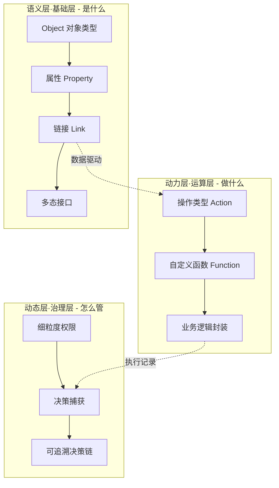

# 本体论与 DDD：统一数据语义之后，到底做什么？

最近在企业数字化和 AI 工程化圈子里，"本体论"（Ontology）成了高频热词。不少人的第一反应和我一样：这不是哲学里的古老概念吗？怎么突然成了 Palantir 企业数据平台的核心，还成了大企业落地知识图谱、运营 AI、数字化治理的关键底座？

更让人困惑的是：DDD（领域驱动设计）早就讲过"统一语义"了，本体论是不是换个名字炒冷饭？这篇文章就围绕三个问题展开：

1. DDD 和本体论到底有什么区别？
2. Palantir 本体论是什么，统一数据语义之后具体做什么？
3. 这个概念在具体运用中是怎么实现的？

## 一切问题的根源：数据语义混乱

任何一家规模化企业都会遇到同一个困境：市场部的"客户"是潜在意向用户，财务部的"客户"是已付费账户，客服部的"客户"是发起咨询的用户。三个部门同名不同义，数据无法互通、分析无法对齐、AI 无法精准理解。

传统数据库只能存储零散数据，数据湖只能堆砌原始数据，它们都不负责回答"客户到底是什么"。麻省理工斯隆管理学院 2021 年的研究数据显示：数据工作者平均 80% 的工作时间消耗在数据清洗、对齐、适配等基础准备工作中——核心痛点就是跨系统语义不统一、概念无共识、关系无定义。

本体论要解决的，正是这个问题。

## 从哲学到数据：本体论的千年跨越

本体论的本源是哲学核心命题，探讨世界的存在本质、实体分类、属性与关联关系。早在 2500 年前，亚里士多德在《范畴篇》中提出实体、数量、性质、关系等十大范畴，搭建了人类最早的事物分类与认知框架——这是本体论思想的雏形。

1993 年，计算机科学家汤姆·格鲁伯（Tom Gruber）给出数据领域本体论的经典定义：**一种对概念化体系的明确规范**（an explicit specification of a conceptualization）。

通俗解读：本体论就是给一个行业、一家企业的核心业务概念"立规矩"——明确核心事物是什么、有什么特征、和其他事物有什么关联、需要遵守什么业务规则。

有个很直观的比喻：把数据体系比作一座仓库，数据库是存放货物的货架，数据湖是杂乱堆放的货物堆场，而本体论是整套仓库的标准化管理体系——明确分类规则、存放逻辑、关联关系与操作规范，让零散数据变得有序、可解、可用。

本体论回答哲学式的四个基本问题：什么存在（What exists）？如何存在（How it exists）？世界的本原是什么？存在与现象的关系如何？放到数据领域就是：有哪些概念、概念有什么属性、概念间有什么关系、要遵守什么规则。而最后一步——基于概念、关系、规则进行逻辑推导（推理），正是 AI 时代本体论重新爆火的原因。

## DDD 与本体论：相似的表面

DDD（Domain-Driven Design，领域驱动设计）确实有和本体论非常相似的概念：

| DDD 概念 | 本体论对应 |
| --- | --- |
| 统一语言（Ubiquitous Language） | 概念定义 |
| 领域模型（Domain Model） | 知识框架 |
| 限界上下文（Bounded Context） | 本体域的作用范围 |

DDD 的核心理念是：以业务领域知识为中心，用统一语言和模型驱动复杂软件系统设计，把业务概念和业务规则转换成软件系统中的概念和规则，让代码成为业务概念的忠实映射。

两者都关注业务语义的显式化表达，共同点可以归纳为三条：

1. **统一业务概念**：确保大家在理解上保持一致。
2. **结构化建模**：强调概念、关系和规则的构建。
3. **业务即代码**：支持"业务就是代码，代码就是业务"的理念。

本质上，它们都是领域知识的形式化表达，目的都是让机器或系统理解业务是如何运作的。所以很多人（包括我）最初都认为：本体论不过是换个名字炒作。

## DDD 与本体论：本质区别

但深入了解之后会发现，AI 时代选择本体论而不是 DDD，有深层次的原因。一句话总结：

> **DDD 是写给人类的业务手册，本体论是写给 AI 的可执行规则库。**

具体区别体现在四个方面：

### 1. 规则的存在形式：藏在代码里 vs 显式声明

DDD 最初是为软件系统设计的，业务规则大多通过代码实现，隐含在实体、聚合、领域服务里。AI 难以直接理解和解析这些规则——它看到的是一堆类和方法。

本体论则把概念、关系、规则显式声明出来（用 RDF/OWL/SWRL 等标准语言），规则是数据而不是代码，AI 可以直接读取、理解、执行。

### 2. 跨系统互操作：API 协议 vs 语义层

DDD 的限界上下文之间依赖 API 协议交互——这是接口层面的互操作。而多智能体系统、跨企业系统需要在语义层面（自然语言层面）互操作：系统 A 说"顾客"，系统 B 说"客户"，DDD 的 API 协议解决不了这种同名不同义。

本体论恰好提供了一个统一的语义框架：所有系统共享同一套概念定义，互操作发生在语义层而不是接口层。

### 3. 自动推理：不支持 vs 原生支持

DDD 需要程序员编写所有业务逻辑。本体论凭借规范化的规则、标准以及完善的工具链，支持基于知识的自动推导。

例如本体论可以自动推导：如果 A 是 B 的子集，且 B 拥有属性 XXX，那么 A 也拥有属性 XXX。这种推理能力是 AI 智能体自主决策的基础。

### 4. 工具链与标准：方法论 vs 技术标准

这是关键区别：**DDD 是一种方法论，缺乏标准化的工具；本体论是一项可以执行的技术标准。**

早在 2000 年，语义网（Semantic Web）就建立了本体论的相关标准：RDF（资源描述框架）、OWL（Web 本体语言）、SWRL（语义网规则语言），以及 Protégé 等成熟的本体编辑工具。DDD 则没有专用的工具，只有书和最佳实践。

| 对比维度 | DDD（领域驱动设计） | 本体论（Ontology） |
| --- | --- | --- |
| 本质 | 软件设计方法论 | 可执行的技术标准 |
| 服务对象 | 人类开发者、业务专家 | AI 智能体、系统 |
| 规则形式 | 隐含在代码中 | 显式声明（RDF/OWL/SWRL） |
| 跨系统互操作 | API 协议（接口层） | 语义层（自然语言层） |
| 自动推理 | 不支持 | 原生支持 |
| 工具链 | 无专用工具 | 标准语言 + 成熟工具链 |
| 典型产出 | 限界上下文、聚合、领域服务 | 概念/属性/关系/规则体系 |

最新的趋势是把两者结合：DDD 做顶层设计与边界划分，本体论做语义建模，DDD 实现代码，本体论主导推理引擎——既让 AI 能够执行，也让人类便于维护。

## Palantir 本体论：把静态词典变成业务引擎

Palantir 提出的专属本体论，跳出了传统静态本体的局限。传统本体多是静态术语规范，只解决"名词对齐"问题；而 Palantir Ontology 是**动态、可运算、可决策的企业数字孪生体系**——不仅定义概念语义，更绑定业务操作、逻辑规则、权限治理与 AI 运算，是真正落地业务的工程化本体框架，也是 Foundry 平台支撑企业级智能决策的核心内核。

它采用**三层立体架构 + 四大核心组件**。

### 三层架构

**1. 语义层（基础层）：定义企业"是什么"**

统一企业所有数据的语义标准，对应传统本体的概念体系。包含 Object 对象类型、属性、链接类型、接口规范，将企业所有物理资产（工厂、设备、物料）、数字资产（订单、交易、工单）抽象为标准化实体，彻底解决同名不同义、异名同义的数据混乱问题。同时支持多态建模，让同类实体可统一交互、差异化适配。

**2. 动力层（运算层）：定义企业"做什么"**

这是 Palantir 本体区别于传统本体的核心突破。传统本体只做静态定义，而动力层通过操作类型（Action）、自定义函数（Function），封装企业所有业务逻辑与运算规则：支持捕获人工操作、联动系统决策、执行复杂业务计算，让本体从"静态词典"变成"可运算的业务引擎"。

**3. 动态层（治理层）：定义企业"怎么管"**

承载细粒度安全治理、动态权限、决策捕获能力。所有数据变更、业务操作、模型推理结果都会被实时记录，形成可追溯、可复盘的决策链路。同时支持动态适配业务变化，自动更新实体属性、关联关系与业务规则，实现本体的持续迭代，无需大规模重构数据体系。

### 四大核心组件

1. **Object 对象与链接体系**：将 ERP、CRM、IoT、财务等所有异构数据源，统一映射为标准化业务对象，通过链接打通跨系统数据关联，替代传统复杂的数据表关联与 ETL 适配。
2. **操作类型与自定义函数**：封装审批、下单、库存调整、风险预警等所有业务动作，支持低代码编写复杂逻辑，实现业务流程自动化、标准化。
3. **多态接口**：统一同类对象的交互规范，实现不同业务场景的复用适配，大幅降低应用开发成本。
4. **AI/ML 模型绑定模块**：支持将训练好的机器学习模型直接映射到本体实体，模型输入输出完全对接业务语义，实现 AI 模型的工程化落地与闭环迭代。

### 与传统数据架构的核心差异

传统数据架构遵循"先存数据、后定规则"，而 Palantir 采用**本体优先（Ontology-first）**建模思路：先定义企业业务本体框架，再将零散数据、AI 模型映射到本体体系中，从根源规避数据冗余、标准混乱、逻辑割裂问题。

在 Palantir 官方文档的表述里，这个差异更直白：**本体论把 Foundry 和传统数据仓库区分开来——不再是 SQL 查表，而是操作带有类型、属性、链接和动作的对象**。本体论是让数据对人和 AI 都有意义的语义层。

### 与知识图谱的关系

很多人混淆本体论与知识图谱。简单来说：**本体论是知识图谱的骨架，知识图谱是本体论的血肉落地**。

从技术逻辑看：本体论负责定义规则——规定知识图谱中有哪些实体、实体有什么属性、实体间有什么关系、需要遵守什么约束；知识图谱负责承载数据——按照本体定义的框架，填充海量真实业务数据，形成可视化、可检索、可推理的知识网络。

## 统一数据语义之后，具体做什么？

这是最核心的问题。很多人把本体论理解成"画一张概念图"，画完就结束了。实际上，定义统一语义只是第一步，之后还有一整条工程链路。按执行顺序拆解：

### 第 1 步：数据接入与映射（把异构数据源"翻译"成本体对象）

本体定义了"应该有哪些对象、每个对象有什么属性"，接下来要把 ERP、CRM、IoT、财务等所有异构数据源映射到这些对象上。这一步替代的是传统复杂的数据表关联与 ETL 适配：数据源的表结构、字段名、格式差异全部在映射层被屏蔽，下游消费方只看到统一的本体对象。

### 第 2 步：链接打通（跨系统关联）

对象之间通过链接类型（1 对 1、1 对多、多对多）建立业务关联：客户→购买→产品、油井→搭载设备→产生运维数据。链接把分散在不同系统里的数据在语义层面串起来，形成跨系统的业务视图——这就是知识图谱填充数据的过程。

### 第 3 步：操作与函数（把业务逻辑装进本体）

定义完"是什么"和"和谁有关"，要定义"能做什么"。操作类型封装审批、下单、库存调整、风险预警等业务动作（Palantir 默认提供 create / modify / delete 三类基础操作）；自定义函数承载复杂业务计算。这一步让本体从静态定义变成可运算的业务引擎。

### 第 4 步：权限与治理（动态管控）

本体承载细粒度安全治理与动态权限：谁能看哪些对象、谁能执行哪些操作。所有数据变更、业务操作、模型推理结果都被实时记录，形成可追溯、可复盘的决策链——这正是金融行业满足监管溯源要求的基础。

### 第 5 步：AI 模型绑定（把推理接进业务）

把训练好的机器学习模型直接映射到本体实体上，模型输入输出完全对接业务语义。大模型时代这一步价值更大：深度学习先驱杰弗里·辛顿说过，"神经网络能从数据中学习模式，但它们不学习语义"。大模型擅长文本关联、概率生成，但无法理解企业专属的业务定义与逻辑规则，极易产生幻觉。本体为 AI 提供了**精准的业务语义锚点**——让 AI 不再单纯依赖数据概率，而是基于真实业务逻辑推理、决策。

### 第 6 步：决策捕获与回流（MLOps 闭环）

模型推理结果直接作用于业务系统（自动下单、风控拦截、调度建议），业务操作产生的新数据又回流本体，驱动模型迭代优化——形成完整的 AI 工程化闭环。

### 一个完整例子：智能餐厅

假设开一家智能餐厅，服务员都是 AI，能独立完成点菜、做菜、结账的全流程。统一数据语义之后，整条链路是这样跑的：

1. **语义层（AI 理解概念）**：定义菜品、顾客、订单、过敏原等概念；建立关系"顾客下单产生订单"；设定规则"宫保鸡丁含有花生和鸡肉""VIP 顾客可享九折""如果顾客不吃花生，则禁止其下单"。
2. **推理层（AI 自动推导）**：顾客点了一份宫保鸡丁，AI 自动检测冲突——顾客不吃花生，宫保鸡丁含花生，阻止订单提交。
3. **执行层（动作落地）**：系统调用规则引擎进行检查，返回错误信息"顾客不吃花生，下单失败"；同时推理引擎自动计算 VIP 优惠，算出结账金额。

这里 DDD 和本体论的分工很清晰：DDD 负责订单聚合（包含顾客信息、菜品信息和支付信息）、限界上下文（前厅、厨房、收银台）这些**人类理解**层面的结构；本体论负责**AI 理解**层面的概念、规则与推理。

## 这个概念在具体运用中是怎么实现的？

### Palantir Foundry 里的落地方式

在 Foundry 平台里，本体论的实现是工程化的，主要靠这几个工具：

- **Ontology Manager**：可视化管理对象类型、属性、链接类型、操作类型——不用写代码就能搭本体。
- **OSDK（Ontology SDK）**：本体对象被自动转换成 TypeScript API（`@foundry/ontology-api`），开发者可以直接在代码里操作对象：`employee.manager.get()` 拿到上级对象，`ObjectSet.filter(...)` 查询对象集。
- **Workshop**：低代码搭建业务应用，按钮直接触发本体上的操作类型。
- **AIP（AI Platform）**：AI Agent 通过语义层理解业务，基于本体执行推理和动作。

一个典型的落地流程：数据源接入 → 在 Ontology Manager 里建对象类型和链接类型 → 定义操作类型（如"分配技术员"：输入技术员 ID，设置状态为 scheduled）→ 在 Workshop 里放按钮触发操作 → AI Agent 通过 AIP 调用同样的操作——**人类和 AI 走的是同一套本体**。

### 真实案例

**能源：油田资产统一管控。** 某大型能源企业的钻井、设备、能耗、运维数据分属不同系统，口径不统一。基于本体搭建统一能源知识图谱：定义"油井、设备、运维记录、能耗数据、故障风险"等核心对象，搭建"油井-搭载设备-产生运维数据-存在风险隐患"的关联链路，嵌入风险评估规则。落地后所有岗位共享同一套本体数据视图，工程师实时排查设备隐患，管理层基于统一数据制定长期资产投资策略。

**高端制造：航空传感器数据赋能研发。** 某航空制造企业的传感器数据（震动、温度、损耗）分散在工控系统中，以往数据准备需要数周。基于本体重构数据架构后，非技术岗位的设计师、质检专家可直接通过业务术语检索数据，原本数周的数据准备工作缩短至分钟级，数据复用率提升 80% 以上。

**金融：客户全生命周期风控。** 大型银行的客户数据分散在储蓄、信贷、理财、风控、支付等多个系统。基于本体构建客户知识图谱，嵌入实名认证、风险评级、交易风控等规则与操作逻辑，实现一次数据建模、全业务复用；系统自动捕获每一次风控决策，形成可追溯的决策链，满足监管溯源要求，风控误判率大幅降低。

**航空运营：航班全链路智能调度。** 统一建模"航班、飞机、机组人员、机务任务、机场资源、天气状态"等对象，绑定 AI 预测模型。AI 模型基于本体实时推演航班调整后的人员排班、设备检修、资源分配方案，所有调度决策被实时捕获、复盘，持续迭代优化。

### 没有 Palantir 怎么玩：开源平替

Palantir 是商业产品，但本体的实现思路完全可以复刻。老刘说NLP 在《Palantir Ontology 的 Neo4j+业务规则引擎平替实现》里给出了开源方案：

- **Neo4j** 承担对象与链接（语义层）：对象类型建模为标签，对象实例建模为节点，链接类型建模为关系。
- **规则引擎**（如 Drools）承担操作与推理（动力层）：业务规则显式声明，支持自动推理。
- **LLM Agent** 承担自然语言入口：Agent 把用户意图映射到本体概念，调用规则引擎执行，再通过图谱查询结果。

这套组合与 Palantir 的"语义层 + 动力层 + AI"在结构上同构——本体论的落地并不绑定特定厂商。

### 落地心法：核心不是技术，是共识

很多企业落地本体论失败，核心误区是把它当成纯技术项目。Palantir 大量落地实践证明：**本体搭建 80% 的工作是跨部门业务共识，20% 是技术落地**。

1. **小切口起步**：拒绝一次性搭建全企业本体，优先选择核心高频场景（客户数据治理、设备资产管理、订单流程管控），快速落地验证价值。
2. **跨域协同共建**：组建业务、IT、数据、运营联合小组，统一各部门术语定义、业务规则、数据口径，从源头消除语义分歧。
3. **迭代动态优化**：本体不是一成不变的标准，而是随业务迭代的动态体系，根据业务新增、流程调整、系统升级持续优化。

## 延伸阅读：老刘说NLP 的本体论专辑（重点推荐）

本体论的知识跨度很大：从哲学、语义网标准（RDF/OWL/SWRL）、知识图谱构建，到 Palantir Ontology 的工程实践、本体驱动 Agent，每一层都有不少坑。这里重点推荐一个系统性资源：

[老刘说NLP ·「本体论ontology」专辑（40 篇）](https://mp.weixin.qq.com/mp/appmsgalbum?action=getalbum&__biz=MzAxMjc3MjkyMg==&scene=1&album_id=4560921807159246853&count=3#wechat_redirect)

这是公众号"老刘说NLP"整理的本体论专题合集，共 40 篇文章，从概念到落地全覆盖，部分代表文章：

- **概念梳理**：《充满歧义的本体论到底是什么？从 Web Ontology 到 Schema 再到 Palantir Ontology》《本体论的那些事儿——从 Web 语义本体、知识图谱本体再到 Palantir Ontology》
- **Palantir 深度解读**：《Palantir Ontology 再认识：几大要素、OSDK 及 AIP 的串联》《Palantir ontology 长文再总结：核心要素之间关系梳理、执行数据流、2 个实例及具体落地建议》
- **平替与实战**：《Palantir Ontology 的 Neo4j+业务规则引擎平替实现及其如何"驱动"Agent？》《关于本体论落地的 6 个真实认识》
- **规则推理**：《再看 Ontology 规则推理：语义网本体论中的规则表示方案及 SWRL 规则自动挖掘思路》
- **本体与 Agent**：《Ontology 本体驱动 Agent 究竟是个啥？技术起底及静态、动态本体怎么区分？》《运维场景 Agent 的本体建模 UModel》
- **本体构建**：《知识图谱本体如何从关系数据库中自动构建？》《动态本体 Ontology 如何自动生成？》

## 参考资料

- [一文读懂 Palantir 本体论：从哲学概念到企业 AI 的底层数据基石（知乎）](https://zhuanlan.zhihu.com/p/2047039764482861004)
- [今年爆火的"本体论"到底是什么（腾讯云开发者社区，作者：不做虫子）](https://cloud.tencent.com/developer/article/2645794)
- [老刘说NLP ·「本体论ontology」专辑（40 篇）](https://mp.weixin.qq.com/mp/appmsgalbum?action=getalbum&__biz=MzAxMjc3MjkyMg==&scene=1&album_id=4560921807159246853&count=3#wechat_redirect)
- [Palantir Foundry Ontology 官方文档](https://palantir.com/docs/foundry/ontology/overview)
