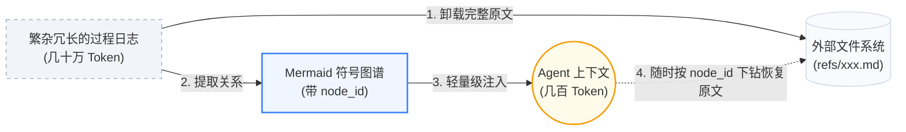

  

> **让 Agent 沉淀经验，让人专注创造。**  
> GitHub: [TencentCloud/TencentDB-Agent-Memory](https://github.com/TencentCloud/TencentDB-Agent-Memory)  
> License: MIT | Node: ≥22.16 | OpenClaw: ≥2026.3.13

---

## ✨ 效果亮点

**TencentDB Agent Memory = 符号化短期记忆 + 分层式长期记忆。**

- **符号化短期记忆**：将厚重的工具日志分层卸载，逐步总结成轻量级 Mermaid 结构符号，大幅降低 Token 消耗的同时提升任务成功率。
- **分层式长期记忆**：把碎片化对话层层提炼，沉淀出有层次的画像与场景，不再是扁平的向量堆砌。

**作为 OpenClaw 插件接入后**：最高节省 **61.38% Token**，通过率相对提升 **51.52%**；PersonaMem 准确率从 **48%** 提升到 **76%**。

| 记忆能力 | Benchmark | 原生成功率 | 加插件后 | 相对变化 | 原生 Token | 加插件后 | 相对变化 |
| :------ | :--- | :---: | :---: | :---: | :---: | :---: | :---: |
| **短期记忆** | WideSearch | 33% | **50%** | **+51.52%** | 221.31M | **85.64M** | **−61.38%** |
| **短期记忆** | SWE-bench | 58.4% | **64.2%** | **+9.93%** | 3474.1M | **2375.4M** | **−33.09%** |
| **短期记忆** | AA-LCR | 44.0% | **47.5%** | **+7.95%** | 112.0M | **77.3M** | **−30.98%** |
| **长期记忆** | PersonaMem | 48% | **76%** | **+59%** | — | — | — |

> 超长 Session 评测不是单题清空上下文，而是把多个任务拼接到同一个 Session 中连续执行。例如 SWE-bench 每个 Session 连续执行 50 个任务，用来模拟真实长程 Agent 的上下文累积压力。

---

## 项目简介

**Memory 不是为了让 AI 存下所有东西，而是为了让人不必重复所有事情。**

在实际使用中，我们往往需要反复告诉 Agent 固定 SOP、项目背景、工具习惯和输出格式。这些信息不应该每次重新解释，但同时也不应该被无脑、扁平地全部塞进上下文。

TencentDB Agent Memory 帮助 Agent 学会你的流程、保留任务上下文、复用历史经验。但它**拒绝暴力的历史堆砌**，也**抛弃不可逆的暴力摘要**。它将记忆设计为一套极具层次感的系统，以**符号化记忆**解决单次长任务的信息过载，以**记忆分层**解决跨会话的经验沉淀。

> **让 Agent 记住该记的，让人把注意力留给判断、创造和真正有价值的工作。**

---

## 核心技术：拒绝平铺，走向分层与符号化

TencentDB Agent Memory 的设计理念围绕两个核心展开：**记忆分层** 与 **符号化记忆**。这不仅让 Agent "记得更多"，更重要的是"想得更清"。

### 1. 记忆分层：渐进式披露与异构存储

传统的记忆系统往往将所有数据切片并平铺为向量，召回时如同在一堆毫无关联的便利贴中寻找线索，缺乏宏观视角的指引。

**不管是长期的知识、短期的任务，还是未来的经验能力，记忆都不应该平铺，生成和召回都必须有层次。** TencentDB Agent Memory 将"分层"作为整个架构的统一设计哲学：

| 层次 | 类型 | 存储形式 | 说明 |
|------|------|----------|------|
| **短期分层** | 上下文卸载/任务 | `refs/*.md` → `jsonl` → **Mermaid 画布** | 底层保留工具调用原文，中层步骤摘要，高层轻量 Mermaid 任务地图 |
| **长期分层** | 用户理解 | **L0 Conversation** → **L1 Atom** → **L2 Scenario** → **L3 Persona** | 语义金字塔，高层把握偏好，底层考证细节 |
| **技能分层（Roadmap）** | 动作沉淀 | 轨迹 → 解决模式 → Skill/SOP | 记忆包含"会做什么" |

#### 短期记忆的分层

底层保留原始、厚重的工具调用结果（`refs/*.md`），中层抽取步骤摘要（`jsonl`），高层则浓缩为一张极度轻量的 Mermaid 任务画布。Agent 在上下文中仅需关注高层结构，遇错时再沿着 `node_id` 下钻到底层查证。

#### 长期个性化（用户理解）的分层

打破扁平的历史记录，建立 **L0 Conversation → L1 Atom → L2 Scenario → L3 Persona** 的语义金字塔：

- **L0 — Conversation（原始对话）**：保留最原始的对话流水，作为可追溯的证据层
- **L1 — Atom（结构化事实）**：从对话中提取的结构化事实片段（时间、事件、偏好等），以向量化形式存储
- **L2 — Scenario（场景块）**：将 L1 Atom 按照场景聚合，形成一块块可读的 Markdown 场景描述
- **L3 — Persona（用户画像）**：从多个 Scenario 中提炼出的用户宏观画像——表达风格、长期目标、核心偏好

平时靠高层 Persona 把握用户偏好，需要考证细节时再检索底层 Atom。

#### 技能生成（Skill 与动作沉淀，Roadmap）

记忆不应仅限于"知道什么"，还应包括"会做什么"。TencentDB Agent Memory 正在将分层延伸至动作域：从底层的执行轨迹（Traces）与报错日志中，中层归纳出共性的解决模式，高层最终提炼出可直接挂载复用的 Skill 或标准 SOP 代码。

  

#### 渐进式披露与异构存储

为了支撑这种无处不在的分层，系统设计了**底层数据库与上层文件系统结合的存储方案**：

- **底层**（海量事实、日志、轨迹）存入数据库或归档文件，确保稳定与全量检索
- **高层**（画像、场景、画布、Skill）存入业务可读的文件系统（Markdown），确保高信息密度、逻辑清晰与白盒可调

**低层保留证据，高层保留结构。**

#### 每一条信息都 100% 可找回、可恢复

压缩或抽象最大的风险是"丢失证据"。得益于严格的索引映射机制，系统内没有任何一段摘要是"不可逆"的黑盒。无论是短期记忆中被卸载的一段报错日志，还是长期记忆里总结出的一条用户偏好，Agent 或开发者都可以沿着 **"高层符号（Persona / 画布） → 中层索引（Scenario / JSONL） → 底层原文（L0 Conversation / refs）"** 的链路进行完美溯源与恢复。

  

### 2. 符号化记忆：用最少符号表达最多语义（Mermaid 画布）

长程任务中最消耗 Token 的往往是繁杂的过程日志（如搜索结果、代码、报错）。为此，系统结合 **上下文卸载（Context Offloading）** 提出了 **符号化记忆**：

- **Mermaid 符号图谱**：取代冗长的自然语言或扁平的 JSON，使用高密度、强拓扑的 Mermaid 语法来描绘任务状态流转，既能被 LLM 精准理解，也方便人类阅览。
- **历史折叠与卸载**：完整工具日志被卸载到外部文件系统，上下文仅保留轻量级的 Mermaid 任务地图。
- **基于 `node_id` 的溯源**：Agent 看着符号图谱推理，如需核对细节，直接 grep 图谱上的 `node_id` 即可瞬间找回完整原文，既大幅降本又保全了 100% 可追溯性。

---

## 🤔 方案特点

### 1. 宏观画像 + 微观事实：同一套下钻机制降低幻觉

压缩最大的风险是"省了 Token，也丢了证据"。TencentDB Agent Memory 没有把历史压成一段不可恢复的 summary，而是保留了从高层摘要回到底层证据的路径。

| 问题类型 | 优先使用 | 继续下钻 |
| :--- | :--- | :--- |
| 日常偏好、表达风格、长期目标 | L3 Persona / L2 Scenario | 需要事实时查 L1 Atom / L0 Conversation |
| 具体事实、时间、项目细节 | L1 Atom / L0 Conversation | 命中不足时扩大时间范围或语义检索 |
| 当前长任务继续执行 | Active MMD 任务画布 | 摘要不够时查 JSONL，再读 `refs/*.md` 原文 |
| 历史任务恢复 | Metadata 任务入口 | 打开 MMD → 找 node_id → 追 result_ref |

上层负责"情商"和方向，下层负责"证据"和精度。短期压缩和长期记忆在这里合成一条闭环：**能折叠，也能展开；能抽象，也能追证。**

### 2. 白盒可调试：记忆不是黑盒向量

很多记忆系统的问题是：召回错了，你只能看到一串向量分数，很难判断到底哪里错。TencentDB Agent Memory 把关键中间产物保存在可读文件里：

- L2 Scenario 块是 Markdown，可以直接打开检查。
- L3 Persona 存放在 `persona.md`，可以追溯到对应的 Scenario。
- 短期任务画布是 Mermaid，既能给人看，也能给 Agent 读。
- 原文、摘要、节点之间有 `result_ref` 和 `node_id` 关联。

这意味着调试不再是翻黑盒数据库，而是沿着 **"Persona → Scenario → Atom → Conversation"** 的链路逐层定位。

**这些分层记忆产物都存放在 `~/.openclaw/memory-tdai/` 下，可以直接打开目录逐层查看。**

### 3. 工程能力完整：不是 Demo，而是可接入的插件

| 能力 | 说明 |
| :--- | :--- |
| OpenClaw 插件 | 安装后即可自动捕获、提取、召回记忆 |
| Hermes Gateway 适配 | `TdaiCore + HostAdapter` 解耦宿主框架 |
| 本地后端 | `SQLite + sqlite-vec`，开箱即用 |
| 混合检索 | BM25 + 向量 + RRF，兼顾关键词和语义召回 |
| Agent 工具 | `tdai_memory_search` / `tdai_conversation_search` |

---

## 🧩 源码拆解：记忆系统的七块设计

前面的章节从设计理念与基准效果切入，这一节直接拆源码看实现。整套机制一共七块：**底座是四层记忆金字塔，往上是写入、提炼、检索、注入四条主干，再配上冲突仲裁、任务地图、故障降级三处兜底**。七块串起来，就是"对话 → 记忆 → 再对话"的完整闭环。

### 1. 记忆金字塔：为什么不是一张表（L0 → L3）

先问一个问题：既然记忆就是一堆事实，为什么不直接存成一个列表？

因为**同一份数据没法既是原文又是摘要**。你想要证据完整，就得把原话一字不改地存下来；你想省 Token，就得把它们压缩成精简摘要——这两个需求互相矛盾，拆成四层是结构性的解法：从底到顶越来越精简，官方把这个结构叫做**记忆金字塔**。

- **L0 流水账（Conversation）**：每次对话结束，系统把用户和助手的原话写进本地文件，再同步落一份到数据库。一字不改，不做任何提炼——这是证据层。
- **L1 记忆卡片（Atom）**：相当于构建一份"会议纪要"。系统在后台把对话通读一遍，先按情境分段，再从每段里抽出结构化事实。**每张卡片只记一件事**，类型只有**偏好、事件、规则**三种，还带一个优先级，重要的排前面。
- **L2 场景档案（Scenario）**：把同一情境下的卡片打包成一份文件，**按情境组织，不按日期**。文件头记着创建时间、更新时间、摘要和**热度值**——每被检索命中一次热度加 1，用得多的排前面。
- **L3 人格摘要（Persona）**：从所有场景档案里提炼出的稳定画像，描述的是"这个用户是谁"，不落在某一次对话上。它是四层里**唯一不需要检索**的：前三层都得查到了才用得上，只有它每次新会话**无条件注入**。也正因为如此，它必须足够短、足够稳定——它占的是每一轮对话的固定成本。

四层各管一段：**L0 留证据，L1 保精度，L2 保情境，L3 保效率**。底层存数据库、全量可检索；高层写成 Markdown、人能直接读直接改。四层还能串起来：从人格摘要往下查到场景档案，再查到记忆卡片，卡片带着来源标记，一路追到原始对话——**平时给你高密度摘要，纠错时给你完整证据链**。

### 2. 写入与提炼：录音与会议纪要的分离

记忆分层解决"怎么存"，这一节回答"什么时候存"。往记忆库里写一条只需要一个动作：把这一轮的用户输入和助手回复交给系统，**原始对话毫秒级落盘**。这一步只是录音，不做任何理解。

记忆卡片没有顺手一起做，是因为**提炼绕不开模型**。"我不吃香菜"是长期偏好，"今天中午吃了火锅"是一次性事件——这两句话在文本上没有任何区别，只有理解了内容才能分开，规则和关键词统计都做不了这个判断。而模型调用有成本也有延迟，放进主流程，你说完一句话得干等着它跑完才有回复，所以只能**挪到后台异步跑**。

> 实测时效：官方测试中那组数据为什么等待 6 秒？因为尽管原始对话毫秒级落盘，但要等模型跑完提炼，卡片才进得了检索范围。凡是做语义提炼的记忆系统都有这段时间差，区别只在长短。

提炼默认有两个触发条件：**每满 5 轮对话**，或者**停止输入 10 分钟**，也可以手动立即触发。新会话开头还有个例外：系统默认开了预热（warm-up），前几轮的阈值从 1 开始递增——1 轮、2 轮、4 轮，之后才稳定到 5 轮。所以刚开始聊，第一轮就会触发一次提炼，不用等满 5 轮。

每张卡片的类型和优先级由模型根据内容判断，没有写死的规则。好处是灵活，代价是**不可预测**：同一句话在不同上下文里可能被判成不同类型。

### 3. 检索：三条路径与一个默认值的坑

存下来只是第一步，需要的时候，系统得能从一堆记忆里挑出该用的那几张。这里设计了三种方式：

**第一条：字面匹配（keyword）**。底层用全文索引加关键词稀有度打分：中文查询先交给分词器切成若干词，再用"或"的关系去匹配卡片，命中稀有词的排在前面。这条路快、省钱，但很死板。卡片总量很少时还有个副作用——稀有度分数会失真。源码为此留了一条补救路径：遇到这种情况就**放弃阈值过滤，直接信任索引排序**。实测检索时「你能吃吗」那次的意外命中，就是这条补救路径起效了。

**第二条：语义指纹（embedding）**。系统把问题和卡片各自转成一串数字坐标，两段话含义越接近坐标越接近，查询时按坐标远近判断说的是不是一回事——所以字面上一个字都不重叠也能命中。这条路需要额外配一个模型服务，**默认没开**；打开之后换说法、跨语言都能召回。

**第三条：混合检索（hybrid）**。前两条路同时跑，再用**排名叠加器（RRF）**把两份排名合成一张榜单。规则很简单：一张卡片在自己那份排名里越靠前加分越多，两边都出现的分数累加。关键细节是**叠加器只看名次，不看原始分数**——因为字面匹配和语义相似度是两套计分方式，这边的 0.8 分和那边的 0.8 分不是一回事，直接比大小没有意义；只比名次，两套结果才能合到一张榜上。

这里有个容易踩的坑：**策略的默认值是混合检索，但语义能力的默认值是关闭**——两个凑在一起，检索实际降级成纯关键词。零配置装完跑的是字面匹配，"混合检索"是配了语义服务才生效的默认值。

### 4. 注入：双区布局与缓存计费

检索不是给你看的，是给模型看的。每轮对话开始前，系统先把当前这句话和记忆库做一次匹配，召回最相关的几张卡片，全程有 **5 秒超时保护**，超时就跳过注入。

召回的内容会放到**两个地方**：

- **用户消息前面**：本轮动态召回的记忆卡片，每轮都变；
- **系统提示末尾**：人格摘要、场景导航和工具指南，几轮才变一次。

分开放是有讲究的：大模型服务商会**缓存系统提示这段稳定前缀**，命中缓存就不用重复计费；把每轮都变的卡片塞进系统提示，缓存立刻失效，Token 消耗和延迟一起上升。所以动态的归动态，稳定的归稳定。

注入还有预算控制：**单条记忆有长度上限，本轮注入也有总字符上限**。另外系统会在提示词里约束 Agent 每轮主动检索合计不超过 3 次——这是软约束，靠模型自觉遵守，不是代码层面的硬限流。

### 5. 冲突仲裁：新增、跳过、更新还是合并

找得到、用得上，还剩一个问题：你今天说的和昨天说的矛盾了，系统该听哪一个？这种判断在工程上比想象中难很多。「必须用 PostgreSQL」和「改用 MySQL」字面上矛盾，但矛盾不一定是改主意，至少有三种可能：

1. 你改主意了——该**覆盖**旧的；
2. 你在说两个不同项目的事——该**两条并存**；
3. 你自己前后不一致——该**留两条让人类来判断**。

这三种在文本上长得一模一样，只有理解了上下文才能分开，所以写一条记忆要多调一次模型。系统的做法是**冲突仲裁**，分两个阶段：

- **第一阶段：候选召回（不调模型）**。把新卡片转成语义指纹，在已有卡片里找距离最近的几张；语义能力不可用就降级到关键词召回，两条路都不可用就跳过这一步。
- **第二阶段：模型裁决**。把新卡片和候选老卡片一起打包，一次性问模型：这条该**新增、跳过、更新还是合并**。

关键在于：**第二阶段的判断质量完全取决于第一阶段召回到了什么**。模型只能在给它看的候选里做判断，没召回到的老卡片，在它眼里等于不存在。

### 6. 任务地图：长任务的折叠视图

单次任务本身太长怎么办？比如让 Agent 改一个跨十几个文件的 bug，它调工具、读报错、再调工具，几十轮下来上下文就撑爆了。解决思路和长期记忆一样——**平时给折叠视图，需要时再展开细看**：

详细过程被转存到外部文件，上下文里只留一张**任务地图**。这张图用节点和箭头呈现状态怎么流转，每个节点标着编号和下一步动作；Agent 要核对细节，就按编号回到那份详细记录——这正是前面"符号化记忆"一节的 Mermaid 画布 + `node_id` 下钻机制。官方在 WideSearch 长任务基准上的数据：Token 消耗从 2.21 亿降到 8500 万，通过率从 33% 提升到 50%。

### 7. 故障降级：记忆系统坏了也不影响对话

前面讲的都是正常路径。但记忆系统挂在对话主链上，**任何一环卡住，你收到的结果就是 Agent 不回话**——这正是引入记忆系统最现实的顾虑。源码里有一条明确的降级路线，原则是**故障容忍优先于功能完整**：

| 环节 | 降级策略 |
|------|---------|
| 检索侧 | 语义和关键词都可用 → 跑混合；只有一条可用 → 降级成那一条；两条都不可用 → 返回空结果 |
| 写入侧 | 去重判断超时 → 全部存为新卡片；语义指纹写入失败 → 不影响已经落盘的原始对话；召回超时 → 跳过本轮注入 |

最坏情况是这一轮没有记忆可用，但**对话还能继续**。

四层分层、写入与提炼、三条检索路径、双区注入、冲突仲裁、任务地图、降级路线——串起来就是 TencentDB Agent Memory 的完整机制。

## 🔧 可调参数（三级，零配置可用）

**所有字段均有合理默认值，零配置即可跑。** 如果要调优，可以按使用深度逐层展开。

### Level 1 · 日常调参（覆盖 90% 使用场景）

| 字段 | 默认 | 说明 |
| :--- | :--- | :--- |
| `timezone` | `"system"` | 时区 |
| `storeBackend` | `"sqlite"` | 存储后端 |
| `recall.strategy` | `"hybrid"` | 召回策略：`keyword` / `embedding` / `hybrid`（RRF 融合，推荐） |
| `recall.maxResults` | `5` | 每次召回条数 |
| `pipeline.everyNConversations` | `5` | 每 N 轮对话触发一次 L1 记忆提取 |
| `persona.triggerEveryN` | `50` | 每 N 条新记忆触发用户画像生成 |
| `offload.enabled` | `false` | 是否启用短期记忆压缩 |

### Level 2 · 进阶调优（长任务 / 长 Session 场景）

| 字段 | 默认 | 说明 |
| :--- | :--- | :--- |
| `pipeline.enableWarmup` | `true` | Warm-up：新 session 从 1 轮起触发，每次翻倍至 N（1→2→4→…） |
| `pipeline.l1IdleTimeoutSeconds` | `600` | 用户停止对话多久后触发 L1 |
| `pipeline.l2MinIntervalSeconds` | `900` | 同 session 两次 L2 之间的最小间隔 |
| `recall.timeoutMs` | `5000` | 召回超时阈值，超时跳过注入不阻塞对话 |
| `offload.mildOffloadRatio` | `0.5` | 温和压缩触发比例（占 context window） |
| `offload.aggressiveCompressRatio` | `0.85` | 激进压缩触发比例 |
| `offload.mmdMaxTokenRatio` | `0.2` | MMD 注入 token 预算比例 |
| `bm25.language` | `"zh"` | 分词语言：`zh`（jieba）/ `en` |

### Level 3 · 完整参数表（运维 / 自定义模型 / 远程 embedding）

- `embedding.*` — 远程 embedding 服务（OpenAI 兼容 API）
  - `embedding.sendDimensions`（默认 `true`）：OpenAI `text-embedding-3-*` 系列依赖该字段做 Matryoshka 维度截断；但部分开源模型（如 **BGE-M3**）不支持自定义维度，需设为 `false`
- `llm.*` — 独立 LLM 模式（绕过宿主框架内置模型）
- `offload.backendUrl / backendApiKey` — 将 offload 流程卸载到后端服务
- `report.*` — 指标上报

---

## 🎬 Demos

<table align="center">
  <tr align="center" valign="middle">
    <td width="50%" valign="middle">
      <video src="https://github.com/user-attachments/assets/667231cd-1c77-43e5-a662-6123a0073bc4" controls="controls" muted="muted" style="max-width: 100%;"></video>
    </td>
    <td width="50%" valign="middle">
      <video src="https://github.com/user-attachments/assets/6c6a29a6-c8aa-45b2-8258-bebac8f03396" controls="controls" muted="muted" style="max-width: 100%;"></video>
    </td>
  </tr>
  <tr align="center" valign="top">
    <td><em>OpenClaw × Agent Memory</em></td>
    <td><em>Hermes × Agent Memory</em></td>
  </tr>
</table>

---

## 🛣️ Roadmap

- [x] 长期个性化记忆（L0 → L3）
- [x] 短期记忆压缩（Context Offload + Mermaid 画布）
- [x] 可用本地 SQLite 后端与腾讯云向量数据库 TCVDB 后端
- [x] OpenClaw 插件与 Hermes Gateway 适配
- [ ] 记忆可迁移：跨 Agent / 跨框架 / 跨设备的导入导出与热迁移
- [ ] Skill 自动生成
- [ ] 可视化调试与记忆观测面板

---

## 🚀 上手与接入：三个决定

**默认配置下它用本地 SQLite 存储，安装完就能用。** 如果想换成自己的大模型来做提炼和画像生成，只需要填三项信息：模型的**访问凭证、服务地址和模型名称**（对应上文 Level 3 参数表的 `llm.*`）。

从接入方式看，它支持三种路径：

- **装成 Agent 平台插件**（OpenClaw 一键安装）；
- **通过统一网关调用**（Hermes Gateway 适配）；
- **在自研项目里直接引用**（TdaiCore + HostAdapter 解耦宿主框架）。

装完之后有一个配置值得先想清楚：**要不要开语义召回**。如果 Agent 只需要记住格式规范、工具偏好这类说法固定的东西，就不用开；如果它要理解自然语言表达的偏好，就需要开。

放在以前，这套系统背后的一整套东西都得自己写——向量化、相似度检索、结果重排序，全是应用层的任务。现在它变成了安装时的一个选项。**Agent 需要的记忆能力，正在从应用层下沉到数据库层**。数据库给人存了几十年数据，现在要开始给 AI 存记忆了。

## 📊 项目演示幻灯片

> 以下幻灯片来自 **2026 腾讯犀牛鸟对外开源人才计划** 的 TencentDB Agent Memory 专题分享，系统性地展示了项目的设计思路与能力全景。

### 大模型长程任务的"三重枷锁"

Agent 在处理长程任务时面临三大核心挑战：上下文窗口有限、Token 消耗巨大、跨会话经验无法沉淀。传统方案要么暴力塞入全部历史导致 Token 爆炸，要么使用不可逆的摘要丢失关键证据。

  

### 破局之道：独创双引擎记忆架构

TencentDB Agent Memory 提出 **短期记忆引擎 + 长期记忆引擎** 的双引擎架构：

- **短期记忆引擎**：负责当前会话的上下文流式卸载与 Mermaid 符号化压缩，实时降低 Token 消耗
- **长期记忆引擎**：负责跨会话的经验沉淀，通过 L0→L3 语义金字塔实现从原始对话到用户画像的层层提炼

  

### 短期记忆：上下文流式卸载

长程任务中，工具调用的中间结果（搜索、代码、报错）会迅速撑爆上下文窗口。TencentDB Agent Memory 通过流式卸载将完整日志写到外部文件系统，上下文中仅保留轻量级 Mermaid 符号图谱（几百 Token），Agent 按需下钻 `node_id` 查证原文。

  

### 长期记忆：L0 – L3 语义金字塔

从原始对话（L0）到用户画像（L3）的渐进式提炼链路：

| 层级 | 内容 | 用途 |
|:---|:---|:---|
| **L3 Persona** | 用户画像（表达风格、长期目标、核心偏好） | 日常判断方向，把握宏观 |
| **L2 Scenario** | 场景块（按主题聚合的 Markdown） | 理解上下文场景 |
| **L1 Atom** | 结构化事实（向量化存储） | 考证具体细节 |
| **L0 Conversation** | 原始对话流水 | 终极证据溯源 |

  

### 透明可控：100% 白盒完美溯源

所有分层记忆产物均为可读文件（Markdown / Mermaid），沿着 "Persona → Scenario → Atom → Conversation" 链路可逐层定位至原文。调试不再是翻黑盒数据库，而是直接打开目录查看。

  

### 实测基准：全面性能评估

| Benchmark | 原生成功率 | 加插件后 | 提升 |
|:---|:---:|:---:|:---:|
| WideSearch | 33% | **50%** | **+51.52%** |
| SWE-bench | 58.4% | **64.2%** | **+9.93%** |
| AA-LCR | 44.0% | **47.5%** | **+7.95%** |
| PersonaMem | 48% | **76%** | **+59%** |

Token 节省方面，WideSearch 降低 **61.38%**，SWE-bench 降低 **33.09%**，AA-LCR 降低 **30.98%**。

  

### 企业级工程能力：即插即用

- OpenClaw 插件一键安装，自动捕获、提取、召回
- Hermes Gateway 适配，TdaiCore + HostAdapter 解耦
- 本地 SQLite + sqlite-vec 开箱即用
- BM25 + 向量 + RRF 混合检索
- Agent 工具：`tdai_memory_search` / `tdai_conversation_search`

  

---

> 本文内容基于 [TencentDB-Agent-Memory README_CN.md](https://github.com/TencentCloud/TencentDB-Agent-Memory/blob/main/README_CN.md) 及 2026 腾讯犀牛鸟对外开源人才计划分享幻灯片，聚焦记忆系统的设计理念、架构与源码机制；上手与接入概览见正文，完整安装部署步骤请参考 GitHub 原 README。
>
> **MIT License** © TencentDB Agent Memory Team
