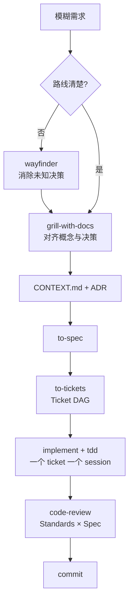

## 它是什么

一句话：**把软件工程中不同性质的认知活动拆成可复用的 Skill，再用持久化工程制品把多个 Agent Session 串成一条受控流水线。** 它的反面是"写一个超级 Prompt，让 Agent 一口气把整个工程做完"。

主链：`grill-with-docs → to-spec → to-tickets → implement → code-review`；`wayfinder` 位于更上游，解决"大到连 spec 都暂时写不出来"的项目。



## Skill 与 AGENTS.md 的区别

Skill = 可教授、可复用、面向具体任务的 Agent 工作流。标准结构：`skill-name/SKILL.md` + 可选 `scripts/ templates/ references/`。SKILL.md 描述：何时用 / 何时不用 / 读什么 / 执行什么 / 产出什么 / 如何判定完成 / 禁止事项。

| | AGENTS.md | Skill |
|---|---|---|
| 语义 | 每次进项目都要知道的全局规则 | 只有执行某类任务才加载的专项 SOP |
| 加载 | 常驻 context | 渐进加载（progressive disclosure） |

模型平时只知道 skill 的 name + description，真正需要时才加载完整 SKILL.md —— 不会把几十页开发规则全部塞进每次 context。这就是 Skill 相对"巨型 AGENTS.md"的核心优势。

## 各环节精髓

### wayfinder —— 决策图谱，不是任务清单

- **触发条件**：任务大到单 Session 装不下，且从当前位置到目标的路线模糊
- 输出是 **decision tickets（决策问题）**，不是实现任务。例："semantic 与 episodic memory 是否共享 schema？""冲突解决在 write-time 还是 retrieval-time？"——而不是"写 Retriever""加 API"
- **it plans, it doesn't do**：wayfinder 只规划，不实现
- Wayfinder Map = 一张决策 DAG；**frontier（雾的边界）** 是当前能解决的决策，Agent 不需要理解全部未来，只解决 frontier，然后 frontier 前移
- 与检查点的区别：checkpoint 回答"我做到哪了"（execution state）；wayfinder 回答"我知道了什么、还缺什么决策"（knowledge state + decision graph）。**Session 可以死，决策图不死**
- 已知需求/架构的任务**不要用**（如"给 MemoryStore 加 batchDelete"）——直接走主链。它是 situational on-ramp，不是默认入口

### grill-with-docs —— 一次一个问题

- 逐题追问：Q1 → 你答 → Agent 修正模型 → Q2……
- **代码能回答的问题不问人**（"项目用什么数据库"→ grep 代码，不是问你）；只问真正需要 human decision 的问题（"同一用户出现两条矛盾的高置信度偏好，保留历史还是覆盖旧值？"）
- 产出 **CONTEXT.md**：统一领域词汇（受 DDD Ubiquitous Language 影响），防止 memory/record/item/knowledge 语言漂移；定义过的术语不要换同义词

### ADR —— 只记"为什么"

CONTEXT.md 答 What（词义），ADR 答 Why（架构决策）。**稀少原则**：只记录难逆转 + 存在真实 trade-off + 未来的人不知道原因会觉得奇怪的决策。每条 ADR = Context / Decision / Alternatives / Consequences。例：ADR-0003 Tombstone-based Forgetting（SQLite 留 tombstone，vector index 删 embedding）。

### to-spec —— 不重新采访

该问的问题在 grill 阶段已问完，spec 只做整理。必含 **Out of Scope**："不做 UI 重构 / 不做 DB 迁移 / 不换 embedding 模型"——明确划定不做的事，对抗 Agent scope creep。**Spec 决定 WHAT。**

### to-tickets —— 垂直切片，禁止水平切片

- 反对横向拆法：Ticket1 Database / Ticket2 API / Ticket3 UI / Ticket4 Test（直到最后才有东西能跑）
- 要求 **tracer bullet / vertical slice**：每个 ticket 端到端打通 input → domain → storage → retrieval → verification
- 每个 ticket 可独立运行、独立测试、独立 review、独立 commit；**Agent 的最佳工作单位是"一个可验证的行为"**，而不是"完成整个数据库层"

### implement —— hands, not head

Spec 定 WHAT、Ticket 定 SCOPE、ADR 定 WHY、test seam 定 WHERE，implement **只定 HOW**。若实现中突然说"还是换 PostgreSQL 吧"= 流程失败，退回设计阶段。

### tdd —— 一次一个行为

Test1 RED → Code → GREEN → Test2 RED → ……，不是先写 20 个测试再写实现。第一条测试最好就是 tracer bullet（先把 input → parser → storage → embedding → retrieval → output 整条链跑通，再叠加 conflict/forgetting/confidence）。测试面向 public interface，不测实现细节。

### code-review —— 两个独立维度

| 维度 | 问的问题 | 检查内容 |
|---|---|---|
| Standards | 代码好吗？ | 规范、架构、坏味道、重复、命名、职责、耦合 |
| Spec | 做对了吗？ | 每条 Requirement 是否实现、有无遗漏、有无 scope creep |

两维**不合并成一个分数**：代码优雅但做错需求 = Standards PASS / Spec FAIL；功能正确但质量差 = 反过来。这比"Agent 写完自己说 OK"可靠得多。

### handoff —— 可恢复状态，不是对话总结

- 内容：当前 ticket、已实现、当前失败、假设、下一步、引用
- **已存在于 Spec/ADR/issue/commit 的内容只引用、不复制**——handoff 不是知识库，是 live continuation state（默认放临时目录，不污染 repo）
- 类比：Repo 文档 ≈ 磁盘；Git commit ≈ durable transaction；对话 ≈ RAM；handoff ≈ process checkpoint

## 五层信息架构

```
L1 永久规则   AGENTS.md（构建规则 / 约束 / 命令）
L2 领域知识   CONTEXT.md + ADR
L3 项目状态   Wayfinder Map + Spec + Tickets
L4 执行状态   git branch / commits / tests / 当前 ticket
L5 会话状态   conversation + handoff
```

**不要混。** 2000 行的 AGENTS.md（架构+需求+历史+TODO+prompt 全塞进去）是错误方向：

| 信息 | 放哪 |
|---|---|
| 永久工程规则 | AGENTS.md |
| 项目术语 | CONTEXT.md |
| 架构决策 | docs/adr/ |
| 要做什么 | Spec |
| 工作单元 | Issue/Ticket |
| 当前做到哪 | Git/Issue |
| Session 接续 | Handoff |
| 专项工作 SOP | Skill |

## 中途接入一个进行中的大项目

不用推倒重来：保留已验证成果，画一条 baseline，**过去只理解不重写，未来走 Skill 流水线**。

1. **只读审计**（先不改代码）：仓库结构 / 文档 / git 历史 / 测试 / 现状 → 输出"已实现 / 已验证 / 部分实现 / 未实现 / 可推断的决策 / 不确定 / 不可乱动"。中途接手最大的危险不是不会写代码，而是**对现状理解错**——以为 confidence 没实现、实际已 70%，于是重写一遍，搞出两个 confidence 系统
2. **冻结 baseline**：`git tag pre-skill-baseline` 或记录 HEAD。以后所有改动都能回答：相比 baseline 改了什么、测试/性能是否退化
3. **外部化知识，但不伪造历史**：只补"未来修改时容易误碰的重大决策"（SQLite 是 authority、VectorDB 是 derived index、Foundation 是 frozen baseline）——这些是 decision guardrail。不要生成大量"伪 ADR"
4. **剩余工作分类**（最有价值的一步）：
   - **A 类 已知怎么做** → to-spec → to-tickets → implement
   - **B 类 大方向明确但细节模糊** → grill-with-docs 先 settle，再进 spec
   - **C 类 连架构方向都不确定** → wayfinder（个别决策可 /prototype 验证），决策后 ADR → spec
5. **wayfinder 只管理架构雾，不管理整个项目**；已稳定的部分禁止重新设计
6. 之后 **一个 ticket 一个 fresh session**：implement → tdd → 验证 → code-review → commit。20K token、90% 当前任务的 fresh context，远胜 100K token、70% 噪声的大 context

附加三板斧：

- **Change Budget**：每个 ticket 声明 Allowed / Maybe / Forbidden 文件路径（想改 EmbeddingProvider 必须先解释为什么跨界）→ 大幅降低"修 A 搞坏 B"
- **验证层级**：Compile → Unit → Integration → Regression → E2E → Benchmark，编译通过不算完成
- **赛事/需求可追溯**：赛事 PDF → Requirement Matrix → Spec → Ticket → Code → Test → Evidence，每一条都能追到证据。旧代码不做全量重构，按 P0 正确性 / P1 架构风险 / P2 可维护性 / P3 外观分级，只处理影响后续开发、正确性、评分的问题

## 工程宪法（12 条）

1. 一次 Session 只解决一个清晰工作单元
2. 模糊的超大型任务先 Wayfinder，禁止直接 Coding
3. 需求不清晰先 Grill，禁止边写边猜
4. 重大决策写 ADR，普通决定不要滥用
5. 统一项目词汇写 CONTEXT.md
6. Spec 决定 WHAT，Ticket 决定 SCOPE，Implementation 决定 HOW
7. Ticket 必须尽量是 Vertical Slice，不做 Database/API/UI 横向任务
8. 实现阶段禁止重新讨论已经 settled 的架构
9. 代码必须有 feedback loop：typecheck / test / runtime verification
10. 每个完成的 ticket 必须独立 review
11. Context 快满时 Handoff，不要让 Agent 硬撑
12. Session 可以丢，工程状态不能丢

## 推荐核心集（避免 Skill Hell）

第一阶段只用 9 个：`setup-matt-pocock-skills`、`wayfinder`、`grill-with-docs`、`to-spec`、`to-tickets`、`implement`、`tdd`、`code-review`、`handoff`。其余（prototype / diagnosing-bugs / triage / improve-codebase-architecture / domain-modeling / codebase-design / research / teach…）按需引入——Skill 太多会变成 Skill Hell，人和 Agent 都不知道该调哪个。Matt 为此做了 `/ask-matt`：只做 Situation → Which skill? → What order? 的路由，自己不干活。

安装：`npx skills@latest add mattpocock/skills`，然后每个 repo 跑一次 `/setup-matt-pocock-skills`（探测 issue tracker、domain docs 位置、triage labels，写入项目配置，一次性 bootstrap）。

## 一句话总结

**Wayfinder 管"还有什么不知道"，Spec 管"要做什么"，Tickets 管"这次做多少"，TDD 管"怎么证明做对"，Git/Issue/ADR/CONTEXT 管"下一次 Agent 怎么不失忆"。**

Session 是 disposable 的，Artifact 才是 durable 的。这套体系本质上是一个面向软件工程 Agent 的**外部 Memory Architecture**：语义记忆 = CONTEXT.md + ADR（系统是什么、为什么这样设计）；情景记忆 = issues + commits + handoff（发生过什么）；程序记忆 = Skills + AGENTS.md（遇到这种事该怎么做）。

## 资料来源

- [AI Hero — Matt Pocock](https://www.aihero.dev/)
- [mattpocock/skills（GitHub 仓库）](https://github.com/mattpocock/skills)
